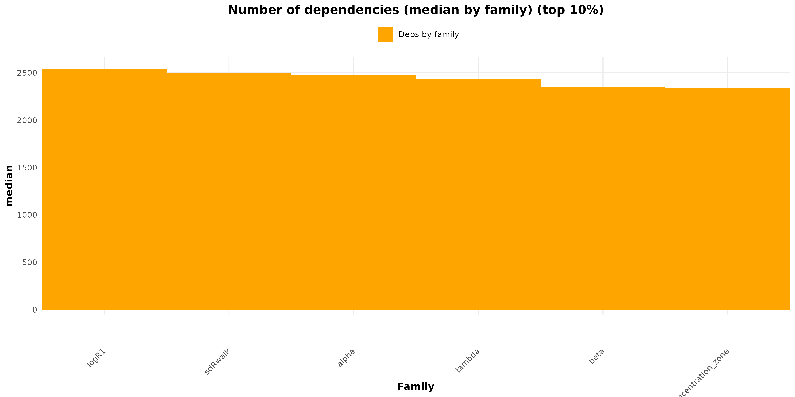
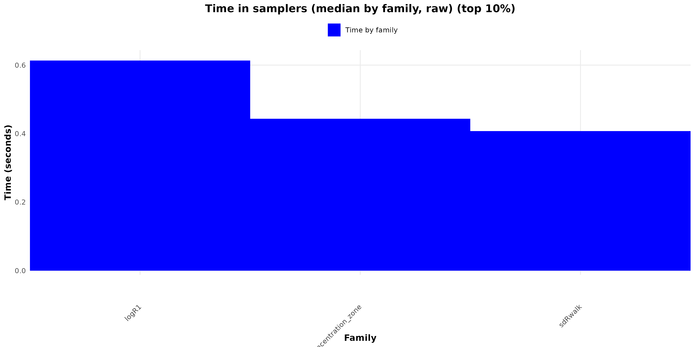

````{r setup, include=FALSE}
## ------------------------------------------------------------
## Global knitr options
## Purpose:
##  - Display all R code chunks
##  - Print console outputs, messages, and warnings
##  - Ensure reproducible and transparent reporting
## ------------------------------------------------------------

knitr::opts_chunk$set(
  echo    = TRUE,        # show R code
  results = "markup",   # print textual outputs in the document
  message = TRUE,       # show messages (message())
  warning = TRUE,       # show warnings
  error   = TRUE,       # keep rendering and display errors if they occur
  comment = "",         # do not prefix outputs with '##'
  prompt  = FALSE,      # avoid console-like '>' prompts
  fig.width  = 7,
  fig.height = 5
)

## Improve readability of printed outputs
options(
  width = 90,           # line width for console outputs
  scipen = 999          # avoid scientific notation when possible
)
````

# Introduction

The third case study focuses on the GEREM (Glass Eel Recruitment Estimation Model), a hierarchical Bayesian framework developed to estimate European eel (Anguilla anguilla) recruitment across multiple nested spatial scales, from overall recruitment to sub-regional zones and individual river catchments. GEREM was originally designed to synthesize fragmented and heterogeneous recruitment time series, providing a coherent probabilistic structure to link local indices to regional and large-scale recruitment dynamics while explicitly propagating uncertainty [@drouineau2016gerem; @bornarel2018modelling].

The model is formulated as a state-space system in which annual overall recruitment is represented as a latent dynamic process and subsequently redistributed across zones and river basins. Spatial allocation is governed by a deterministic surface-based rule controlled by a power parameter β, which determines how recruitment is partitioned among catchments. This parameter is central to the model structure, as it directly shapes the spatial hierarchy of recruitment and the relative contribution of basins within a given zone.

From a statistical perspective, GEREM combines elements of dynamic factor analysis, through latent common trends describing temporal variability in recruitment, with explicit spatial allocation rules grounded in simple but structurally influential assumptions. This formulation is particularly well suited to eel assessment contexts, where recruitment signals are noisy, spatially heterogeneous, and rarely observed exhaustively, yet are expected to exhibit coherent regional patterns driven by large-scale environmental forcing [@drouineau2016gerem, @drouineau2021incorporating].

GEREM has been applied at national and European scales and has been used within ICES advisory contexts, notably by the Working Group on Eels (WGEEL). More recently, it has been identified as a candidate component for spatially explicit assessment frameworks promoted in the WKFEA roadmap, motivating renewed interest in its statistical behaviour as model scope and data coverage expand.

From a computational standpoint, GEREM represents a fundamentally different class of challenge compared to fully mechanistic life-cycle models. Although its dimensionality is more moderate, the model combines several non-smooth, bounded, and correlated components, including truncated distributions, simplex-like constraints, and deterministic allocation rules. In particular, the surface-based power allocation governed by β induces sharp geometric features in the posterior distribution, leading to singular regions and abrupt changes in curvature.

As a consequence, the full GEREM formulation is not differentiable, making it ill-suited for direct application of gradient-based algorithms such as Hamiltonian Monte Carlo (HMC) or the No-U-Turn Sampler (NUTS), whose efficiency relies on smooth posterior manifolds. GEREM therefore provides an instructive example of a realistic and operational hierarchical model for which sampler choice must be driven by structural properties rather than by asymptotic efficiency considerations alone.

In this vignette, GEREM is used as a methodological counterpoint to the WGNAS life-cycle model. While the latter illustrates the benefits of Hamiltonian sampling in a large, fully differentiable integrated assessment model, GEREM highlights the practical limitations of such approaches when differentiability assumptions are violated. Together, these two case studies span a realistic spectrum of integrated stock assessment models and underscore the need for model-specific, diagnostically informed MCMC strategies.

# Material and Methods

All parts of this section (Materials and methods) are directly extracted from the original R Markdown document developed by Hilaire Drouineau for the GEREM model.

```{r setup_gerem, include=FALSE}

knitr::opts_chunk$set(echo = FALSE,warning=FALSE,message=FALSE,fig.width=14.9/2.54,
                      fig.height=10/2.54,dpi=300)
colorpalette=cbf_1 <- c("#999999", "#E69F00", "#56B4E9", "#009E73", 
                        "#F0E442", "#0072B2", "#D55E00", "#CC79A7")

load("glass_eel_yoy.Rdata")
series=unique(glass_eel_yoy$site)

username = Sys.info()["user"]
CY<-2024 # current year ==> dont forget to update the graphics path below (

library("RPostgres")
library("hues")
library("bookdown")
library("coda")
library("nimble")
library("getPass")
library("RPostgres")
library("sf")
library("dplyr")
library("ggplot2")
library("yaml")
library("parallel")
library("tidyr")
library("flextable")
library("reshape2")
library("rnaturalearth")
library("nimble")
library("nimbleHMC")

set_flextable_defaults(
  font.size = 8.5, font.family = "Calibri",
  font.color = "black",
  table.layout = "autofit",
  border.color = "black",
  theme_fun=theme_booktabs)


knitr::opts_chunk$set(echo = TRUE)
updatedData = FALSE
if ((!file.exists(paste("datagerem_nimble2_",CY,".rdata",sep="")))){
  if (username=="hdrouineau"){
    cred_ccm=read_yaml("credentials_ccm.yml")
    con_ccm=dbConnect(Postgres(),host=cred_ccm$host,dbname=cred_ccm$dbname,
                      user=cred_ccm$user,port=cred_ccm$port,
                      password=cred_ccm$password)
    table_seaoutlets="hydrographie.ccm_v2_1_riverbasin_seaoutlets"
  }
  
  #get the surface of a catchment given a list of wso_id
  getSurface=function(w,con){
    if (is.na(w)) return(2.133000e+16) #corresponds to unreal catchments
    w <- gsub("\\{","(",w)
    w <- gsub("\\}",")",w)
    dbGetQuery(con,paste("select sum(area_km2) from",
                         table_seaoutlets,
                         "where wso_id in ",w))[1,1]
  }
  cred=read_yaml("credentials.yml")
  
  
  con_wgeel=dbConnect(Postgres(),
                      dbname=cred$dbname,
                      host=cred$host,
                      port=cred$port,
                      user= cred$user,
                      password= cred$password)
  updatedData = TRUE
  
} else {
  load(paste("datagerem_nimble2_",CY,".rdata",sep=""))
}

create_zone=function(z, izone,tab_series_zones){
  # tab_series_zones <- tab_series %>%
  #   dplyr::filter(zone == z)
  
  #list of all ccm_wso_id: some are too small and are not in all catchments
  catchment_with_series=as.integer(unique(na.omit(unlist(stringr::str_split(gsub("\\{","",gsub("\\}","",tab_series_zones$ser_ccm_wso_id)),",")))))
  allcatchment_zone=allcatchments%>%st_drop_geometry()%>% filter(zone==z)
  catchments_zone_series=allcatchment_zone %>%
    filter(ser_ccm_wso_id%in%catchment_with_series)
  catchments_zone_not_in_series=allcatchment_zone %>%
    filter(!ser_ccm_wso_id%in%catchment_with_series)
  if (length(catchment_with_series) > 1) {
    weights<-paste0("weights_z",izone,"[1:(1+length(surface_catchments_zone_series_z",izone,"))] <- c(pow(surface_catchments_zone_series_z",izone,"[1:(length(surface_catchments_zone_series_z",izone,"))],beta), sum(pow(surface_catchments_not_in_series_z",izone,"[1:(length(surface_catchments_not_in_series_z",izone,"))],beta)))")
    alphaZ<-paste0("alpha_z",izone,"[1:(1+length(surface_catchments_zone_series_z",izone,"))] <- weights_z",izone,"[1:(1+length(surface_catchments_zone_series_z",izone,"))] / sum(weights_z",izone,"[1:(1+length(surface_catchments_zone_series_z",izone,"))]) * concentration_zone")
    props<-paste0("for (y in 1:nbyear){
  props_z",izone,"[y,1:(1+length(surface_catchments_zone_series_z",izone,"))] ~ ddirich(alpha_z",izone,"[1:(1+length(surface_catchments_zone_series_z",izone,"))])
}")
    
  } else {
    weights <- paste0("weights_z",izone, "[1:2] <- c(pow(surface_catchments_zone_series_z",izone,",beta), sum(pow(surface_catchments_not_in_series_z",izone,"[1:(length(surface_catchments_not_in_series_z",izone,"))],beta)))")
    alphaZ<-paste0("alpha_z",izone,"[1:2] <- weights_z",izone,"[1:2] / sum(weights_z",izone,"[1:2]) * concentration_zone")
    props<-paste0("for (y in 1:nbyear){
  props_z",izone,"[y,1:2] ~ ddirich(alpha_z",izone,"[1:2])
}")
  }

  Rcm <- 'for (y in 1:nbyear){'
  for (i in 1:nrow(tab_series_zones)){
    ser_id=match(as.integer(unique(na.omit(unlist(stringr::str_split(gsub("\\{","",gsub("\\}","",tab_series_zones$ser_ccm_wso_id[i])),","))))),catchments_zone_series$ser_ccm_wso_id)
    if (length(ser_id)>0){
      if (all(!is.na(ser_id))){
        Rcm <-paste(Rcm,paste0('    Rcm[y,',match(tab_series_zones$ser_ccm_wso_id[i],tab_series$ser_ccm_wso_id),"] <- ",
                               paste(paste0("props_z",izone,"[y,",ser_id,"]*Rzone[y,",izone,"]"), collapse = "+")),sep="\n")
      } else{
        Rcm <-paste(Rcm,paste0('  Rcm[y,',match(tab_series_zones$ser_ccm_wso_id[i],tab_series$ser_ccm_wso_id),"] <- Rzone[y,",izone,"]"),sep="\n")
      }
    } else{
      Rcm <-paste(Rcm,paste0('  Rcm[y,',match(tab_series_zones$ser_ccm_wso_id[i],tab_series$ser_ccm_wso_id),"] <- Rzone[y,",izone,"]"),sep="\n")
    }
  }
  Rcm <- paste(Rcm,'}', sep="\n")
  res <- list(code=paste(paste("#####Zone",izone),
                         weights,
                         alphaZ,
                         props,
                         Rcm,
                         sep="\n\n"),
              surface_catchments_zone_series_z=catchments_zone_series$area_km2,
              surface_catchments_not_in_series_z=catchments_zone_not_in_series$area_km2)
  names(res) <- c("code",
                  paste0("surface_catchments_zone_series_z",izone),
                  paste0("surface_catchments_not_in_series_z",izone))
  res
  
}

```


```{r dataLoadingFormatting, echo=FALSE, warning=FALSE, message=FALSE}
####loading time series from WGEEL
if ((!file.exists(paste("datagerem_nimble2_",CY,".rdata",sep=""))) ){
  
  series_wgeel=read.table("catchment_wgeel.csv",header=TRUE,sep=";")
  wgeel=dbGetQuery(con_wgeel,paste("select das_year,ser_nameshort,ser_uni_code,das_value,ser_ccm_wso_id,ser_x,ser_y from datawg.t_dataseries_das left join datawg.t_series_ser on das_ser_id =ser_id where das_year>=1960 and das_year <=",CY," and ser_nameshort in ('",paste(series_wgeel$ser_nameshort[series_wgeel$from_wgeel],collapse="','"),"')",sep="") )
  series_wgeel <- merge(series_wgeel,
                        unique(wgeel[,c("ser_nameshort","ser_ccm_wso_id","ser_x","ser_y")]),
                        all.x=TRUE)
  series_wgeel <- rbind.data.frame(series_wgeel,series_wgeel[series_wgeel$ser_nameshort=="MiSpG",,drop=FALSE])
  series_wgeel$ser_nameshort[nrow(series_wgeel)] = "MinG"
  series_wgeel$ser_ccm_wso_id[!series_wgeel$from_wgeel] = 
    as.character(series_wgeel$wso_id[!series_wgeel$from_wgeel])
  series_wgeel$surface=sapply(series_wgeel$ser_ccm_wso_id,getSurface,con=con_ccm )
  
  
  ###converting to kg
  wgeel$das_value=ifelse(wgeel$ser_uni_code=="t",
                         wgeel$das_value*1000,
                         ifelse(wgeel$ser_uni_code=="nr",
                                wgeel$das_value*0.3/1000,
                                wgeel$das_value))
  
  ###reshaping and merging Minho Spain and Portugal
  wgeel_wide=wgeel %>%
    dplyr::select(das_year,das_value,ser_nameshort) %>%
    pivot_wider(names_from=ser_nameshort,values_from=das_value,id_cols=das_year)
  
  
  
  
  ####loading additional french series
  french_wide=read.table("french_serie2.csv",header=TRUE,sep=";")
  names(french_wide)[1]="das_year"
  french_wide=subset(french_wide,french_wide$das_year>=1960 & french_wide$das_year<=CY)
  
  
  tmp <- unique(na.omit(series_wgeel[,c("ser_x","ser_y","ser_ccm_wso_id")]))
  series_wgeel$ser_x[!series_wgeel$from_wgeel]=
    tmp$ser_x[match(series_wgeel$ser_ccm_wso_id[!series_wgeel$from_wgeel],
                    tmp$ser_ccm_wso_id)]
  series_wgeel$ser_y[!series_wgeel$from_wgeel]=
    tmp$ser_y[match(series_wgeel$ser_ccm_wso_id[!series_wgeel$from_wgeel],
                    tmp$ser_ccm_wso_id)]
  
  series_wgeel[series_wgeel$ser_nameshort=="SeGEMAC",c("ser_x","ser_y")] =
    c(-1.136938,45.796857)
  series_wgeel[series_wgeel$ser_nameshort=="ChGEMAC",c("ser_x","ser_y")] =
    c(-1.076013,45.953153)
  series_wgeel[series_wgeel$ser_nameshort=="Somme",c("ser_x","ser_y")] =
    c(1.644597,50.181853)
  series_wgeel[series_wgeel$ser_nameshort=="Oria",c("ser_x","ser_y")] =
    c(-2.1307297,43.2827)
  
  
  values_wide=merge(wgeel_wide,french_wide,all=TRUE)
  series=series_wgeel
  
  values_long <- values_wide %>%
    pivot_longer(-das_year,
                 names_to="ser_nameshort",
                 values_to="das_value")
  
  series_stat <- merge(series, values_long) %>%
    dplyr::select(-wso_id,-ser_ccm_wso_id,-scale_bound_shape2,-scale_bound_shape1, -min_bound,-max_bound) %>%
    filter(!is.na(das_value)) %>%
    group_by(ser_nameshort, type, zone, surface) %>%
    summarise(first_year=min(das_year),
              last_year=max(das_year),
              nbyear=n_distinct(das_year))
  values_long <- na.omit(merge(values_long,
                               series[,c("ser_nameshort","zone")]))
  data_points <- values_long %>%
    group_by(zone,das_year) %>%
    summarise(n=n(),pre=n()>0)
}
```


```{r buildingZone, echo=FALSE, warning=FALSE, message=FALSE}
######building zones
if ((!file.exists(paste("datagerem_nimble2_",CY,".rdata",sep=""))) ){
  sf::sf_use_s2(FALSE)
  
  allcatchments=st_read(con_ccm,query=paste('select wso_id ser_ccm_wso_id,area_km2,"window",sea_cd,geom from',table_seaoutlets,' where strahler>0 and area_km2 > 0 and ("window"<=2004 or "window"=2008)'))
  outlets=st_read(con_ccm,query='select "window",gid, wso_id ser_ccm_wso_id, geom from hydrographie.ccm_v2_1_w2003_rivernodes where num_seg=0')
  outlets=subset(outlets,outlets$ser_ccm_wso_id %in% allcatchments$ser_ccm_wso_id)
  emu=st_read(con_wgeel,query="select emu_nameshort, emu_cou_code,geom from ref.tr_emu_emu")
  asso=st_nearest_feature(st_transform(outlets,4326),emu)
  outlets$emu=emu$emu_nameshort[asso]
  allcatchments$emu=outlets$emu[match(allcatchments$ser_ccm_wso_id,outlets$ser_ccm_wso_id)]
  
  allcatchments$zone=allcatchments$emu
  
  allcatchments=subset(allcatchments,!is.na(allcatchments$zone)) |>
    filter(zone %in% c("FR_Adou","FR_Garo", "FR_Loir","FR_Bret"))
  allcatchments$zone=as.factor(allcatchments$zone)
  
  zone=aggregate(allcatchments$area_km2,list(allcatchments$zone),sum)
  names(zone)=c("zone","surface")
}
```


```{r mapsZones, echo=FALSE,warning=FALSE,message=FALSE, fig.height=16/2.54, fig.cap="Zone definition and available data"}
sf::sf_use_s2(FALSE)
worldmap <- ne_countries(scale = 'medium', type = 'map_units',
                         returnclass = 'sf')
europe_cropped <- st_crop(worldmap, xmin = -13, xmax = 27,
                          ymin = 35, ymax = 65)
colpal=iwanthue(length(levels(allcatchments$zone)))
series$jitx=jitter(series$ser_x,amount=.5)
series$jity=jitter(series$ser_y,amount=.5)
ggplot(europe_cropped)+geom_sf(data=europe_cropped,
                               fill="white")+
  
  geom_sf(data=allcatchments,aes(fill=zone),cex=2,col=NA,alpha=1)+
  geom_point(data=series,aes(x=jitx,
                             y=jity,
                             col=type),cex=2,shape=15)+
  geom_point(data=series,aes(x=jitx,
                             y=jity),
             cex=2,shape=0)+
  scale_fill_manual("Zone",values=colorpalette)+
  scale_color_manual("Type of series",values=rev(colorpalette))+
  xlab("")+
  ylab("")+
  theme_bw()
```

```{r availableData, echo=FALSE,tab.cap="Available time series of recruitment"}
ft <- flextable(series_stat[order(series_stat$zone,series_stat$ser_nameshort),]) %>%
  colformat_num(j="surface") %>%
  set_header_labels(ser_nameshort="Series",
                    type="Type",
                    zone="Zone",
                    surface="Surface (km²)",
                    first_year="First Year",
                    last_year="Last Year",
                    nbyear="Nb data")%>%
  bold(bold = TRUE, part = "header")
autofit(ft)
```


```{r priorsScaling, fig.cap="Priors for exploitation rates and trap efficiency. Exploitation rate and trap efficiency make make the link between observed data and models predictions of absolute recruitments", echo=FALSE, warning=FALSE, message=FALSE}
priors=na.omit(unique(series[,c("type","scale_bound_shape1","scale_bound_shape2","min_bound","max_bound")]))
priors=expand_grid(priors,x=seq(0,1,.01))
priors <- priors %>%
  mutate(prior=dbeta(x,scale_bound_shape1,scale_bound_shape2)) %>%
  mutate(prior=ifelse(x<=min_bound | x>=max_bound ,0,prior))
priors$series=mapply(function(t,s1,s2) 
  paste(series$ser_nameshort[series$type==t &
                               series$scale_bound_shape1==s1 &
                               series$scale_bound_shape2==s2],
        collapse="\n"),
  priors$type,priors$scale_bound_shape1,priors$scale_bound_shape2)
ggplot(priors,aes(x=x, y=prior))+
  geom_line(aes(col=series))+
  xlab("scaling factor") + ylab("prior density")+
  scale_color_manual("factor",values=colorpalette)+
  guides(col = guide_legend(ncol = 3))+
  theme_bw()
```

## Running the model
```{r runningConfig, echo=FALSE, include=FALSE}
if ((!file.exists(paste("datagerem_nimble2_",CY,".rdata",sep=""))) ){
  
  burnin=100000
  sample=1000
  thin=50
  
  
  
  row.names(values_wide)=values_wide$das_year
  values_wide=values_wide[,-1]
  
  
  ###############formatting data and inputs
  
  
  nbyear=nrow(values_wide)
  absolute=subset(values_wide,select=which(series$type[match(names(values_wide),series$ser_nameshort)]=="absolute"))
  serie=subset(values_wide,select=which(series$type[match(names(values_wide),series$ser_nameshort)]=="relative"))
  trap=subset(values_wide,select=which(series$type[match(names(values_wide),series$ser_nameshort)]=="trap"))
  catch=subset(values_wide,select=which(series$type[match(names(values_wide),series$ser_nameshort)]=="catch"))
  
  
  #serie=serie+1
  serie=sweep(serie,2, colMeans(serie,na.rm=TRUE),"/")
  logIAObs=as.matrix(log(serie))
  logIAObs[is.infinite(logIAObs)]=NA #we removed 0 
  logUObs=log(absolute)
  logIPObs=as.matrix(log(trap))
  logIPObs[is.infinite(logIPObs)]=NA #we removed 0 
  logIEObs=log(catch)
  
  nbsurvey=ncol(serie)
  nbabsolute=ncol(absolute)
  nbtrap=ncol(trap)
  nbcatch=ncol(catch)
  
  ########formatting catchments
  nbzone=nrow(zone)
  tab_series=unique(series[,c("ser_ccm_wso_id","surface","zone")]) # a table with one row per catchment in which we have data
  
  ###############creating vector of indices to match the different dataset
  catchment_survey=match(series$ser_ccm_wso_id[match(names(serie),series$ser_nameshort)],tab_series$ser_ccm_wso_id)
  catchment_absolute=match(series$ser_ccm_wso_id[match(names(absolute),series$ser_nameshort)],tab_series$ser_ccm_wso_id)
  catchment_trap=match(series$ser_ccm_wso_id[match(names(trap),series$ser_nameshort)],tab_series$ser_ccm_wso_id)
  catchment_catch=match(series$ser_ccm_wso_id[match(names(catch),series$ser_nameshort)],tab_series$ser_ccm_wso_id)
  
  meanlogq=rep(log(.5),ncol(serie))
  
  
  
  # mulogRglobal1=log(sum(colMeans(absolute,na.rm=TRUE)))+log(sum(surfaceZone)/sum(surface[catchment_absolute]))
  
  
  
  save(list=setdiff(ls(),c("cred","cred_ccm")), file = paste("datagerem_nimble2_",CY,".rdata",sep=""))
  dbDisconnect(con_wgeel)
  dbDisconnect(con_ccm)
} else{
  load(paste("datagerem_nimble2_",CY,".rdata",sep=""))
}  


initpropR=rep(1,nbzone)
zone_param <- lapply(seq_len(nrow(zone)), function(iz){
  zonename=zone$zone[iz]
  create_zone(zone$zone[iz],iz,tab_series%>%filter(zone==zonename))
})
myconstants = list(
  nbzone=nbzone,
  nbsurvey=nbsurvey,
  nbtrap=nbtrap,
  nbabsolute=nbabsolute,
  nbcatch=nbcatch,
  catchment_survey=catchment_survey,
  catchment_trap=catchment_trap,
  catchment_catch=catchment_catch,
  catchment_absolute=catchment_absolute,
  initpropR=initpropR,
  nbyear=nbyear,
  scale_trap=sapply(1:nbtrap,function(i){
    as.matrix(series[series$ser_nameshort==names(trap)[i],
                     c("scale_bound_shape1",
                       "scale_bound_shape2")])
  }),
  scale_catch=sapply(1:nbcatch,function(i){
    as.matrix(series[series$ser_nameshort==names(catch)[i],
                     c("scale_bound_shape1",
                       "scale_bound_shape2")])
  }),
  min_trap=sapply(1:nbtrap,function(i){
    series[series$ser_nameshort==names(trap)[i],"min_bound"]
  }),
  max_trap=sapply(1:nbtrap,function(i){
    series[series$ser_nameshort==names(trap)[i],"max_bound"]
  }),
  min_catch=sapply(1:nbcatch,function(i){
    series[series$ser_nameshort==names(catch)[i],"min_bound"]
  }),
  max_catch=sapply(1:nbcatch,function(i){
    series[series$ser_nameshort==names(catch)[i],"max_bound"]
  }))

for(z in zone_param){
  myconstants <- c(myconstants,z[-1])
}
code <- paste(sapply(zone_param, function(x) x[["code"]]),collapse='\n')
code <- paste(code, "concentration_zone~dunif(10,100)", sep="\n\n")

readLines("modelCode_nimble2.R") %>%
  stringr::str_replace("RCM",code) %>%
  writeLines("modelCode_nimblerevised.R")


mydata=list(
  logIAObs=as.matrix(logIAObs),
  logIPObs=as.matrix(logIPObs),
  logUObs=as.matrix(logUObs),
  logIEObs=as.matrix(logIEObs)
)

generate_init=function(){
  gen_init=function(x){
    logIAObs=apply(mydata$logIAObs,2,function(x){
      d=which(!is.na(x))
      x[which(is.na(x))]=runif(length(which(is.na(x))),min(x,na.rm = TRUE)*2,max(x,na.rm = TRUE)*2)
      x[d]=NA
      x
    })
    logIPObs=apply(mydata$logIPObs,2,function(x){
      d=which(!is.na(x))
      x[which(is.na(x))]=runif(length(which(is.na(x))),min(x,na.rm = TRUE)*2,max(x,na.rm = TRUE)*2)
      x[d]=NA
      x
    })
    
    logUObs=apply(mydata$logUObs,2,function(x){
      d=which(!is.na(x))
      x[which(is.na(x))]=runif(length(which(is.na(x))),min(x,na.rm = TRUE)*2,max(x,na.rm = TRUE)*2)
      x[d]=NA
      x
    })
    logIEObs=apply(mydata$logIEObs,2,function(x){
      d=which(!is.na(x))
      x[which(is.na(x))]=runif(length(which(is.na(x))),min(x,na.rm = TRUE)*2,max(x,na.rm = TRUE)*2)
      x[d]=NA
      x
    })
    
    
    #inits
    propR=matrix(0,myconstants$nbzone,myconstants$nbyear)
    for (i in 1:myconstants$nbyear){
      tmp=rbeta(myconstants$nbzone,1,1)
      propR[,i]=tmp/sum(tmp)
    }
    
    sdq=(runif(1,0.26,1))
    sdRglob=(runif(1,0.26,1))
    sdRwalk=(runif(1,0.26,1))
    sdIA=(runif(myconstants$nbsurvey,0.26,1))
    sdIP=(runif(myconstants$nbtrap,0.26,1))
    sdU=(runif(myconstants$nbabsolute,0.26,1))
    sdIE=(runif(myconstants$nbcatch,0.26,1))
    
    epsilonRzone=rnorm(myconstants$nbyear*myconstants$nbzone,0,1)
    epsilonR=rnorm(myconstants$nbyear,0,1)
    beta=runif(1,.75,.82)
    logR1=runif(1,6,15)
    logq=runif(ncol(mydata$logIAObs),-13,0)
    a=mapply(function(mi,ma) runif(1,mi,ma), myconstants$min_trap,myconstants$max_trap)
    # VZ <- sapply(seq_len(myconstants$nbzone), function(z){
    #   log((exp(1/tauLocal)-1)*(sum(pow(pow(myconstants$surfaceallcatchment[z,seq_len(myconstants$nbcatchmentzone[z])],beta)*exp(-0.5/tauLocal),2))/pow(sum(pow(myconstants$surfaceallcatchment[z,seq_len(myconstants$nbcatchmentzone[z])],beta)*exp(-0.5/tauLocal)),2))+1)})
    # 
    # 
    # 
    # muWeightZone <- sapply(seq_len(myconstants$nbzone), function(z){   log(sum(pow(myconstants$surfaceallcatchment[z,seq_len(myconstants$nbcatchmentzone[z])],beta)*exp(-0.5/tauLocal)))+0.5/tauLocal-0.5*VZ[z]^2})
    # weightZone <- mapply(function(mu,sd) rlnorm(1,mu,sd),muWeightZone,sqrt(VZ))
    # 
    
    p=mapply(function(mi,ma) runif(1,mi,ma), myconstants$min_catch,myconstants$max_catch)
    inits=list(sdIE=sdIE,sdq=sdq,propR=propR,sdRglob=sdRglob,
               sdIA=sdIA,sdIP=sdIP,sdU=sdU, #precisionpropRwalk=precisionpropRwalk,      
               epsilonRzone=epsilonRzone,epsilonR=epsilonR,
               beta=beta,
               # weightZone=weightZone,
               logR1=logR1,logIAObs=logIAObs,logIPObs=logIPObs,logUObs=logUObs,
               logIEObs=logIEObs,sdRwalk=sdRwalk,
               logq=logq,a=a,p=p)
    inits
  }
  gen_init(1)
}

```

#Computational optimisation and sampler benchmarking

The sections below present the computational diagnostics and benchmarking analyses conducted to assess and improve MCMC sampling efficiency for the GEREM model.

## Step 0 – Load packages

```{r load-samoptipro}
devtools::load_all("~/samOptiPro_packages_dev/samOptiPro")
devtools::document()
devtools::load_all()
```

# Step 1 – GEREM Model 

```{r GEREM Model}
geremCode <- nimbleCode({
  ##### Zone 1

  weights_z1[1:(1 + length(surface_catchments_zone_series_z1))] <-
    c(
      pow(surface_catchments_zone_series_z1[1:(length(surface_catchments_zone_series_z1))], beta),
      sum(pow(surface_catchments_not_in_series_z1[1:(length(surface_catchments_not_in_series_z1))], beta))
    )

  alpha_z1[1:(1 + length(surface_catchments_zone_series_z1))] <-
    weights_z1[1:(1 + length(surface_catchments_zone_series_z1))] /
    sum(weights_z1[1:(1 + length(surface_catchments_zone_series_z1))]) *
    concentration_zone

  for (y in 1:nbyear){
    props_z1[y, 1:(1 + length(surface_catchments_zone_series_z1))] ~
      ddirich(alpha_z1[1:(1 + length(surface_catchments_zone_series_z1))])
  }

  for (y in 1:nbyear){
    Rcm[y, 1] <- props_z1[y, 1] * Rzone[y, 1]
    Rcm[y, 8] <- props_z1[y, 2] * Rzone[y, 1]
  }

  ##### Zone 2

  weights_z2[1:2] <-
    c(
      pow(surface_catchments_zone_series_z2, beta),
      sum(pow(surface_catchments_not_in_series_z2[1:(length(surface_catchments_not_in_series_z2))], beta))
    )

  alpha_z2[1:2] <- weights_z2[1:2] / sum(weights_z2[1:2]) * concentration_zone

  for (y in 1:nbyear){
    props_z2[y, 1:2] ~ ddirich(alpha_z2[1:2])
  }

  for (y in 1:nbyear){
    Rcm[y, 9] <- props_z2[y, 1] * Rzone[y, 2]
  }

  ##### Zone 3

  weights_z3[1:(1 + length(surface_catchments_zone_series_z3))] <-
    c(
      pow(surface_catchments_zone_series_z3[1:(length(surface_catchments_zone_series_z3))], beta),
      sum(pow(surface_catchments_not_in_series_z3[1:(length(surface_catchments_not_in_series_z3))], beta))
    )

  alpha_z3[1:(1 + length(surface_catchments_zone_series_z3))] <-
    weights_z3[1:(1 + length(surface_catchments_zone_series_z3))] /
    sum(weights_z3[1:(1 + length(surface_catchments_zone_series_z3))]) *
    concentration_zone

  for (y in 1:nbyear){
    props_z3[y, 1:(1 + length(surface_catchments_zone_series_z3))] ~
      ddirich(alpha_z3[1:(1 + length(surface_catchments_zone_series_z3))])
  }

  for (y in 1:nbyear){
    Rcm[y, 2] <- props_z3[y, 1] * Rzone[y, 3]
    Rcm[y, 3] <- props_z3[y, 4] * Rzone[y, 3] + props_z3[y, 3] * Rzone[y, 3]
    Rcm[y, 4] <- props_z3[y, 4] * Rzone[y, 3] + props_z3[y, 3] * Rzone[y, 3]
    Rcm[y, 6] <- props_z3[y, 2] * Rzone[y, 3]
  }

  ##### Zone 4

  weights_z4[1:(1 + length(surface_catchments_zone_series_z4))] <-
    c(
      pow(surface_catchments_zone_series_z4[1:(length(surface_catchments_zone_series_z4))], beta),
      sum(pow(surface_catchments_not_in_series_z4[1:(length(surface_catchments_not_in_series_z4))], beta))
    )

  alpha_z4[1:(1 + length(surface_catchments_zone_series_z4))] <-
    weights_z4[1:(1 + length(surface_catchments_zone_series_z4))] /
    sum(weights_z4[1:(1 + length(surface_catchments_zone_series_z4))]) *
    concentration_zone

  for (y in 1:nbyear){
    props_z4[y, 1:(1 + length(surface_catchments_zone_series_z4))] ~
      ddirich(alpha_z4[1:(1 + length(surface_catchments_zone_series_z4))])
  }

  for (y in 1:nbyear){
    Rcm[y, 5] <- props_z4[y, 1] * Rzone[y, 4]
    Rcm[y, 7] <- props_z4[y, 2] * Rzone[y, 4]
  }

  concentration_zone ~ dunif(10, 100)

  # Prior for first year of recruitment
  logRglobal[1] <- logR1
  Rglobal[1] <- exp(logRglobal[1])

  for (zone in 1:(nbzone)){
    Rzone[1, zone] <- Rglobal[1] * propR[zone, 1]
  }

  for (y in 2:nbyear){
    mulogRglobal[y] <- logRglobal[y - 1]
    logRglobal[y] <- mulogRglobal[y] + epsilonR[y] * sdRwalk
    Rglobal[y] <- exp(logRglobal[y])
    for (zone in 1:(nbzone)){
      # Rzonepred[y, zone] <- Rglobal[y] * propR[zone]
      # sdRzone[y, zone] <- sqrt((0.000001 + Rglobal[y]) * (0.000001 + propR[zone]) *
      #                           (.999999999999 - propR[zone]))
      # Rzone[y, zone] <- max(0.000000001,
      #                        Rzonepred[y, zone] + epsilonRzone[(y - 1) * nbzone + zone] *
      #                        sdRzone[y, zone])  # Truncation to avoid log(0)
      Rzone[y, zone] <- propR[zone, y] * Rglobal[y]
    }
  }

  for (zone in 1:nbzone){
    Rzone_final[zone] <- Rzone[nbyear, zone]
    alpha[zone] <- initpropR[zone] + 0.01  # * precisionpropRwalk
  }

  for (y in 1:nbyear){
    if (nbsurvey > 1){
      for (isurvey in 1:nbsurvey){
        ######## Required: survey catchability q[survey] and catchment area bvsurvey[survey]
        logIApred[y, isurvey] <-
          logq[isurvey] + log(Rcm[y, catchment_survey[isurvey]]) -
          0.5 / tauIA[isurvey]
        logIAObs[y, isurvey] ~ dnorm(logIApred[y, isurvey], tauIA[isurvey])
      }
    } else {
      logIApred[y, 1] <- logq[1] + log(Rcm[y, catchment_survey]) - 0.5 / tauIA[1]
      logIAObs[y, 1] ~ dnorm(logIApred[y], tauIA[1])
    }

    if (nbtrap > 1){
      for (itrap in 1:nbtrap){
        ######## Trap efficiency
        logIPpred[y, itrap] <-
          loga[itrap] + log(Rcm[y, catchment_trap[itrap]]) -
          0.5 / tauIP[itrap]
        logIPObs[y, itrap] ~ dnorm(logIPpred[y, itrap], tauIP[itrap])
      }
    } else {
      logIPpred[y, 1] <- loga[1] + log(Rcm[y, catchment_trap]) - 0.5 / tauIP[1]
      logIPObs[y, 1] ~ dnorm(logIPpred[y, 1], tauIP[1])
    }

    if (nbcatch > 1){
      for (icatch in 1:nbcatch){
        ######## Catch efficiency
        logIEpred[y, icatch] <-
          logp[icatch] + log(Rcm[y, catchment_catch[icatch]]) -
          0.5 / tauIE[icatch]
        logIEObs[y, icatch] ~ dnorm(logIEpred[y, icatch], tauIE[icatch])
      }
    } else {
      logIEpred[y, 1] <- logp[1] + log(Rcm[y, catchment_catch]) - 0.5 / tauIE[1]
      logIEObs[y, 1] ~ dnorm(logIEpred[y, 1], tauIE[1])
    }

    if (nbabsolute > 1){
      for (iabsolute in 1:nbabsolute){
        ######## Same as above, but without catchability
        logUpred[y, iabsolute] <-
          log(Rcm[y, catchment_absolute[iabsolute]]) - 0.5 / tauU[iabsolute]
        logUObs[y, iabsolute] ~ dnorm(logUpred[y, iabsolute], tauU[iabsolute])
      }
    } else {
      logUpred[y] <- log(Rcm[y, catchment_absolute]) - 0.5 / tauU[1]
      logUObs[y, 1] ~ dnorm(logUpred[y], tauU[1])
    }
  }

  beta ~ dunif(0.71, 1.3)

  propR[1:nbzone, 1] ~ ddirich(alpha[1:nbzone])

  for (y in 2:nbyear){
    alphaYear[y - 1, 1:nbzone] <- lambda * propR[1:nbzone, y - 1]
    propR[1:nbzone, y] ~ ddirich(alphaYear[y - 1, 1:nbzone])
  }

  lambda <- 80

  for (y in 1:(nbzone * nbyear)){
    epsilonRzone[y] ~ dnorm(0, 1)
  }

  for (y in 1:nbyear){
    epsilonR[y] ~ dnorm(0, 1)
  }

  logR1 ~ dunif(6, 15)

  for (survey in 1:nbsurvey){
    logq[survey] ~ dunif(-13, 0)
  }

  if (nbtrap > 1){
    for (itrap in 1:nbtrap){
      a[itrap] ~ T(dbeta(scale_trap[1, itrap], scale_trap[2, itrap]),
                   min_trap[itrap], max_trap[itrap])
      loga[itrap] <- log(a[itrap])
    }
  } else {
    a[1] ~ T(dbeta(scale_trap[1, 1], scale_trap[2, 1]),
             min_trap, max_trap)
    loga[1] <- log(a[1])
  }

  if (nbcatch > 1){
    for (icatch in 1:nbcatch){
      p[icatch] ~ T(dbeta(scale_catch[1, icatch], scale_catch[2, icatch]),
                    min_catch[icatch], max_catch[icatch])
      logp[icatch] <- log(p[icatch])
    }
  } else {
    p[1] ~ T(dbeta(scale_catch[1, 1], scale_catch[2, 1]),
             min_catch, max_catch)
    logp[1] <- log(p[1])
  }

  # precisionpropRwalk ~ dunif(0.5, 1)

  sdRglob ~ T(dt(df = 1, mu = 0, sigma = 2.5), 0.001, 1)
  tauRglob <- 1 / sdRglob^2

  for (isurvey in 1:nbsurvey){
    tauIA[isurvey] <- sdIA[isurvey]
    sdIA[isurvey] ~ T(dt(df = 1, mu = 0, sigma = 2.5), 0.001, 1)
  }

  for (itrap in 1:nbtrap){
    tauIP[itrap] <- 1 / sdIP[itrap]^2
    sdIP[itrap] ~ T(dt(df = 1, mu = 0, sigma = 2.5), 0.001, 1)
  }

  for (iabsolute in 1:nbabsolute){
    tauU[iabsolute] <- 1 / sdU[iabsolute]^2
    sdU[iabsolute] ~ T(dt(df = 1, mu = 0, sigma = 2.5), 0.001, 1)
  }

  for (icatch in 1:nbcatch){
    tauIE[icatch] <- 1 / sdIE[icatch]^2
    sdIE[icatch] ~ T(dt(df = 1, mu = 0, sigma = 2.5), 0.001, 1)
  }

  sdq ~ T(dt(df = 1, mu = 0, sigma = 2.5), 0.001, 1)
  tauq <- 1 / sdq^2

  sdRwalk ~ T(dt(df = 1, mu = 0, sigma = 2.5), 0.001, 1)
  tauRwalk <- 1 / sdRwalk^2
})

```

# Step 2 – Building and compiling the model

```{r Building and compiling, message=FALSE, warning=FALSE}
## ---- NIMBLE global options ----
nimble::nimbleOptions(
  buildInterfacesForCompiledNestedNimbleFunctions = TRUE,
  MCMCsaveHistory = FALSE
)

## ---- Monitors (explicit) ----
monitors <- c(
  "beta",
  "logq", "loga", "logp",
  "logRglobal",
  "Rzone", "propR", "Rcm",
  "sdIA", "sdIP", "sdIE", "sdU",
  "concentration_zone"
)

## ---- Model builder (WGNAS-compatible API; per-chain inits) ----
build_M <- local({
  code_     <- geremCode
  const_    <- myconstants
  data_     <- mydata
  monitors_ <- monitors

  ## Optional: allow precomputed inits list (one per chain) if provided in env
  inits_list_ <- if (exists("inits_nimble", envir = .GlobalEnv, inherits = TRUE)) {
    get("inits_nimble", envir = .GlobalEnv, inherits = TRUE)
  } else {
    NULL
  }

  ## Parallel-safe init generator (NO global deps)
  make_inits <- function() {

    fill_missing_as_NA_then_randomize <- function(mat) {
      mat <- as.matrix(mat)
      apply(mat, 2, function(x) {
        d <- which(!is.na(x))
        na_idx <- which(is.na(x))
        if (length(na_idx) > 0) {
          mi <- min(x, na.rm = TRUE)
          ma <- max(x, na.rm = TRUE)
          # safeguard if column is all NA or degenerate
          if (!is.finite(mi) || !is.finite(ma) || mi == ma) {
            mi <- -1
            ma <-  1
          }
          x[na_idx] <- runif(length(na_idx), min = mi * 2, max = ma * 2)
        }
        x[d] <- NA
        x
      })
    }

    logIAObs <- fill_missing_as_NA_then_randomize(data_$logIAObs)
    logIPObs <- fill_missing_as_NA_then_randomize(data_$logIPObs)
    logUObs  <- fill_missing_as_NA_then_randomize(data_$logUObs)
    logIEObs <- fill_missing_as_NA_then_randomize(data_$logIEObs)

    ## inits
    propR <- matrix(0, const_$nbzone, const_$nbyear)
    for (i in seq_len(const_$nbyear)) {
      tmp <- rbeta(const_$nbzone, 1, 1)
      propR[, i] <- tmp / sum(tmp)
    }

    sdq     <- runif(1, 0.26, 1)
    sdRglob <- runif(1, 0.26, 1)
    sdRwalk <- runif(1, 0.26, 1)

    sdIA <- runif(const_$nbsurvey,   0.26, 1)
    sdIP <- runif(const_$nbtrap,     0.26, 1)
    sdU  <- runif(const_$nbabsolute, 0.26, 1)
    sdIE <- runif(const_$nbcatch,    0.26, 1)

    epsilonRzone <- rnorm(const_$nbyear * const_$nbzone, 0, 1)
    epsilonR     <- rnorm(const_$nbyear, 0, 1)

    beta  <- runif(1, 0.75, 0.82)
    logR1 <- runif(1, 6, 15)

    logq <- runif(ncol(data_$logIAObs), -13, 0)

    a <- mapply(function(mi, ma) runif(1, mi, ma), const_$min_trap,  const_$max_trap)
    p <- mapply(function(mi, ma) runif(1, mi, ma), const_$min_catch, const_$max_catch)

    list(
      sdIE = sdIE, sdq = sdq, propR = propR, sdRglob = sdRglob,
      sdIA = sdIA, sdIP = sdIP, sdU = sdU,
      epsilonRzone = epsilonRzone, epsilonR = epsilonR,
      beta = beta,
      logR1 = logR1,
      logIAObs = logIAObs, logIPObs = logIPObs, logUObs = logUObs, logIEObs = logIEObs,
      sdRwalk = sdRwalk,
      logq = logq, a = a, p = p
    )
  }

  function(chain_id = 1L, export_global = FALSE) {

    chain_id <- as.integer(chain_id)
    stopifnot(chain_id >= 1L)

    ## Choose inits: prefer list-per-chain if available, otherwise generate
    inits_i <- if (is.list(inits_list_) && length(inits_list_) >= chain_id) {
      inits_list_[[chain_id]]
    } else {
      make_inits()
    }

    m <- nimble::nimbleModel(
      code        = code_,
      name        = sprintf("GEREM model (chain %d)", chain_id),
      constants   = const_,
      data        = data_,
      inits       = inits_i,
      buildDerivs = TRUE
    )

    try(m$initializeInfo(), silent = TRUE)

    cm   <- nimble::compileNimble(m, showCompilerOutput = FALSE)
    conf <- nimble::configureMCMC(m, monitors = monitors_)

    if (isTRUE(export_global)) {
      assign("m",    m,    envir = .GlobalEnv)
      assign("cm",   cm,   envir = .GlobalEnv)
      assign("conf", conf, envir = .GlobalEnv)
    }

    list(
      model     = m,
      cmodel    = cm,
      conf      = conf,
      monitors  = monitors_,
      code_text = paste(deparse(code_), collapse = "\n"),
      chain_id  = chain_id
    )
  }
})

## quick sanity check (sequential)
b1 <- build_M(chain_id = 1L, export_global = TRUE)
exists("m"); exists("cm")

```

# Step 3 – Diagnosing differentiability and HMC eligibility

## `diagnose_model_structure()`: structural and timing bottlenecks

```{r diagnose-structure, message=TRUE, warning=FALSE}
cat("\n[MODEL STRUCTURE CHECK]\n")
diag_s <- diagnose_model_structure(
  model              = m,
  include_data       = FALSE,
  removed_nodes      = NULL,
  ignore_patterns    = c("^lifted_", "^logProb_"),
  make_plots         = TRUE,
  output_dir         = "outputs/diagnostics",
  save_csv           = FALSE,
  node_of_interest   = NULL,
  sampler_times      = NULL,
  sampler_times_unit = "seconds",
  auto_profile       = TRUE,
  profile_niter      = 5000,
  profile_burnin     = 500,
  profile_thin       = 1,
  profile_seed       = NULL,
  np                 = 0.10,
  by_family          = TRUE,
  family_stat        = c("median", "mean", "sum"),
  time_normalize     = c("none", "per_node"),
  only_family_plots  = TRUE
)
```


```{r diagnose-structure  plots}


```
*Figure2. Number of model dependencies by node family(a) and corresponding sampler runtime contribution(b)*

###Structural diagnostics and interpretation (GEREM)

The structural diagnostic indicates that the GEREM model comprises 1,262 stochastic nodes and 2,050 deterministic nodes, confirming that computational burden is not driven solely by probabilistic components, but also—and often predominantly—by the propagation of dependencies through deterministic transformations and latent states. This situation is typical of hierarchical models implemented in NIMBLE, where the structure of the computational graph strongly governs inference cost and mixing behavior [@geyer1992practical; @de2017programming].

Figure2a-b summarize, by parameter family, two complementary diagnostics:
(i) the median size of downstream dependency sets (“number of dependencies”, top 10%), and
(ii) the median time spent in samplers (“time in samplers”, top 10%).

Figure 2a (dependencies). A small number of families dominate the upper tail of the dependency distribution, most notably logR1, sdRwalk, alpha, lambda, beta, and concentration_zone. Updates to these quantities propagate through a large fraction of the model graph, affecting recruitment dynamics, zone-level allocations, catchment processes, and multiple observation components. These parameters therefore act as structural control nodes: they are not necessarily numerous, but their influence extends widely through the model.

Figure 2b (sampler time). The ranking of families by per-update computational cost differs from the dependency-based ranking. Some highly connected families are not the most expensive to update, while others with more moderate dependency sets incur higher sampler costs. This discrepancy is expected: empirical update time reflects a combination of (a) structural reach (dependency size), (b) the type of sampler used (e.g. random-walk, Dirichlet random-walk, posterior predictive), (c) the effective dimension of the family, and (d) the internal cost of likelihood and normalization calculations [@de2017programming]. Consequently, neither dependency size nor sampler time alone provides a complete summary of computational bottlenecks.

The baseline MCMC configuration further reveals substantial heterogeneity in sampling mechanisms, with RW_dirichlet samplers for propR and props_z*, standard random-walk samplers for several hyperparameters and process effects, and a large posterior_predictive block grouping many downstream nodes. In such settings, meaningful optimization requires joint consideration of structural diagnostics and empirical profiling, as improvements targeted at families with both high connectivity and high sampler cost are most likely to yield substantial gains in overall efficiency [@geyer1992practical].

## `run_structure_and_hmc_test()`: combined structure + HMC/NUTS check

```{r structure-hmc-test, message=TRUE, warning=FALSE}
out <- run_structure_and_hmc_test(build_M, include_data = FALSE)
```

### Combined structure + HMC/NUTS suitability check (GEREM)

The combined structural and HMC/NUTS diagnostic confirms that the GEREM model is large and transformation-heavy, with 1,262 stochastic nodes and approximately 2,064 deterministic nodes. As in many integrated hierarchical Bayesian models, a substantial fraction of the computational burden is therefore driven by deterministic propagation and dependency closure, rather than by stochastic updates alone [@de2017programming; @geyer1992practical].

The non-differentiability scan does not detect any explicit non-smooth functions in the code or in the active graph, and no “fatal” non-differentiability is reported. The exclusion of HMC/NUTS instead follows from geometric constraints that violate the default assumptions of unconstrained Hamiltonian dynamics.

Two structural showstoppers are identified. First, simplex constraints affect 325 nodes, including Dirichlet-type latent vectors such as propR[ , ] and props_z*. These parameters lie on probability simplices and therefore require bijective transformations to an unconstrained space with appropriate Jacobian adjustments before HMC/NUTS can be applied safely [@betancourt2017_conceptual; @stan2017stan]. Second, truncation or bounded continuous support is detected for 17 nodes, for example scale parameters with truncated priors such as sdRglob and sdIA[ ]. Truncation introduces hard boundaries and challenging posterior geometry, which is often unsupported or unstable in generic HMC implementations without specialized handling [@betancourt2017_conceptual; @stan2017stan].

Because these issues are structural, the diagnostic correctly reports that the model is not structurally suitable for HMC/NUTS, and the empirical HMC/NUTS smoke test is therefore not run. This conservative decision avoids confounding methodological comparisons with partial or implementation-specific workarounds [@geyer1992practical].

From a practical perspective, the baseline sampler composition—combining Dirichlet random-walk updates for simplex parameters, standard random-walk samplers, and a posterior-predictive block—is consistent with the constraint structure of the model. If HMC/NUTS were to be considered at all, it would need to be restricted to carefully selected, unconstrained, differentiable subcomponents and combined with non-gradient samplers for constrained parameters, resulting in a genuinely hybrid sampling strategy [@de2017programming; @monnahan2017faster].

## Step 4 – Convergence assessment with default samplers (baseline)

```{r baseline parallel-run-GEREM , eval=TRUE, echo=TRUE, message=TRUE, warning=FALSE,results='markup',fig.show='as.is', fig.width=6.5, fig.height=4.5}

n.iter   <- 150000
n.burnin <- 100000
n.thin   <- 50
n.chains <- 3

res_b <- run_baseline_config_parallel(
  build_fn  = build_M,
  niter     = n.iter,
  nburnin   = n.burnin,
  thin      = n.thin,
  monitors  = monitors,
  nchains   = n.chains,
  seed      = 123,
  n_cores   = n.chains,
  extra_export = c("generate_init", "mydata", "myconstants")
)

## --- extract samples as mcmc.list
samples_ml <- as_mcmc_list_sop(
  res_b$samples,
  samples2 = NULL,
  drop_loglik = FALSE,
  thin = n.thin
)


runtime_s <- res_b$runtime_s
runtime_s

## ------------------------------------------------------------
## Convergence check from samOptiPro baseline output (coda)
## ------------------------------------------------------------
stopifnot(inherits(samples_ml, "mcmc.list"))

## 1) Rhat (Gelman-Rubin) per monitored parameter
gel <- coda::gelman.diag(samples_ml, multivariate = FALSE)

## gel$psrf is a matrix with columns: Point est., Upper C.I.
rhat <- gel$psrf[, "Point est."]

## 2) Proportion converged under a threshold (e.g. 1.05)
thr <- 1.05
propconv <- mean(rhat <= thr, na.rm = TRUE)
## --- make sure the objects exist (exported by build_M when first called)
stopifnot(exists("m"), exists("conf"))

## ------------------------------------------------------------
## Bottelenecks family-level
## ------------------------------------------------------------
bot2 <- identify_bottlenecks_family(
  samples_ml,
  runtime_s,
  ess_threshold      = 1000,
  sampler_params     = NULL,
  model              = m,
  mcmc_conf          = conf,   
  ignore_patterns    = c("^lifted_","^logProb_"),
  strict_sampler_only= TRUE,
  auto_configure     = TRUE,
  rhat_threshold     = 1.01,
  ess_per_s_min      = 0
)

bot2$top3
bot2
## ------------------------------------------------------------
## Diagnostics plots
## ------------------------------------------------------------
out_dir <- "~/samOptiPro_packages_dev/samOptiPro/vignettes/Gerem/outputs/diagnostics"
dir.create(out_dir, showWarnings = FALSE, recursive = TRUE)

## 1) Diagnostics table
diag_tbl <- compute_diag_from_mcmc_alt(
  samples   = samples_ml,
  runtime_s = res_b$runtime_s
)

## 2) Use the *actual* MCMC configuration used to run the chain(s)
## Prefer: exported `conf` (from build_M(export_global=TRUE))
## Fallback: conf from res object if available
if (!exists("conf", inherits = TRUE)) {
  if (!is.null(res_b$conf_by_chain)) {
    conf <- res_b$conf_by_chain[[1]]
  } else if (!is.null(attr(res_b, "conf_by_chain"))) {
    conf <- attr(res_b, "conf_by_chain")[[1]]
  } else {
    stop("No MCMC configuration found: provide `conf` or ensure `res_b` carries `conf_by_chain`.")
  }
}

## 3) Generate plots to disk (ensure out_dir is used)
plots_bn <- plot_bottlenecks(
  diag_tbl,
  sampled_only = TRUE,
  conf.mcmc    = conf,
  samples_ml   = samples_ml,
  out_dir      = out_dir
)

## 4) Include ONLY requested PNGs
wanted <- c(
  "bar_family_computational_eff.png",
  "bar_family_algorithmic_eff.png",
  "rhat_family_bars_overall.png"
)

wanted_paths <- file.path(out_dir, wanted)

missing <- wanted_paths[!file.exists(wanted_paths)]
if (length(missing) > 0) {
  cat("\n[WARNING] Some requested figures were not found on disk:\n")
  print(missing)
  cat("\n[INFO] Available PNG files in out_dir:\n")
  print(list.files(out_dir, pattern = "\\.png$", full.names = FALSE))
} else {
  knitr::include_graphics(wanted_paths)
}

invisible(NULL)


```
### Baseline run (GEREM): convergence still incomplete

We first ran the baseline GEREM configuration using the package’s default parallel backend (3 chains; \(n_{\text{iter}} = 150{,}000\), \(n_{\text{burnin}} = 100{,}000\), \(thin = 50\)). The sampling phase required **1586 s** of wall-clock time. Convergence was assessed using the Gelman–Rubin diagnostic (R̂) computed on the monitored parameters. Using a standard threshold of **R̂ ≤ 1.05**, the **proportion of converged parameters was 0.96**, indicating that a non-negligible subset of the monitored state space still fails to mix adequately under the baseline configuration.

Because subsequent diagnostic-driven optimization steps (e.g. bottleneck identification and sampler reconfiguration) are most interpretable once the chains have reached a reasonably stationary regime, our first objective was therefore to **prioritize convergence** before attempting to improve computational efficiency.

### Family-level bottlenecks under the baseline configuration

We then applied the family-level bottleneck analysis (\(\text{ESS}_\text{threshold} = 1000\), \(R̂_\text{threshold} = 1.01\), strict sampler-only mapping) to identify which components dominate computational cost. Results are consistent across algorithmic efficiency (AE), computational efficiency (CE), and time-based rankings, and reveal three dominant bottleneck families:

- **beta** (single parameter): lowest AE and CE, and the largest estimated slow-node time (**≈ 10,338 s**), making it the primary bottleneck.
- **logq** (5 parameters): second-ranked bottleneck, with an estimated slow-node time of **≈ 5,529 s**.
- **sdIE** (2 parameters): third-ranked bottleneck, with an estimated slow-node time of **≈ 2,931 s**.

This hierarchy indicates that a small number of parameter families account for a disproportionate share of the computational burden. In particular, improvements targeting **beta** and **logq** are expected to yield the largest potential gains.

### Implications for the optimization strategy

Given that the baseline configuration does not achieve full convergence (propconv = 0.96), and that the GEREM model includes structural elements known to challenge gradient-based samplers (e.g. truncated distributions and non-differentiable components), the next step is to first ensure stable convergence. We therefore follow the historically successful strategy of enforcing a **slice-only configuration (onlySlice = TRUE)** to obtain near-complete convergence, before re-introducing targeted sampler upgrades (e.g. NUTS/HMC or block RW) only for diagnostically identified bottlenecks and where structural assumptions allow.

# Step 5-Strategy: slice-only sampling (onlySlice)

```{r strategy1-parallel-run, eval=TRUE, echo=TRUE, message=FALSE, warning=FALSE,results='markup',fig.show='as.is', fig.width=6.5, fig.height=4.5}
## ------------------------------------------------------------
## Strategy: GEREM (parallel) with strict slice-only samplers
## ------------------------------------------------------------
n.iter   <- 150000
n.burnin <- 100000
n.thin   <- 50
n.chains <- 3

res_slice <- run_only_slice_parallel(
  build_fn  = build_M,
  niter     = n.iter,
  nburnin   = n.burnin,
  thin      = n.thin,
  monitors  = monitors,
  nchains   = n.chains,
  seed      = 123L,
  n_cores   = n.chains,
  parallel_backend = "PSOCK"
)


## --- extract samples as mcmc.list
samples_ml <- as_mcmc_list_sop(
  res_slice$samples,
  samples2     = NULL,
  drop_loglik  = FALSE,
  thin         = n.thin
)

runtime_s <- res_slice$runtime_s
runtime_s

## ------------------------------------------------------------
## Convergence check from samOptiPro baseline output (coda)
## ------------------------------------------------------------
stopifnot(inherits(samples_ml, "mcmc.list"))

## 1) Rhat (Gelman-Rubin) per monitored parameter
gel <- coda::gelman.diag(samples_ml, multivariate = FALSE)

## gel$psrf is a matrix with columns: Point est., Upper C.I.
rhat <- gel$psrf[, "Point est."]

## 2) Proportion converged under a threshold (e.g. 1.05)
thr <- 1.05
propconv <- mean(rhat <= thr, na.rm = TRUE)
## --- make sure the objects exist (exported by build_M when first called)
stopifnot(exists("m"), exists("conf"))

bot3 <- identify_bottlenecks_family(
  samples_ml,
  runtime_s,
  ess_threshold       = 1000,
  sampler_params      = NULL,
  model               = m,
  mcmc_conf           = conf,
  ignore_patterns     = c("^lifted_", "^logProb_"),
  strict_sampler_only = TRUE,
  auto_configure      = TRUE,
  rhat_threshold      = 1.01,
  ess_per_s_min       = 0
)

bot3$top3
bot3
## ------------------------------------------------------------
## Diagnostics plots
## ------------------------------------------------------------
out_dir <- "~/samOptiPro_packages_dev/samOptiPro/vignettes/Gerem/outputs1/diagnostics"
dir.create(out_dir, showWarnings = FALSE, recursive = TRUE)

## 1) Diagnostics table
diag_tbl <- compute_diag_from_mcmc_alt(
  samples   = samples_ml,
  runtime_s = res_slice$runtime_s
)

## 2) Use the *actual* MCMC configuration used to run the chain(s)
## Prefer: exported `conf` (from build_M(export_global=TRUE))
## Fallback: conf from res object if available
if (!exists("conf", inherits = TRUE)) {
  if (!is.null(res_slice$conf_by_chain)) {
    conf <- res_slice$conf_by_chain[[1]]
  } else if (!is.null(attr(res_slice, "conf_by_chain"))) {
    conf <- attr(res_slice, "conf_by_chain")[[1]]
  } else {
    stop("No MCMC configuration found: provide `conf` or ensure `res_slice` carries `conf_by_chain`.")
  }
}

## 3) Generate plots to disk (ensure out_dir is used)
plots_bn <- plot_bottlenecks(
  diag_tbl,
  sampled_only = TRUE,
  conf.mcmc    = conf,
  samples_ml   = samples_ml,
  out_dir      = out_dir
)

## 4) Include ONLY requested PNGs
wanted <- c(
  "bar_family_computational_eff.png",
  "bar_family_algorithmic_eff.png",
  "rhat_family_bars_overall.png"
)

wanted_paths <- file.path(out_dir, wanted)

missing <- wanted_paths[!file.exists(wanted_paths)]
if (length(missing) > 0) {
  cat("\n[WARNING] Some requested figures were not found on disk:\n")
  print(missing)
  cat("\n[INFO] Available PNG files in out_dir:\n")
  print(list.files(out_dir, pattern = "\\.png$", full.names = FALSE))
} else {
  knitr::include_graphics(wanted_paths)
}

invisible(NULL)

```

## Strategy 1: prioritising full convergence using slice-only sampling

As a first corrective step, the optimisation workflow deliberately focused on achieving full convergence of the model, before attempting any improvement in computational or algorithmic efficiency. To this end, the MCMC configuration was rebuilt using a slice-only strategy (onlySlice = TRUE), forcing all stochastic nodes to be updated exclusively with slice samplers.

This choice is theoretically well justified for GEREM: slice sampling does not rely on gradient information, is robust to non-differentiable likelihood components, and is known to perform reliably in models with constrained parameter spaces and complex posterior geometries.

Under this configuration, the convergence diagnostics improved substantially. The proportion of converged parameters increased to propconv = 0.99, indicating that almost all monitored parameters satisfied the convergence criterion. This confirms that the lack of convergence observed in the baseline run was primarily algorithmic, rather than structural or data-driven.

At this stage, the slice-only configuration is therefore treated as a converged reference baseline, suitable for subsequent diagnostic analyses.

### Bottleneck analysis on the converged configuration

With convergence ensured, we applied the bottleneck identification procedure to the slice-only run in order to characterise the remaining limitations in sampling efficiency. The analysis was conducted at the family level, aggregating parameters by model component and focusing on effective sample size (ESS), algorithmic efficiency (AE), computational efficiency (CE), and slowest-node runtime.

The results reveal a highly structured pattern of inefficiencies:

The beta parameter family emerges as the dominant bottleneck across all diagnostic axes (AE, CE, and runtime). Despite being a single-parameter family, it exhibits the lowest median AE (≈ 0.06), the lowest CE, and the largest slow-node runtime (~13,500 s). This indicates that beta is both statistically difficult to sample and computationally expensive, making it a prime candidate for targeted optimisation.

The logq family (five parameters) represents the second most severe bottleneck, with low ESS and efficiency metrics and a substantial contribution to total runtime. This suggests strong posterior correlations or weak identifiability in the catchability-related submodel.

The sdIE family ranks third among the bottlenecks. While its median ESS exceeds the target threshold, its computational cost remains high relative to other variance components.

In contrast, several other families (e.g. sdIA, sdIP, sdU, concentration_zone) meet the ESS target and exhibit substantially better efficiency metrics, indicating that they are not primary drivers of poor overall performance once convergence is achieved.

Importantly, no degenerate families were detected, confirming that the slice-only configuration produces a well-defined and numerically stable posterior exploration.

### Implications for the optimisation workflow

These results illustrate a key principle of the proposed diagnostic-driven workflow. Ensuring convergence through a robust, if computationally conservative, strategy (here, slice-only sampling) allows bottlenecks to be identified unambiguously. In the case of GEREM, the analysis clearly isolates a small number of parameter families—most notably beta and logq—that dominate the computational burden.

Subsequent optimisation steps can therefore focus on these specific components, for instance by testing alternative samplers, reparameterisations, or partial blocking strategies, while preserving the converged slice-only configuration as a reference benchmark.

# Step 6 – Step 5 – Strategy 2: global slice-only sampling with targeted NUTS on \(\beta\)

```{r Strategy2 parallel-run-GEREM , eval=TRUE, echo=TRUE, message=TRUE, warning=FALSE,results='markup',fig.show='as.is', fig.width=6.5, fig.height=4.5}

#res_slice_like_hist <- run_custom_mcmc_parallel(
  #build_fn   = build_M,
  #niter      = 150000,
  #nburnin    = 100000,
  #thin       = 50,
  #monitors   = monitors,
  #nchains    = 3,
  #n_cores    = 3,
  #seed       = 123L,
  #base_policy   = "onlySlice",
  #mcmc_project  = "model",     # <-- clé pour GEREM-like stability
  #parallel_backend = "PSOCK"
#)
res_mix <- run_custom_mcmc_parallel(
  build_fn   = build_M,
  niter      = 150000,
  nburnin    = 100000,
  thin       = 50,
  monitors   = monitors,
  nchains    = 3,
  n_cores    = 3,
  seed       = 123L,
  base_policy   = "onlySlice",
  mcmc_project  = "model",
  override_nodes = list(
    list(target = "beta", type = "NUTS", control = list())
  )
)

## --- extract samples as mcmc.list
samples_ml <- as_mcmc_list_sop(
  res_mix$samples,
  samples2 = NULL,
  drop_loglik = FALSE,
  thin = n.thin
)


runtime_s <- res_mix$runtime_s
runtime_s

## --- make sure the objects exist (exported by build_M when first called)
## ------------------------------------------------------------
## Convergence check from samOptiPro baseline output (coda)
## ------------------------------------------------------------
stopifnot(inherits(samples_ml, "mcmc.list"))

## 1) Rhat (Gelman-Rubin) per monitored parameter
gel <- coda::gelman.diag(samples_ml, multivariate = FALSE)

## gel$psrf is a matrix with columns: Point est., Upper C.I.
rhat <- gel$psrf[, "Point est."]

## 2) Proportion converged under a threshold (e.g. 1.05)
thr <- 1.05
propconv <- mean(rhat <= thr, na.rm = TRUE)
## --- make sure the objects exist (exported by build_M when first called)
stopifnot(exists("m"), exists("conf"))
## ------------------------------------------------------------
bot4 <- identify_bottlenecks_family(
  samples_ml,
  runtime_s,
  ess_threshold      = 1000,
  sampler_params     = NULL,
  model              = m,
  mcmc_conf          = conf,   # <-- FIX: conf.mcmc (not conf_mcmc)
  ignore_patterns    = c("^lifted_","^logProb_"),
  strict_sampler_only= TRUE,
  auto_configure     = TRUE,
  rhat_threshold     = 1.01,
  ess_per_s_min      = 0
)

bot4$top3
bot4
## ------------------------------------------------------------
## Diagnostics plots
## ------------------------------------------------------------
out_dir <- "~/samOptiPro_packages_dev/samOptiPro/vignettes/Gerem/outputs2/diagnostics"
dir.create(out_dir, showWarnings = FALSE, recursive = TRUE)

## 1) Diagnostics table
diag_tbl <- compute_diag_from_mcmc_alt(
  samples   = samples_ml,
  runtime_s = res_mix$runtime_s
)

## 2) Use the *actual* MCMC configuration used to run the chain(s)
## Prefer: exported `conf` (from build_M(export_global=TRUE))
## Fallback: conf from res object if available
if (!exists("conf", inherits = TRUE)) {
  if (!is.null(res_mix$conf_by_chain)) {
    conf <- res_mix$conf_by_chain[[1]]
  } else if (!is.null(attr(res_mix, "conf_by_chain"))) {
    conf <- attr(res_mix, "conf_by_chain")[[1]]
  } else {
    stop("No MCMC configuration found: provide `conf` or ensure `res_mix` carries `conf_by_chain`.")
  }
}

## 3) Generate plots to disk (ensure out_dir is used)
plots_bn <- plot_bottlenecks(
  diag_tbl,
  sampled_only = TRUE,
  conf.mcmc    = conf,
  samples_ml   = samples_ml,
  out_dir      = out_dir
)

## 4) Include ONLY requested PNGs
wanted <- c(
  "bar_family_computational_eff.png",
  "bar_family_algorithmic_eff.png",
  "rhat_family_bars_overall.png"
)

wanted_paths <- file.path(out_dir, wanted)

missing <- wanted_paths[!file.exists(wanted_paths)]
if (length(missing) > 0) {
  cat("\n[WARNING] Some requested figures were not found on disk:\n")
  print(missing)
  cat("\n[INFO] Available PNG files in out_dir:\n")
  print(list.files(out_dir, pattern = "\\.png$", full.names = FALSE))
} else {
  knitr::include_graphics(wanted_paths)
}

invisible(NULL)

```


To improve convergence while beginning to address the primary bottleneck identified in the baseline run, we tested a hybrid configuration combining (i) a **global slice-only policy** for all nodes (\code{onlySlice}) and (ii) a **targeted NUTS sampler** for the parameter \(\beta\) (the top-ranked bottleneck family under the baseline configuration). Concretely, we ran 3 chains with \(n_{\text{iter}}=150{,}000\), \(n_{\text{burnin}}=100{,}000\), and \(thin=50\), using the legacy-compatible compilation route (\code{mcmc_project="model"}), and forcing \(\beta\) to be sampled with \code{NUTS}.

The sampling phase took **2199 s** of wall-clock time, i.e. noticeably slower than the baseline run (1586 s). Convergence was assessed using Gelman–Rubin R̂ on the monitored parameters with the same threshold (R̂ ≤ 1.05). Under this hybrid configuration, the **proportion of converged parameters dropped to 0.888**, indicating that the targeted introduction of NUTS on \(\beta\) did **not** stabilize the overall MCMC; rather, it degraded global convergence relative to both the baseline configuration (0.96) and the slice-only reference strategy tested previously (≈0.99 in the historical workflow).

Family-level bottleneck diagnostics remain qualitatively unchanged: \(\beta\) is still the dominant bottleneck, followed by \(\log q\) and \(\text{sdIE}\). However, the measured efficiencies for \(\beta\) are substantially worse than in the baseline configuration. In particular, the median family-level CE/AE for \(\beta\) decreases to **CE\(_{\text{med}}\)=0.033** and **AE\(_{\text{med}}\)=0.024**, with an implied slow-node time of **≈30,378 s**, confirming that \(\beta\) remains both the **least efficient** and the **most time-dominant** component under this hybrid configuration.

Overall, this experiment suggests that **“onlySlice + NUTS(\(\beta\))” is not a suitable intermediate strategy for GEREM** in its current form. This is consistent with the model structure: GEREM contains truncated distributions and non-differentiable elements, and even if NUTS is applied only to \(\beta\), its interaction with the rest of the slice-updated latent structure can still generate poor mixing and/or pathological geometry from the perspective of the joint posterior. The next step is therefore to keep the global convergence-friendly slice-only setup as a reliable reference, and to explore alternative targeted upgrades for \(\beta\) that are more compatible with the model geometry (e.g. tuned RW on \(\beta\), block proposals involving \(\beta\) with strongly coupled components, or reparameterizations), before attempting any further gradient-based moves.

# 7. Discussion: convergence instability and implications for GEREM optimisation

A first important result emerging from the GEREM experiments is the **strong sensitivity of convergence diagnostics to initial values**. Across repeated runs with different initialisations, we observe substantial variability in the proportion of converged parameters (`propconv`), even under otherwise identical MCMC configurations. In particular, the baseline configuration and the slice-only strategy (Strategy 1) alternate between moderate convergence (`propconv` ≈ 0.95–0.97) and near-complete convergence (`propconv` ≈ 0.99–1.00), depending on the initial state of the chains. This instability propagates to Strategy 2, where the introduction of NUTS on \(\beta\) yields similarly inconsistent convergence behaviour, with some runs showing a marked degradation relative to both the baseline and the slice-only configuration.

This observation has two immediate methodological implications. First, **directly comparing MCMC configurations when convergence itself is unstable is not statistically meaningful**. Efficiency metrics such as ESS, ESS/s, algorithmic efficiency (AE), or family-level bottleneck rankings implicitly assume that samples are representative of the stationary posterior distribution. When this assumption is violated, bottleneck identification becomes unreliable, and apparent inefficiencies may simply reflect transient behaviour driven by poor initialisation rather than intrinsic sampler–model mismatch. Second, the extraction and interpretation of bottlenecks in the absence of satisfactory convergence should therefore be regarded as **diagnostic hypotheses**, not actionable optimisation targets.

Despite this variability, a consistent qualitative pattern emerges: **enforcing a global slice-only policy (Strategy 1)** tends to improve convergence robustness relative to the baseline configuration. Even when `propconv` does not reach unity, slice-only sampling systematically reduces the frequency of severe convergence failures. This behaviour is fully consistent with the theoretical properties of slice sampling, which does not rely on gradient information and is therefore more tolerant of sharp posterior geometries, truncations, and non-differentiable components [@neal2003slice; @gilks1995markov]. In the current state of the GEREM model, Strategy 1 can thus be interpreted as a *stabilisation step*, rather than an efficiency-optimised solution.

By contrast, **Strategy 2 (onlySlice + NUTS on \(\beta\)) does not yield the expected improvement**. Although \(\beta\) is consistently identified as the dominant bottleneck family under the baseline configuration, introducing NUTS on this parameter leads to a systematic drop in global convergence (`propconv` ≈ 0.89 in the run presented here), accompanied by a degradation of both AE and CE for \(\beta\) itself. This result highlights an important point: **local efficiency improvements on a single parameter do not necessarily translate into global improvements in hierarchical models**. Even when applied surgically, gradient-based updates can interact poorly with the surrounding latent structure if the joint posterior geometry violates the assumptions underlying Hamiltonian dynamics.

A likely explanation lies in the **non-differentiable structure of GEREM**, which includes truncated distributions and hard parameter bounds. In NIMBLE, as in other autodiff-based frameworks, truncated or bounded priors (e.g. `T(dnorm(...), a, b)` or `dunif(a, b)`) induce undefined or discontinuous gradients at the boundaries, causing Hamiltonian trajectories to break down or become unstable. While NUTS may still run technically, the resulting dynamics can be highly inefficient or even misleading [@betancourt2017_conceptual; @carpenter2017stan]. This issue is not specific to NIMBLE and is well documented in Stan and related frameworks, where hard constraints are handled via reparameterisation rather than truncation.

To address this limitation, we are currently exploring **“soft-bounded” parameterisations** as a prerequisite for making GEREM compatible with HMC/NUTS. The general idea, illustrated conceptually in Figure X, is to replace hard bounds with smooth transformations. For instance, a parameter constrained to \((a,b)\) can be expressed as
\[
\mu = a + (b-a)\,\mu_{\text{raw}}, \quad \mu_{\text{raw}} \sim \mathrm{Beta}(\alpha,\beta),
\]
optionally augmented with a mild penalty discouraging values extremely close to 0 or 1. Such constructions preserve differentiability across the entire parameter space and are standard practice in gradient-based Bayesian modelling [@betancourt2015hamiltonian; @stan2017stan]. Similar strategies are implicitly used in Stan through unconstrained parameter spaces and Jacobian adjustments.

At present, NIMBLE does not provide a built-in analogue of these soft constraints for truncated distributions, and implementing them requires manual reparameterisation at the model-code level. We therefore view the current GEREM results not as a failure of NUTS per se, but as evidence that **model reparameterisation is a necessary precondition** for meaningful HMC-based optimisation. Until such changes are implemented, slice-only configurations remain the most reliable option for ensuring convergence, and any comparison of sampler efficiency should be conditioned on demonstrably stable chains.

# 8. References
