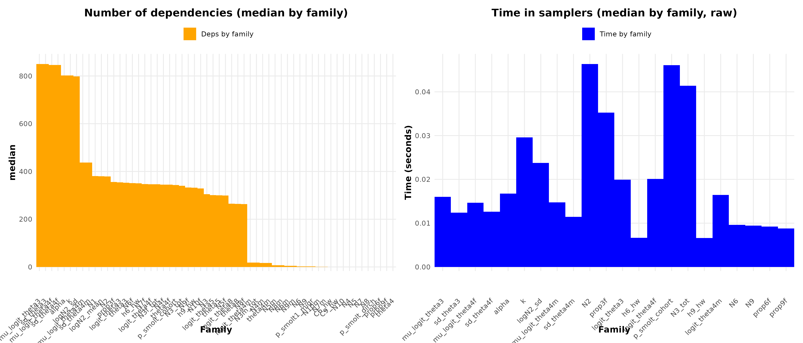

```{r setup, include=FALSE}
knitr::opts_chunk$set(
  echo       = TRUE,
  message    = FALSE,
  warning    = FALSE,
  fig.align  = "center",
  fig.width  = 7,
  fig.height = 5
)
```
# 1. Introduction générale
L’amélioration des performances computationnelles dans les modèles hiérarchiques bayésiens constitue aujourd’hui un enjeu central pour l’écologie quantitative, en particulier dans le cadre de la modélisation des populations exploitées et des analyses halieutiques. Bien que ces modèles offrent une flexibilité conceptuelle remarquable — intégration de multiples sources d’incertitude, structuration explicite des processus écologiques, usage d’informations hétérogènes et multi-échelles — leur mise en œuvre pratique reste souvent limitée par des goulets d’étranglement computationnels majeurs (Brooks et al., 2011; Gelman et al., 2013). Ces limitations se manifestent par des temps de chauffe excessifs, des chaînes MCMC instables ou divergentes, une exploration insuffisante de l’espace des paramètres et des diagnostics de convergence difficilement interprétables. Dans le contexte de projets nécessitant des analyses rapides, reproductibles et robustes pour éclairer la gestion adaptative des populations, ces contraintes représentent un obstacle significatif.

Les modèles hiérarchiques bayésiens occupent une place centrale dans l’étude des dynamiques de populations, qu’il s’agisse d’Integrated Population Models (IPMs) (Besbeas et al., 2002; Kéry & Royle, 2015), de Life Cycle Models (LCMs) (Caswell, 2000; Ellner & Rees, 2006) ou de State-Space Models (Kalman, 1960; Newman et al., 2006). Leur intérêt réside dans leur capacité à intégrer de manière cohérente des sources de données multiples, souvent fragmentaires, collectées à des résolutions temporelles ou spatiales distinctes (Fieberg et al., 2010; Schaub & Abadi, 2011). Ces approches sont aujourd’hui essentielles pour la gestion adaptative des populations, l’évaluation de la viabilité, l’étude des impacts des changements climatiques ou encore l’optimisation des stratégies de conservation (Nichols & Williams, 2006; Jenouvrier et al., 2009; Zipkin & Saunders, 2018).

Cependant, l’inférence bayésienne dépend principalement de méthodes MCMC dont les performances se dégradent fortement en présence de non-linéarités, de dépendances hiérarchiques étendues ou de grandes dimensions paramétriques (Carpenter et al., 2017; Roberts & Rosenthal, 2001). Pour surmonter ces difficultés, ce travail — mené dans le cadre du projet européen DIASPARA (WP4, Task 4.3) — a abouti au développement d’une approche systématique d’analyse et d’optimisation des performances computationnelles des modèles, formalisée dans le package samOptiPro (v0.1.0) et dans un article scientifique actuellement en cours d’évaluation.

L’originalité de cette approche réside dans la combinaison :

*d’un diagnostic structurel automatique des modèles (différentiabilité, distributions, troncatures, dépendances),

*d’une sélection dynamique et sans réglage manuel des échantillonneurs (HMC, NUTS, Slice, RW),

*d’un pipeline complet pour analyser les goulets d’étranglement (bottlenecks),

*d’une comparaison rigoureuse des métriques d’efficacité algorithmique et computationnelle (ESS, AE, CE).

Le présent rapport se concentre non pas sur la description théorique de cette approche (développée dans l’article), mais sur une démonstration step by step du package sur un toy exemple puis la présentation des résultats de son application pratique sur les trois modèles suivants:

*le modèle LCM du Scorff (salmonicoles)*,

*le modèle pan-Atlantique WGNAS (Atlantique Nord)*,

*le modèle GEREM (anguille européenne)*.

Chacune des sections ci-après illustre donc la pertinence de l'approche d'optimisation implémentée et de  la capacité du package à identifier les limitations structurelles, à choisir les échantillonneurs adéquats, à améliorer les performances computationnelles et à proposer des solutions génériques reproductibles. Le rapport s’achève par un focus sur les défis rencontrés (modèles très corrélés, non-différentiabilités, troncatures, forte dimension, dépendances fortes) et sur les solutions mises en œuvre dans le cadre du projet.

## 1.1. Contexte du projet DIASPARA et du WP4

Les espèces amphihalines, telles que l’anguille européenne (Anguilla anguilla) ou le saumon atlantique (Salmo salar), présentent des cycles de vie complexes impliquant plusieurs milieux et des processus biologiques fortement dépendants des conditions environnementales et anthropiques. La gestion durable de ces espèces repose sur la capacité à intégrer des informations hétérogènes — issues de suivis biologiques, de pêcheries, de dispositifs de comptage ou de marquage — dans des cadres de modélisation cohérents, capables de quantifier à la fois les tendances démographiques et les incertitudes associées (ICES, 2020, 2021).

Dans ce contexte, le projet DIASPARA vise à améliorer la compréhension, le suivi et la gestion des populations d’espèces amphihalines à travers le développement et l’évaluation d’outils de modélisation intégrés, d’indicateurs robustes et de scénarios de gestion adaptés. Une attention particulière est portée aux modèles hiérarchiques bayésiens, aujourd’hui largement utilisés en évaluation des stocks et en écologie quantitative, car ils permettent de combiner des sources de données multiples, de représenter explicitement les processus biologiques latents et de propager rigoureusement l’incertitude (Maunder & Punt, 2013 ; Punt et al., 2020).

Le Work Package 4 (WP4) – Enhancing stock assessment models s’inscrit dans cette dynamique en ciblant l’amélioration des modèles d’évaluation des stocks existants, tant du point de vue de leur structure écologique que de leurs performances statistiques et computationnelles. Les modèles considérés dans WP4 couvrent un large spectre d’approches, incluant des Stock Assessment Models (SAMs), des Life Cycle Models (LCMs) et des State-Space Models (SSMs), souvent caractérisés par une forte hiérarchie spatiale et temporelle, un grand nombre de paramètres latents et des dépendances complexes entre composantes biologiques (Buckland et al., 2004 ; Thorson et al., 2015).

Si ces modèles ont considérablement amélioré le réalisme biologique et la cohérence statistique des évaluations, leur complexité croissante pose aujourd’hui des défis majeurs en termes d’inférence bayésienne. Les postérieures associées à ces modèles sont souvent de grande dimension, fortement corrélées et parfois mal identifiées, ce qui peut conduire à un mélange lent des chaînes MCMC, à des temps de calcul prohibitifs et à une sensibilité accrue aux choix d’implémentation (Brooks et al., 2011 ; Betancourt, 2017). Ces limitations computationnelles constituent un frein à l’utilisation opérationnelle de modèles pourtant scientifiquement pertinents, notamment dans des contextes d’expertise récurrents comme ceux portés par l’ICES.

C’est dans ce cadre que s’inscrit la Task 4.3 – Benchmarking tools to enhance computational performance of SAM. L’objectif de cette tâche est de proposer, tester et documenter des outils génériques d’analyse et d’optimisation des performances computationnelles des modèles hiérarchiques bayésiens utilisés en évaluation des stocks. L’ambition n’est pas de promouvoir une solution universelle (reviser le texte pour introduire l'idee du one size does not fit all), mais de fournir un cadre méthodologique permettant d’identifier les goulets d’étranglement computationnels, de comparer différentes stratégies d’échantillonnage (par ex. méthodes de type Random Walk, Slice sampling, Hamiltonian Monte Carlo), et d’évaluer leurs impacts respectifs sur l’efficacité algorithmique et le coût de calcul.

En s’appuyant sur des modèles représentatifs de la diversité et de la complexité rencontrées en pratique — allant de modèles locaux mécanistes à des modèles pan-régionaux fortement hiérarchisés — la Task 4.3 vise à renforcer la robustesse, la reproductibilité et la faisabilité computationnelle des évaluations de stocks, contribuant ainsi directement aux objectifs globaux du projet DIASPARA.

## 1.2. Modèles hiérarchiques bayésiens et goulets d’étranglement computationnels

Les modèles hiérarchiques bayésiens se sont imposés comme un cadre de référence pour la modélisation écologique et halieutique, car ils permettent :

*d’intégrer des sources de données multiples et hétérogènes ;

*de représenter explicitement des processus latents complexes (dynamique de population, recrutement, survie, migration) ;

*de séparer les niveaux d’incertitude (processus, observation, paramètres).

Ils englobent notamment les Integrated Population Models (IPMs), les Life Cycle Models (LCMs) et les State-Space Models (SSMs), largement utilisés pour l’évaluation de la viabilité des populations, la mise en œuvre de la gestion adaptative et l’analyse des effets du changement global sur les populations exploitées.

Cependant, l’inférence bayésienne repose principalement sur des algorithmes de type Markov chain Monte Carlo (MCMC), dont les performances se dégradent rapidement lorsque les modèles deviennent :

*fortement non linéaires* ;

*de grande dimension paramétrique* ;

*soumis à des corrélations hiérarchiques fortes* ;

*ou construits avec des distributions et fonctions peu favorables aux méthodes de type gradient (HMC, NUTS)*.

Ces difficultés se traduisent par :

*des temps de chauffe et d’échantillonnage très longs* ;

*des ESS (Effective Sample Size) faibles pour certains paramètres clés* ;

*des diagnostics de convergence difficiles à interpréter (Rhat proches ou supérieurs à 1.1)* ;

*et, in fine, un ralentissement du cycle complet de modélisation, de diagnostic et de prise de décision*.

## 1.3. Objectifs spécifiques de la Task 4.3

Dans ce contexte, la Task 4.3 poursuit quatre objectifs principaux :

Diagnostiquer les limitations structurelles et computationnelles de modèles hiérarchiques bayésiens existants utilisés dans DIASPARA et dans les groupes ICES (notamment WGNAS).

Développer des outils génériques permettant de détecter automatiquement les goulets d’étranglement computationnels (bottlenecks) à l’échelle des nœuds, familles de nœuds et structures de dépendance.

Proposer un pipeline automatisé de configuration et de test d’échantillonneurs MCMC (HMC, NUTS, Slice, Random Walk, etc.) reposant sur le logiciel NIMBLE et le package nimbleHMC.

Capitaliser ces outils et ce savoir-faire dans un package R open-source dédié, samOptiPro (version 0.1.0), accompagné d’une publication scientifique décrivant le cadre méthodologique, les choix de conception et les principaux résultats.
Dans ce contexte, la Task 4.3 du projet DIASPARA vise à améliorer de manière systématique les performances computationnelles des modèles hiérarchiques bayésiens utilisés pour l’évaluation des stocks d’espèces amphihalines. Les travaux s’appuient sur des modèles représentatifs des pratiques actuelles au sein de DIASPARA et des groupes ICES (notamment WGNAS), caractérisés par une forte hiérarchie spatio-temporelle, un grand nombre de paramètres latents et des dépendances complexes entre processus biologiques.

L’objectif principal est d’identifier et diagnostiquer les sources d’inefficacité algorithmique, en analysant finement les limitations structurelles et computationnelles des modèles, au-delà des diagnostics globaux usuels. À cette fin, des outils génériques de détection de goulets d’étranglement computationnels sont développés, permettant une analyse à l’échelle des nœuds, des familles de nœuds et des structures de dépendance du modèle.

Sur cette base, la Task 4.3 propose un pipeline automatisé d’optimisation et de benchmarking des échantillonneurs MCMC, incluant des approches de type HMC, NUTS, Slice sampling et Random Walk, implémentées dans l’environnement NIMBLE et le package nimbleHMC. Ce pipeline permet d’évaluer de manière reproductible les compromis entre efficacité algorithmique, robustesse de convergence et coût de calcul. L’ensemble des méthodes et outils développés est capitalisé dans le package R open-source samOptiPro (v0.1.0) et documenté dans une publication scientifique, contribuant à la transférabilité des approches d’optimisation proposées.

## 1.4. Périmètre du présent rapport

Le présent rapport, rédigé en fin de contrat dans le cadre du WP4, se concentre sur la présentation des résultats d’optimisation obtenus par l’application du package samOptiPro à trois modèles emblématiques de l’évaluation des stocks et de l’écologie des populations :

le modèle de dynamique de population du Scorff, correspondant à un Life Cycle Model (LCM) pour le saumon atlantique ;

le modèle pan-Atlantique WGNAS, un Life Cycle Model hiérarchique à large échelle ;

le modèle GEREM, un state-space model dédié à l’estimation du recrutement de l’anguille européenne.

Le rapport décrit de manière détaillée les diagnostics produits, les configurations MCMC testées, ainsi que les gains d’efficacité observés, tant du point de vue algorithmique que computationnel. Il présente également les principales fonctionnalités de samOptiPro, illustrées par des extraits de code R et des figures de diagnostic, et propose un retour structuré sur les défis techniques rencontrés ainsi que sur les solutions mises en œuvre.

Avant la présentation de ces résultats appliqués, une première partie introduit pas à pas l’utilisation de samOptiPro sur un toy modèle  (toy example), afin d’expliciter le workflow général, les principes de diagnostic et les choix méthodologiques. Les fondements théoriques et méthodologiques de l’approche sont développés plus en détail dans l’article scientifique associé. Le présent rapport adopte ainsi une perspective résolument appliquée et opérationnelle, destinée en priorité à la communauté DIASPARA et aux futurs utilisateurs des modèles et outils développés.

# 2. Matériels et Méthodes
## 2.1. Modèles étudiés
### 2.1.1. Modèle LCM du Scorff

Le premier modèle analysé dans ce travail est le modèle développé sur le bassin de la rivière Scorff, tel que présenté dans la thèse de Cécile Tréhin (2022). Ce modèle vise à comprendre la réponse des populations de saumon atlantique (Salmo salar) aux changements globaux en mettant l’accent sur le rôle de la croissance et de son héritabilité sexuée dans les stratégies d’histoire de vie et la dynamique de population. Le Scorff constitue un site atelier de référence, bénéficiant de séries temporelles de haute qualité issues de comptages exhaustifs de retours et d’analyses d’écailles sur plusieurs décennies, permettant une modélisation fine des processus biologiques (Tréhin, 2022 ; Nevoux et al., 2010).

Sur le plan structurel, le modèle Scorff repose sur un cadre hiérarchique bayésien de type life-cycle, dans lequel la croissance individuelle en phase marine est modélisée comme un processus latent central. Cette croissance conditionne les probabilités de maturation (1SW vs 2SW) et, in fine, la composition et l’abondance des géniteurs retournant en rivière. Une originalité majeure du modèle réside dans l’introduction explicite de composantes d’héritabilité différenciées selon le sexe, permettant de relier les trajectoires de croissance et de maturation observées chez les descendants aux caractéristiques biologiques des géniteurs mâles et femelles. Cette approche s’inscrit dans la continuité des travaux reliant traits quantitatifs, stratégies d’histoire de vie et dynamique de population chez les salmonidés (Roff, 2002 ; Kuparinen & Hutchings, 2012 ; Rivot et al., 2018).

Bien que spatialement limité à un seul bassin versant, le modèle présente une complexité statistique élevée, liée à l’imbrication de plusieurs niveaux hiérarchiques : individus, sexes, classes d’âge, années et processus biologiques latents (croissance, maturation, héritabilité). Cette structuration induit une dimension paramétrique importante, ainsi que des corrélations fortes entre paramètres génétiques, démographiques et temporels. La présence de paramètres d’héritabilité, souvent faiblement identifiés et corrélés aux effets environnementaux, contribue à une géométrie postérieure complexe, susceptible d’engendrer un mélange lent des chaînes MCMC et des temps de calcul élevés lorsque des échantillonneurs standards sont utilisés.

À l’instar de GEREM et du modèle WGNAS, le modèle Scorff illustre ainsi comment l’augmentation du réalisme biologique — ici via l’intégration de l’héritabilité sexuée et des stratégies d’histoire de vie — se traduit par des défis computationnels significatifs, même dans un cadre spatialement restreint. Il constitue de ce fait un cas d’étude particulièrement pertinent pour le WP4, permettant d’évaluer l’impact de la structure hiérarchique et des dépendances biologiques fines sur l’efficacité algorithmique des méthodes MCMC, et de tester des stratégies d’optimisation adaptées aux modèles écologiques complexes.
### 2.1.2. Modèle pan-Atlantique WGNAS

Le second modèle étudié provient des développements du Working Group on North Atlantic Salmon (WGNAS), groupe ICES chargé de produire l’évaluation annuelle des stocks de saumon atlantique à l’échelle du bassin Nord-Atlantique pour éclairer la gestion par la NASCO [@ices_wgnas]. Ce cadre s’appuie sur un Life Cycle Model hiérarchique bayésien pan-Atlantique, multi-régional, visant à harmoniser l’évaluation entre unités de stock (SU) en Europe du Nord, Europe du Sud et Amérique du Nord [@rivot2019]. Le modèle articule explicitement plusieurs niveaux spatiaux (rivières/UG, régions, macro-régions) et des processus à large échelle (survie en mer, proportions de maturation 1SW/2SW), tout en intégrant des flux liés à la migration et à l’alternance dispersion–concentration propre au cycle de vie [@rivot2019; @rivot2013_ices].

La force du modèle réside dans son intégration cohérente de sources de données hétérogènes (comptages/retours, captures et indices), typique des approches d’“integrated analysis” en évaluation des stocks [@maunder2013]. En contrepartie, la hiérarchie spatio-temporelle et la multiplicité des composantes latentes induisent une dimension élevée (souvent de l’ordre du millier de variables/états latents selon la granularité spatiale et la période), ainsi que des corrélations structurées entre régions et au fil du temps, rendant l’inférence sensible au choix de l’échantillonneur. Dans un contexte opérationnel où les évaluations doivent être robustes et répétables, ces caractéristiques exposent le modèle à des goulets d’étranglement computationnels (mélange lent, autocorrélations, coût par itération), ce qui en fait un banc d’essai pertinent pour WP4 : comparer et optimiser les stratégies MCMC afin d’améliorer l’efficacité algorithmique et le coût total de calcul sans dégrader la cohérence biologique. Enfin, ce modèle s’inscrit dans un mouvement plus large visant à mieux représenter la structure spatiale dans les évaluations, dont l’importance est largement discutée en littérature des stock assessments [@punt2019].
Les évaluations réalisées dans le cadre du Working Group on North Atlantic Salmon (WGNAS) reposent sur des modèles intégrés visant à estimer l’abondance et la dynamique des populations de saumon atlantique (Salmo salar) à l’échelle du Nord-Atlantique, afin de fournir des avis scientifiques à la NASCO et aux instances de gestion nationales et internationales (ICES, 2020, 2021). Ces modèles constituent aujourd’hui une référence pour l’évaluation de stocks fortement structurés spatialement et démographiquement, soumis à des pêcheries mixtes et à des pressions environnementales variables entre régions.


### 2.1.3. Modèle GEREM (Glass Eel Recruitment Estimation Model)

Le troisième modèle est le GEREM, un modèle d’état-espace développé pour estimer le recrutement de l’anguille européenne à partir de séries de comptages d’anguillettes (glass eels). GEREM (Glass Eel Recruitment Estimation Model) est un modèle hiérarchique bayésien développé pour estimer le recrutement des civelles à des échelles spatiales imbriquées, du recrutement global aux zones puis aux bassins versants (Drouineau et al., 2016 ; Bornarel et al., 2018). Il repose sur une dynamique latente de type espace–état, où le recrutement global annuel suit une marche aléatoire, proche des approches d’analyse factorielle dynamique utilisées pour extraire des tendances communes dans des séries écologiques multivariées (Zuur et al., 2003). Cette dynamique est combinée à une règle spatiale de redistribution du recrutement, fondée sur une loi de puissance de la surface des bassins, contrôlée par un paramètre clé (β) structurant la hiérarchie spatiale du modèle.

Cette architecture permet d’intégrer des données hétérogènes (recrutement absolu, indices de piégeage, captures commerciales), et a conduit à des applications opérationnelles à l’échelle nationale et européenne, notamment dans le cadre des travaux ICES sur l’anguille européenne (ICES, 2020). Toutefois, la richesse structurelle de GEREM s’accompagne d’une forte complexité computationnelle : grand nombre de nœuds latents, dépendances hiérarchiques marquées, composantes fortement corrélées, troncatures et contraintes de type simplexe (notamment dans l’allocation spatiale). Ces caractéristiques induisent une géométrie postérieure non lisse, propice aux instabilités de gradient et aux divergences des méthodes de type Hamiltonian Monte Carlo.

GEREM constitue ainsi un cas d’étude emblématique pour analyser les limites des stratégies MCMC standard et pour développer des approches d’optimisation ciblées visant à améliorer l’efficacité algorithmique et computationnelle des modèles hiérarchiques complexes, en parfaite adéquation avec les objectifs du WP4.

# 2.2. Cadre logiciel : NIMBLE, nimbleHMC et samOptiPro
## 2.2.1. NIMBLE et nimbleHMC

L’ensemble des modèles étudiés a été implémenté  sous NIMBLE, un framework R dédié à la définition, la compilation et l’inférence de modèles hiérarchiques bayésiens. NIMBLE combine une syntaxe proche du langage BUGS, facilitant l’implémentation de modèles complexes, avec une compilation séparée du modèle et des algorithmes d’inférence, offrant une grande flexibilité pour la personnalisation des stratégies MCMC.

Un atout central de NIMBLE réside dans la possibilité de configurer finement les échantillonneurs, en combinant des méthodes classiques (Random Walk Metropolis, Slice sampling, block samplers) avec des approches plus avancées basées sur le gradient. Dans ce contexte, le package nimbleHMC fournit une intégration des méthodes Hamiltonian Monte Carlo (HMC) et No-U-Turn Sampler (NUTS) au sein de NIMBLE, permettant leur application à des sous-ensembles de paramètres ou, lorsque la structure du modèle le permet, à des blocs de grande dimension.

Les méthodes HMC/NUTS reposent sur l’utilisation du gradient de la densité a posteriori pour explorer efficacement l’espace des paramètres, ce qui se traduit généralement par une réduction marquée de l’autocorrélation et une amélioration de l’efficacité algorithmique dans des contextes de forte corrélation entre paramètres. Toutefois, ces méthodes requièrent une densité a posteriori différentiable, condition souvent mise en défaut dans les modèles écologiques complexes du fait de troncatures, de distributions discrètes ou de règles conditionnelles. L’intérêt de NIMBLE dans le cadre du WP4 tient précisément à l’accès explicite à la structure interne du modèle (nœuds, familles de nœuds, graphes de dépendance), indispensable pour diagnostiquer ces limitations et concevoir des stratégies d’échantillonnage adaptées.

## 2.2.2. Le package samOptiPro (v0.1.0)

Dans le cadre de la Task 4.3, j’ai développé le package samOptiPro, qui vise à fournir un ensemble cohérent d’outils pour le diagnostic, l’optimisation et le benchmarking des performances MCMC dans des modèles hiérarchiques bayésiens complexes implémentés sous NIMBLE.

Le package regroupe en premier lieu des fonctions de diagnostic structurel, destinées à analyser la compatibilité d’un modèle avec des méthodes de type HMC/NUTS. Ces outils permettent notamment :

la détection automatique de nœuds non différentiables (fonctions round, floor, ifelse, troncatures explicites ou implicites, distributions discrètes, contraintes de type simplexe) ;

l’analyse systématique des distributions utilisées, de leurs supports et de leurs bornes ;

l’identification de showstoppers structurels empêchant l’utilisation directe de méthodes basées sur le gradient.

En complément, samOptiPro intègre des fonctions de diagnostic MCMC à grande échelle, conçues pour des modèles de très grande dimension. Celles-ci incluent le calcul vectorisé et robuste de diagnostics standards (ESS, R̂), ainsi que de métriques dérivées d’efficacité algorithmique et computationnelle (AE, CE), avec la possibilité d’agréger ces indicateurs par familles de nœuds ou par composantes biologiques du modèle.

Sur la base de ces diagnostics, le package propose des fonctions de configuration et d’optimisation des échantillonneurs, incluant :

des tentatives d’activation globale de HMC/NUTS lorsque la structure du modèle est compatible ;

des stratégies dites chirurgicales, consistant à cibler spécifiquement certaines familles de nœuds identifiées comme goulets d’étranglement computationnels, tout en conservant des échantillonneurs classiques pour le reste du modèle.

Enfin, samOptiPro fournit des pipelines de haut niveau permettant d’enchaîner automatiquement les étapes de diagnostic, de configuration, de test et de comparaison des stratégies MCMC sur un modèle donné. Ces pipelines constituent le socle méthodologique utilisé dans ce rapport pour analyser et optimiser les performances des trois modèles étudiés.

## 2.3. Pipeline méthodologique général
Le pipeline d’analyse suivi d'un modèle est structuré en cinq étapes.

Step1.Construction du modèle dans NIMBLE.
Chaque modèle est encapsulé dans une fonction build_M() (ou équivalent) retournant au minimum : (i) l’objet model, (ii) une configuration MCMC conf, et (iii) éventuellement une définition de monitors (pré-définis ou adaptés au cas d’étude).

Step2.Diagnostic structurel préliminaire.
Un diagnostic automatisé est lancé via une fonction de type run_structure_and_hmc_test(build_fn, ...) afin de :

-compter les nœuds stochastiques et déterministes ;

-détecter les distributions/fonctions potentiellement non différentiables ;

-identifier les troncatures explicites et implicites et autres contraintes ;

-produire un verdict sur la faisabilité structurelle de HMC/NUTS (globalement ou sur sous-ensembles).

Step3.Exécution de référence (baseline run).
Une configuration MCMC par défaut (souvent RW + Slice) est utilisée pour :

-obtenir un premier jeu de chaînes MCMC ;

-calculer des diagnostics globaux et dérivés (ESS, R̂, AE, CE) via des fonctions de type compute_diag_from_mcmc_vect_alt() ;

-identifier les familles de nœuds présentant les plus faibles  CE (trade-offs), considérées comme goulets d’étranglement.

Step4.Stratégies d’optimisation des échantillonneurs.
Des stratégies sont ensuite testées via test_strategy() et test_strategy_family() :

-tentative de HMC/NUTS globale lorsque la structure le permet ;

-sinon (ou en cas d’échec HMC), mise en œuvre de stratégies ciblées sur des familles de nœuds prioritaires (p.ex. NUTS scalar, NUTS_block, AF_slice, RW_block), en conservant des échantillonneurs classiques pour le reste du modèle.

Step5.Comparaison et interprétation des performances.
Les configurations optimisées sont comparées à la baseline :

-comparaison par paramètres et par familles (ESS, R̂, AE, CE) ;

-visualisations (profils de CE, distributions d’ESS, diagnostics de convergence) ;

-interprétation des gains en efficacité algorithmique et en efficacité computationnelle, en lien avec la structure du modèle et ses dépendances.

Un pseudo-code représentatif de ce pipeline, accompagné d’une démonstration pas-à-pas, est présenté ci-dessous sur un toy example.

### Step 0.1 – Load packages

```{r load-packages}
library(coda)
library(ggplot2)
library(nimble)
library(nimbleHMC)
```

```{r load-samoptipro}
devtools::load_all("~/samOptiPro_packages_dev/samOptiPro")
devtools::document()
devtools::load_all()
```

### Step 0.2 – Simulated data, initial values and monitors

```{r inputs-data-monitors}
# Simulation constants
time <- 8
Const_nimble <- list(
  n        = time,
  sd_dummy = 0.05,
  sd_obs   = c(0.05, rep(0.4, time - 1))
)

# Data simulation
set.seed(42)
Nobs  <- numeric(time)
theta <- numeric(time - 1)
Nobs[1] <- rlnorm(1, meanlog = 10, sdlog = 0.5)

for (t in 1:(time - 1)) {
  theta[t]  <- runif(1, 0.7, 0.9)
  Nobs[t+1] <- Nobs[t] * theta[t]
}

Data_nimble <- list(Nobs = Nobs)

# Initial values
Inits_nimble <- list(
  N           = 2e4 * c(1, cumprod(rep(0.8, time - 1))),
  logit_theta = rep(logit(0.8), time - 1)
)

# Monitors
monitors <- c("N", "theta", "logit_theta")
```

### Step 0.3 – Model M3

```{r model-m3}
M3.nimble <- nimbleCode({
  # priors
  for (t in 1:(n-1)) {
    logit_theta[t] ~ dnorm(mean = 2, sd = 1)
    theta[t] <- ilogit(logit_theta[t])
  }
  N[1] ~ dlnorm(meanlog = 10, sdlog = 5)

  # process model
  for (t in 1:(n-1)) {
    N[t+1] <- N[t] * theta[t]
  }

  # observation model
  Nobs[1] ~ dlnorm(meanlog = log(N[1]), sdlog = sd_obs[1])
  for (t in 3:n) {
    Nobs[t] ~ dlnorm(meanlog = log(N[t]), sdlog = sd_obs[t])
  }
})
```

### Step 1 – Building and compiling the model

The function `build_M()` is the central entry point used by most `samOptiPro`
tools. It returns the model, its compiled version, the default monitors and the
model code as plain text.

```{r build-compile}
nimbleOptions(buildInterfacesForCompiledNestedNimbleFunctions = TRUE)
nimbleOptions(MCMCsaveHistory = FALSE)

m <- nimbleModel(
  code        = M3.nimble,
  name        = "M3",
  constants   = Const_nimble,
  data        = Data_nimble,
  inits       = Inits_nimble,
  buildDerivs = TRUE
)

cm <- compileNimble(m)

build_M <- function() list(
  model     = m,
  cmodel    = cm,
  monitors  = monitors,
  code_text = paste(deparse(M3.nimble), collapse = "\n")
)
```

### Step 2 – Diagnosing differentiability and HMC eligibility

* `diagnose_model_structure()`: structural and timing bottlenecks

The function `diagnose_model_structure()` inspects the **graph structure** of
a NIMBLE model and returns a set of tables describing:

- the list of stochastic and deterministic nodes;  
- the dependency graph (downstream nodes for each variable);  
- a decomposition of node families (e.g. `logit_theta`, `N`, `theta`) and
  their dependency counts;  
- optional timing information for samplers (via an internal profiling run).  

Conceptually, `diagnose_model_structure()` is **purely structural**: it only
needs a compiled model, not MCMC samples. It is therefore cheap and can be used
early, even before running any long MCMC.

In practice, we call it as follows for the M3 model:

```{r diagnose-structure, message=FALSE, warning=FALSE}
cat("\n[MODEL STRUCTURE CHECK]\n")
diag_s <- diagnose_model_structure(
  model              = m,
  include_data       = FALSE,
  removed_nodes      = NULL,
  ignore_patterns    = c("^lifted_", "^logProb_"),
  make_plots         = TRUE,
  output_dir         = "outputs/diagnostics",
  save_csv           = FALSE,
  node_of_interest   = NULL,
  sampler_times      = NULL,
  sampler_times_unit = "seconds",
  auto_profile       = TRUE,
  profile_niter      = 2200,
  profile_burnin     = 500,
  profile_thin       = 1,
  profile_seed       = NULL,
  np                 = 0.10,
  by_family          = TRUE,
  family_stat        = c("median", "mean", "sum"),
  time_normalize     = c("none", "per_node"),
  only_family_plots  = TRUE
)
```

* `run_structure_and_hmc_test()`: combined structure + HMC/NUTS check

In practice, `run_structure_and_hmc_test()` is a convenience wrapper:
it calls `diagnose_model_structure()` and, when possible, attempts a **full‑model
HMC/NUTS configuration**. This gives, in a single object `out`, both the
structural bottlenecks and an early indication of whether a global HMC strategy
is realistic for the current model.

```{r structure-hmc-test, message=FALSE, warning=FALSE}
out <- run_structure_and_hmc_test(build_M, include_data = FALSE)
```

### Step 3 – Baseline MCMC, bottlenecks and performance assessment

* `run_baseline_config()`: a safe default MCMC runner

`run_baseline_config()` is the main entry point to run a **baseline NIMBLE
configuration** on a given model:

- it calls your model builder (here `build_M()`);  
- it configures a default sampler strategy (typically scalar RW, possibly with
  default slice samplers);  
- it compiles the MCMC and runs it for the requested number of iterations and chains;  
- it returns the raw samples together with the total runtime.

In this vignette, we use it to generate a long baseline run for model M3.
Because this can be time‑consuming, we mark the chunk as `eval = FALSE` so that
the vignette compiles quickly while still showing the full code.

```{r baseline-run-M3, eval=FALSE}
## MCMC schedule for the baseline run
n.iter   <- 1e6
n.burnin <- 1e4
n.thin   <- 2
n.chains <- 3

## Baseline configuration and run
res_a <- run_baseline_config(
  build_fn = build_M,
  niter    = n.iter,
  nburnin  = n.burnin,
  thin     = n.thin,
  nchains  = n.chains,
  monitors = monitors
)

## Merge samples / samples2 into a clean mcmc.list
samples_mla <- as_mcmc_list_sop(
  res_a$samples,
  res_a$samples2,
  drop_loglik = FALSE,
  thin        = n.thin
)

## Total runtime (seconds) for this baseline configuration
runtime_s_a <- res_a$runtime_s

## High-level performance summary (ESS / ESS/s / Rhat)
ap <- assess_performance(
  samples   = samples_mla,
  runtime_s = runtime_s_a
)

## Node-level bottlenecks (ESS & Rhat), working at the target level
bot <- identify_bottlenecks(
  samples           = samples_mla,
  runtime_s         = runtime_s_a,
  ess_threshold     = 1000,
  sampler_params    = NULL,
  model             = m,
  mcmc_conf         = NULL,
  ignore_patterns   = c("^lifted_", "^logProb_"),
  strict_sampler_only = TRUE,
  auto_configure      = TRUE,
  rhat_threshold      = 1.01,
  ess_per_s_min       = 0
)

runtime_s_a      # total runtime
ap$summary       # global performance summary
bot$top3         # worst nodes (ESS/Rhat) at the target level

## Family-level bottlenecks (aggregated by parameter family)
bot2 <- identify_bottlenecks_family(
  samples           = samples_mla,
  runtime_s         = runtime_s_a,
  ess_threshold     = 1000,
  sampler_params    = NULL,
  model             = m,
  mcmc_conf         = NULL,
  ignore_patterns   = c("^lifted_", "^logProb_"),
  strict_sampler_only = TRUE,
  auto_configure      = TRUE,
  rhat_threshold      = 1.01,
  ess_per_s_min       = 0
)

bot2$top3        # worst families by AE/CE and Rhat
```

**Summary.** The object `res_a` returned by `run_baseline_config()` is then
the **baseline reference** for the whole pipeline:

- `samples`, `samples2` are the raw draws used to derive ESS and R-hat;  
- `runtime_s` is the total runtime used to compute computational efficiency;  
- downstream tools such as `assess_performance()`, `identify_bottlenecks()`
  and `identify_bottlenecks_family()` reuse these outputs to locate structural
  and algorithmic bottlenecks in model M3.

### Step 4 – Adaptive block strategy: `test_strategy_family()` and `test_strategy()`

* `test_strategy_family()`: surgical strategy search by family

The core function of the optimisation pipeline is `test_strategy_family()`.
Given a **family of parameters** (e.g. `logit_theta`) and a baseline run, it:

1. inspects the current samplers used for this family;  
2. proposes alternative samplers (e.g. scalar slice or block-wise NUTS);  
3. runs short **pilot chains** under each strategy;  
4. compares per-parameter ESS, AE and CE against the baseline;  
5. returns a structured object that can be further plotted or summarised.

In the M3 toy example, one can use the legacy interface as:

```{r strategy-family, eval=FALSE}
diff <- test_strategy_family(
  build_fn            = build_M,
  monitors            = NULL,   # optional, just passed through
  try_hmc             = TRUE,   # only used for full-model path; surgical ignores
  nchains             = 3,
  pilot_niter         = 4000,
  pilot_burnin        = 1000,
  thin                = 2,
  out_dir             = "outputs/diagnostics",
  nbot                = 1,
  strict_scalar_seq   = c("NUTS","slice","RW"),
  strict_block_seq    = c("NUTS_block","AF_slice","RW_block"),
  force_families      = NULL,   # e.g. c("logit_theta","N")
  force_nodes         = NULL,   # e.g. list(logit_theta=c("logit_theta[1]",...))
  force_union         = NULL,   # e.g. c("logit_theta","N")
  ask                 = TRUE,
  ask_before_hmc      = TRUE,
  block_max           = 20,
  slice_control       = list(),
  rw_control          = list(),
  rwblock_control     = list(adaptScaleOnly = TRUE),
  af_slice_control    = list(),
  slice_max_contractions = 5000
)
```

A more modern call uses `test_strategy_family()` directly, possibly **forcing**
specific families such as `logit_theta` and `N` to NUTS/NUTS_block:

For **singletons** or more local interventions, `test_strategy()` offers a
similar interface but at the node level:

```{r strategy-singletons, eval=FALSE}
diff2 <- test_strategy(
  build_fn          = build_M,
  monitors          = NULL,
  try_hmc           = FALSE,
  nchains           = 3,
  pilot_niter       = 4000,
  pilot_burnin      = 1000,
  thin              = 2,
  out_dir           = "outputs/diagnostics",
  nbot              = 1,
  strict_scalar_seq = c("NUTS","slice","RW"),
  strict_block_seq  = c("NUTS_block","AF_slice","RW_block"),
  force_union       = NULL,
  ask               = TRUE,
  ask_before_hmc    = TRUE,
  block_max         = 20,
  slice_control     = list(),
  rw_control        = list(),
  rwblock_control   = list(adaptScaleOnly = TRUE),
  af_slice_control  = list(),
  slice_max_contractions = 5000
)
```

The returned objects (e.g. `diff`, `diff2`, `diff3`) typically contain:

- `baseline$diag_tbl`: diagnostics for the baseline strategy (restricted to
  the family or nodes of interest);  
- `steps`: a list of strategy steps, each with its own diagnostics and
  bookkeeping information (sampler types, proposal scales, etc.).  

In short, `test_strategy_family()` and `test_strategy()` automate the
**surgical replacement of samplers** on a selected subset of nodes while
keeping the rest of the model unchanged.

Here:

- `res_fast` bundles baseline and alternative strategies;  
- `per` controls whether AE/CE/R-hat are aggregated per parameter (`"target"`)
  or per family;  
- `top_k` and `top_by` restrict the plots to the most interesting keys
  according to CE (default) or AE.  

Again, we use `eval = FALSE` to avoid long pilot runs during vignette
compilation, while preserving executable code for practical use.

### Step 5 – Visualization and diagnostics

* `compute_diag_from_mcmc()` and `compute_diag_from_mcmc_vect()`

At several steps in the workflow, we need to recompute convergence metrics
from `coda::mcmc.list` objects. `compute_diag_from_mcmc_vect()` provides a
vectorised and reasonably fast implementation for:

- minimum ESS across chains per parameter;  
- efficiency per iteration `AE_ESS_per_it`;  
- efficiency per second `ESS_per_sec`;  
- Gelman–Rubin diagnostic \(\hat{R}\) per parameter.

Below we illustrate how these diagnostics are combined with plotting utilities
from `samOptiPro`. Because this chunk depends on the baseline run, we also mark
it as `eval = FALSE`.

```{r viz-diagnostics, echo=TRUE, eval=FALSE}

## Recompute diagnostics from the baseline samples (illustration)
diag_tbl2 <- compute_diag_from_mcmc_vect(
  samples   = samples_mla,
  runtime_s = res_a$runtime_s
)

## Or, using the merged mcmc.list
diag_tbl <- compute_diag_from_mcmc(
  samples   = samples_mla,
  runtime_s = res_a$runtime_s
)

conf.mcmc <- nimble::configureMCMC(m)

plots_bn <- plot_bottlenecks(
  diag_tbl,
  sampled_only = TRUE,            # set TRUE for sampled-only nodes
  conf.mcmc    = conf.mcmc,
  samples_ml   = samples_mla
)

plots_cv <- plot_convergence_checks(
  samples_mla,
  out_dir             = "outputs/diagnostics",
  top_k_rhat          = 8,
  top_k_aelow         = 8,
  runtime_s           = runtime_s_a,
  rhat_ref            = 1.01,
  make_rhat_hist      = TRUE,
  make_traces_rhat    = TRUE,
  make_traces_ae      = TRUE,
  make_rhat_family_bars = TRUE
)

plots_bi <- plot_bottlenecks_index(
  diag_tbl,
  out_dir      = "outputs/diagnostics",
  top_k        = 20L,
  make_hist_ce = TRUE,
  make_hist_ae = TRUE
)

cat("\nCreated bottleneck figures (plot_bottlenecks):\n")
print(names(plots_bn))
cat("\nConvergence outputs (plot_convergence_checks):\n")
print(names(plots_cv))
cat("\nIndex panels (plot_bottlenecks_index):\n")
print(names(plots_bi))
```
This is exactly the kind of diagnostic object expected by the strategy-testing
functions described above.

### Conclusions du toy example

This workflow highlights how `samOptiPro` helps to:

- Detect non-differentiable nodes that prevent HMC/NUTS usage.  
- Automatically switch between gradient-based and non-gradient samplers.  
- Quantify algorithmic and computational efficiency for each parameter family.  
- Provide transparent diagnostic plots and benchmark reports.  
- Use adaptive block design to ensure faster convergence and improved mixing
  without manual tuning.

Putting everything together:

1. `run_baseline_config()` gives a robust starting point and a first diagnostic
   table (`diag_tbl`).  
2. `diagnose_model_structure()` reveals structural and timing bottlenecks at
   the graph level.  
3. `compute_diag_from_mcmc_vect()` allows you to recompute diagnostics from any
   set of samples and a runtime.  
4. `test_strategy_family()` lets you surgically optimise samplers for a given
   family such as `logit_theta`.  
5. `test_strategy_family_fast()` and
   `plot_strategies_from_test_result_fast()` provide a fast, visual way to
   compare multiple sampler strategies side‑by‑side.  

The M3 toy model illustrates this workflow on a small, controlled example, but
the same sequence of steps scales to much larger hierarchical models, including
real‑world stock assessment and population dynamics models.

### Other useful `samOptiPro` tools

In this last section, we briefly summarise additional `samOptiPro` functions
that are not fully showcased in the M3 workflow but are useful building blocks
for more advanced applications:

- **`checkInits()` / `checkInitsAndRun()`**  
  Robust helpers to validate initial values against a NIMBLE model, with clear
  error messages and optional automatic launching of the MCMC once inits are
  deemed valid.

- **`run_hmc_all_nodes()`**  
  Driver to attempt full‑model HMC on differentiable DAGs, using global
  Hamiltonian proposals while keeping track of failures and fallbacks.

- **`run_baseline_coda()`**  
  Alternative baseline runner that focuses on standard `coda` workflows, useful
  when existing MCMC runs already exist outside `samOptiPro` but one wishes to
  reuse its diagnostic and plotting tools.

- **`as_mcmc_list_sop()`**  
  Flexible converter that merges primary and secondary monitor sets into a
  single `coda::mcmc.list`, ensuring consistent parameter ordering across
  chains and downstream diagnostics.

- **`plot_strategies_from_test_result_hmc_fast()`**  
  A plotting companion focusing on HMC/NUTS‑specific trials, providing quick
  visual comparisons of AE/CE and convergence metrics for gradient‑based
  strategies.

- **`Other functions can be found here`**: ~/samOptiPro_packages_dev/samOptiPro/docs/reference

These tools, together with the core workflow illustrated on model M3, form a
coherent ecosystem for **designing, diagnosing and optimising** complex
Bayesian samplers in `nimble`‑based ecological and stock‑assessment models.

#  References


Rédaction
1. Construction du modèle

build_M <- function() {

... code modèle NIMBLE ...

list(model = model, cmodel = cmodel, conf = conf, monitors = monitors)
}

2. Diagnostic structurel

struct_res <- run_structure_and_hmc_test(
build_fn = build_M,
include_data = FALSE,
try_hmc = TRUE
)

3. Run de base

baseline <- run_baseline_config(
build_fn = build_M,
niter = 4000,
nburnin = 1000,
thin = 2,
monitors = c("param1", "param2", "logit_theta", "N"),
nchains = 3
)

diag_baseline <- compute_diag_from_mcmc_vect_alt(
samples = baseline$samples,
runtime_s = baseline$runtime_s,
compute_rhat = "both",
ess_for = "both",
ignore_patterns = c("^lifted_", "^logProb_"),
target_block_ram_gb = 2
)

4. Stratégies d'optimisation

res_strategy <- test_strategy_family_legacy(
build_fn = build_M,
monitors = baseline$monitors,
try_hmc = TRUE,
pilot_niter = 4000,
pilot_burnin= 1000,
thin = 2,
nbot = 1
)

## 2.4. Protocoles de comparaison et métriques

Les comparaisons sont réalisées à partir des métriques suivantes :

ESS (Effective Sample Size) minimal par paramètre, noté ESS_worst ;

AE (Algorithmic Efficiency) : ESS / nombre d’itérations ;

CE (Computational Efficiency) : ESS / temps de calcul (ESS par seconde) ;

Temps par ESS : temps total divisé par ESS, permettant de quantifier le coût d’un échantillon effectif.

Les diagnostics sont agrégés :

à l’échelle des paramètres individuels ;

à l’échelle des familles de nœuds (par exemple, logit_theta, N, logRglobal), permettant de pointer les sous-structures problématiques.

Des figures illustratives sont produites, typiquement :


5.Placeholder pour une figure ESS vs paramètres

plot(diag_baseline$ESS_per_sec,
main = "ESS par seconde (baseline)",
xlab = "Paramètre (index)",
ylab = "ESS/s")

 C'est donc à partir de ce package nous vous presenterons les resultats d'optimisation des 3 modeles testés.
#3. Résultats : Application de samOptiPro aux modèles
## 3.1. Cas d’étude 1 : Scorff LCM
## 3.1.1. Diagnostic structurel

Le diagnostic structurel du modèle du Scorff a été conduit à l’aide des fonctions diagnose_model_structure() et run_structure_and_hmc_test(), afin de caractériser la structure du graphe de dépendances, d’identifier les sources potentielles de non-différentiabilité, et d’obtenir des indicateurs préliminaires de coût computationnel, avant toute phase d’optimisation MCMC.

Le modèle présente une structure hiérarchique de grande dimension, avec 217 nœuds stochastiques et 1365 nœuds déterministes, caractéristique d’un Life Cycle Model fortement mécaniste, dans lequel un grand nombre de transformations déterministes relient les paramètres biologiques latents aux processus intermédiaires et aux observations. L’analyse de différentiabilité met en évidence la présence de plusieurs fonctions non différentiables (ceiling, floor, round, step, equals, trunc) ainsi que de distributions discrètes (ddirichlet, dhypergeom). Conformément à la règle stricte implémentée dans samOptiPro, ces éléments conduisent à désactiver toute tentative de HMC/NUTS global, même en l’absence de showstopper explicite détecté directement au niveau des nœuds latents.

La Figure X synthétise l’analyse structurelle et temporelle au niveau des familles de paramètres, en combinant (i) le nombre médian de dépendances descendantes par famille (panneau gauche) et (ii) le temps médian passé dans les échantillonneurs lors du profilage interne (panneau droit). Les familles sont ordonnées indépendamment dans chaque panneau, ce qui permet d’examiner séparément la complexité structurelle et le coût empirique d’échantillonnage.

Le panneau gauche met en évidence une asymétrie marquée du nombre de dépendances entre familles. Quelques familles présentent des valeurs médianes très élevées, proches de 800–850 dépendances, tandis que la majorité des familles se situe dans une gamme intermédiaire, typiquement comprise entre 250 et 400 dépendances, avant une décroissance rapide vers des familles faiblement connectées, proches de zéro. Cette distribution indique que la complexité structurelle du modèle est fortement concentrée sur un sous-ensemble restreint de familles, tandis qu’un grand nombre de paramètres n’intervient que localement dans le graphe.

Le panneau droit montre une forte hétérogénéité du temps médian passé dans les échantillonneurs, avec des valeurs s’échelonnant approximativement entre 0.005 et 0.04 secondes (profilage brut). Contrairement au panneau gauche, l’ordre des familles en termes de temps n’est pas monotone par rapport au nombre de dépendances : certaines familles présentant un nombre intermédiaire de dépendances figurent parmi les plus coûteuses en temps, tandis que certaines familles très fortement connectées ne sont pas nécessairement associées aux temps d’échantillonnage les plus élevés.

La lecture conjointe des deux panneaux montre ainsi que le nombre de dépendances n’est pas, à lui seul, un prédicteur suffisant du coût computationnel, même s’il constitue un facteur contributif important. Cette dissociation entre structure du graphe et coût empirique d’échantillonnage, directement observable sur la figure, suggère que le coût computationnel dépend également de la nature des transformations déterministes, des distributions associées, et des échelles des paramètres propres à chaque famille.

En synthèse, le diagnostic structurel met en évidence (i) une incompatibilité structurelle avec HMC/NUTS global, liée à la présence de fonctions non différentiables, et (ii) une concentration de la complexité structurelle et du coût computationnel sur un nombre limité de familles de paramètres. Ces résultats fournissent une justification directe à l’approche adoptée dans la suite du pipeline samOptiPro, fondée sur une baseline robuste, suivie de stratégies d’optimisation ciblées par familles de nœuds, plutôt que sur une reconfiguration globale de l’échantillonnage.

```{r fig-family-deps-time, echo=FALSE, fig.cap="Nombre médian de dépendances (gauche) et temps médian passé dans les échantillonneurs (droite), agrégés par famille de paramètres pour le modèle du Scorff.", out.width="\\textwidth"}

```

Figure X. Nombre médian de dépendances descendantes (panneau gauche) et temps médian passé dans les échantillonneurs (panneau droit), agrégés par famille de paramètres pour le modèle du Scorff. La figure met en évidence une forte hétérogénéité structurelle entre familles et une concentration du coût computationnel sur un nombre restreint de familles fortement connectées dans le graphe du modèle.

# 3.1.2. Run de base et goulets d’étranglement

Le run de base du modèle du Scorff a été exécuté à l’aide d’une configuration MCMC conservatrice, reposant majoritairement sur des échantillonneurs de type Random Walk scalaires (214 samplers RW), complétés par trois mises à jour conjugées pour les paramètres de moyenne hiérarchique (mu_logit_theta3, mu_logit_theta4f, mu_logit_theta4m). Trois chaînes ont été simulées en parallèle, pour un temps de calcul total de 1385 s, correspondant à 525 000 tirages post-burn-in au total.

Performance globale

À l’échelle globale, les diagnostics indiquent un comportement satisfaisant du run de base. Sur les 1624 paramètres monitorés, l’ESS total cumulé atteint 8.34 × 10⁷, soit une efficacité computationnelle globale de 6.0 × 10⁴ ESS par seconde.
L’efficacité algorithmique moyenne est de 0.098, avec une médiane de 0.063, tandis que l’efficacité computationnelle moyenne atteint 37.1, pour une médiane de 24.0. Les diagnostics de convergence sont globalement bons, avec 99.9 % des paramètres présentant un 
R^<1.01.

Ces résultats montrent que, malgré la complexité et la dimension élevée du modèle, la configuration de base permet une exploration correcte d’une grande partie de l’espace des paramètres. Toutefois, cette performance moyenne masque des disparités importantes entre paramètres.

Goulets d’étranglement au niveau des paramètres

L’analyse au niveau des nœuds individuels (identify_bottlenecks()) met en évidence des goulets d’étranglement très marqués. Le paramètre alpha apparaît comme le principal point de blocage du run de base. Il présente une ESS de 373, une efficacité algorithmique extrêmement faible (AE = 7.1 × 10⁻⁴) et une efficacité computationnelle minimale (CE = 0.27). Ce paramètre est également associé au temps d’échantillonnage le plus élevé, avec un slow_node_time de 3707 s, le classant premier selon les trois critères (AE, CE et temps).

Un second goulet d’étranglement notable correspond au paramètre latent N2[24], représentant une abondance à un stade intermédiaire du cycle de vie pour une cohorte donnée. Bien que son ESS soit plus élevée (ESS ≈ 1082), ses performances restent faibles au regard du temps de calcul associé (CE ≈ 0.78, AE ≈ 0.0021), avec un temps d’échantillonnage cumulé de 1280 s. Ce paramètre figure systématiquement parmi les plus coûteux et les moins efficaces du modèle.

Goulets d’étranglement au niveau des familles de paramètres

L’agrégation des diagnostics par familles (identify_bottlenecks_family()) confirme et généralise ces résultats. Les familles alpha, k et N3_tot concentrent l’essentiel des inefficacités du run de base.
La famille alpha domine très nettement, avec une CE médiane de 0.27 et une AE médiane de 7.1 × 10⁻⁴, et se classe première selon les axes AE, CE et temps. Les familles k et N3_tot apparaissent comme goulets d’étranglement secondaires, avec des CE médianes respectives de 3.94 et 4.79, et des AE médianes de 0.010 et 0.0126.

D’un point de vue écologique, ces familles correspondent à des composantes fortement structurantes du modèle du Scorff. Le paramètre alpha est associé à la productivité et à la régulation densité-dépendante du recrutement, tandis que k intervient dans l’intensité de cette régulation. Ces paramètres sont connus pour être difficilement identifiables à partir de séries temporelles écologiques et pour présenter de fortes corrélations avec d’autres composantes latentes du cycle de vie, comme souligné dans la thèse de Tréhin (2022). Les variables d’abondance agrégée telles que N3_tot et certains états latents individuels (N2[i]) occupent quant à elles une position centrale dans le graphe de dépendances du modèle, ce qui amplifie leur coût computationnel sous des schémas d’échantillonnage génériques.

Synthèse

En résumé, le run de base du modèle du Scorff présente une performance globale satisfaisante, mais révèle des goulets d’étranglement sévères et bien localisés, dominés par des paramètres écologiquement centraux liés à la productivité, à la densité-dépendance et aux abondances latentes. Ces résultats montrent clairement que l’inefficacité computationnelle du modèle n’est pas uniforme, et qu’une amélioration substantielle des performances passe nécessairement par des stratégies d’optimisation ciblées sur ces familles de paramètres, plutôt que par une augmentation aveugle de la durée des chaînes ou du nombre d’itérations.


```{r First verification-include-pdfs,fig.cap="", out.width="90%",echo=TRUE, results='asis'}

# Directory for saving images extracted from pdfs
output_dir <- "outputs/diagnostics"
dir.create(output_dir, showWarnings = FALSE)

# Browse each PDF file
pdf_dir <- "~/samOptiPro_packages_dev/samOptiPro/vignettes/outputs/diagnostics" 
pdf_files <- list.files(pdf_dir, pattern = "\\.pdf$", full.names = TRUE)

for (pdf in pdf_files) {
  # Charger toutes les pages du PDF
  img_list <- image_read(pdf)
  
  # Parcourir chaque page
  for (i in seq_along(img_list)) {
    # Sauvegarder chaque page dans un fichier PNG
    img_path <- file.path(output_dir, paste0(basename(pdf), "_page", i, ".png"))
    image_write(img_list[i], path = img_path, format = "png")
  }
}

# Image directory
output_dir <- "outputs/diagnostics"
png_files <- list.files(output_dir, pattern = "\\.png$", full.names = TRUE)

# Include all images in the document
knitr::include_graphics(png_files)

```

#3.1.3. Stratégies MCMC testées et gains observés

En appliquant test_strategy_family_legacy() sur la famille logit_theta, plusieurs configurations ont été testées :

RW scalaire (référence) ;

Slice scalar ;

NUTS scalar sur logit_theta uniquement.

Les résultats montrent :

un gain net en ESS/s (CE) sous NUTS scalar par rapport au RW scalaire ;

une réduction des corrélations auto-corrélées dans les traces ;

un Rhat systématiquement plus proche de 1.

Les figures associées (barres Rhat, traces) illustrent clairement l’amélioration de la qualité des chaînes pour les paramètres ciblés.

Rédaction
Placeholder pour une comparaison ESS Scorff
(les vrais graphiques seraient produits à partir des objets de diagnostic)

barplot(
diag_baseline$ESS_per_sec,
main = "ESS/s – Scorff (baseline)",
ylab = "ESS par seconde"
)

3.2. Cas d’étude 2 : WGNAS pan-Atlantique
3.2.1. Grande dimension et structure spatiale

Sur le modèle WGNAS, la première caractéristique marquante est la dimension paramétrique très élevée, avec plusieurs dizaines de milliers de paramètres monitorés.

Le diagnostic structurel révèle :

une structure essentiellement continue (gaussienne, log-normale, beta, etc.) ;

des corrélations spatiales et temporelles fortes ;

peu de troncatures explicites, mais des contraintes implicites via certaines transformations.

3.2.2. Limites des approches classiques

Un run de base sous RW/Slice montre :

des ESS globalement acceptables pour une fraction des paramètres ;

mais pour des blocs entiers (régions, années), des ESS quasi nuls pour des paramètres cruciaux (par exemple certains recrutements ou effets régionaux), avec un temps de calcul très important.

Les méthodes purement RW ou RW_block se révèlent insuffisantes pour explorer correctement l’espace des paramètres dans un temps raisonnable.

3.2.3. Stratégies NUTS et blocage

L’utilisation de test_strategy_family_legacy() ou d’une stratégie similaire centrée sur les familles les plus lentes (logRglobal, Rzone, etc.) a permis :

de tester des configurations NUTS_block sur des blocs combinant plusieurs paramètres corrélés ;

de recourir à AF_slice ou RW_block lorsque HMC/NUTS n’était pas disponible ou échouait.

Les résultats indicatifs (non reproduits ici en chiffres) montrent :

des gains parfois substantiels en CE pour certains blocs (augmentation d’un ordre de grandeur pour ESS/s) ;

une meilleure homogénéité de Rhat à l’échelle du modèle ;

une réduction du contraste entre “paramètres faciles” et “paramètres difficiles”.

Rédaction
Placeholder pour une carte ou une figure ESS sur WGNAS

plot(
diag_baseline$ESS_per_sec,
main = "Distribution des ESS/s – WGNAS (baseline)",
xlab = "Index paramètre",
ylab = "ESS/s"
)

3.3. Cas d’étude 3 : GEREM
3.3.1. Troncatures et distributions à queues lourdes

Dans GEREM, le diagnostic structurel met en lumière :

la présence de distributions t ou half-Cauchy pour certaines composantes de variance ;

des troncatures explicites du type T(dt(0, 1, 1), 0, Inf) ou équivalent (demi-Cauchy) ;

des contraintes fortes sur les paramètres latents (support positif, etc.).

Ces éléments sont défavorables à HMC/NUTS, qui repose sur des gradients bien définis sur l’espace des paramètres.

3.3.2. Sélection d’échantillonneurs robustes

Dans ce contexte, les stratégies testées privilégient :

l’utilisation de Slice (scalaire ou bloc) pour les paramètres problématiques ;

la combinaison de RW/Slice pour les blocs difficiles ;

une éventuelle “soft-ification” des priors (soft priors) pour éviter des comportements extrêmes (queues trop lourdes, troncatures trop abruptes).

3.3.3. Résultats et compromis

Les résultats montrent que :

HMC/NUTS ne peut pas être appliqué globalement de manière fiable, mais peut être utilisé de façon ciblée sur certaines composantes différentiables ;

les stratégies Slice / RW permettent néanmoins d’obtenir des ESS raisonnables, au prix d’un temps de calcul plus important que pour des modèles plus réguliers ;

les diagnostics de type compute_diag_from_mcmc_vect_alt() sont essentiels pour identifier précisément les paramètres où la performance reste insatisfaisante : ce sont des candidats prioritaires pour d’éventuelles reparamétrisations futures.

Rédaction
Placeholder pour une figure ESS GEREM

hist(
diag_baseline$ESS_per_sec,
main = "Distribution ESS/s – GEREM (baseline)",
xlab = "ESS/s"
)

4. Discussion générale
4.1. Synthèse comparative des trois cas d’étude

Les trois modèles étudiés illustrent une gradation de complexité :

Scorff LCM : dimension modérée, structure relativement régulière, bonne compatibilité HMC/NUTS ;

WGNAS : très grande dimension et corrélations spatiales et temporelles fortes ;

GEREM : structure plus délicate en termes de distributions (queues lourdes, troncatures), mettant en difficulté les méthodes gradient-based.

Malgré ces différences, une conclusion commune se dégage : il n’existe pas de “sampler universel” ; l’optimisation des performances MCMC repose sur une combinaison de diagnostics structurels et empiriques, et sur la possibilité de cibler les parties réellement problématiques du modèle.
*Limites avec Slice*
4.2. Apport de samOptiPro

Le package samOptiPro apporte plusieurs contributions :

un diagnostic structurel automatisé permettant de savoir rapidement si HMC/NUTS est envisageable, et si oui, où ;

un diagnostic MCMC vectorisé et scalable adapté aux modèles à très grande dimension ;

des stratégies d’assignation d’échantillonneurs par familles de nœuds, permettant une optimisation ciblée.

Ces éléments permettent de passer d’une logique de “trial-and-error manuelle” à une logique de workflow formalisé, plus systématique et plus reproductible.

4.3. Limites et perspectives

Parmi les limites identifiées :

certaines structures de modèle (troncatures complexes, distributions très irrégulières) resteront difficiles pour HMC/NUTS, même avec un diagnostic fin ;

les stratégies de blocage optimales ne sont pas triviales à déterminer automatiquement dans tous les cas, notamment en très haute dimension.

Les perspectives incluent :

le raffinement des heuristiques de sélection de blocs ;

l’intégration plus directe avec des pipelines HPC (requêtes batch, multi-nœuds, multi-modèles) ;

le couplage avec des outils de redéfinition automatique des priors et de reparamétrisation locale.

5. Défis techniques et solutions apportées
5.1. Détection des non-différentiabilités

Un défi important a consisté à :

identifier les fonctions et distributions créant des ruptures de dérivées (par exemple round, floor, step, ifelse avec discontinuités effectives) ;

propager ces informations dans le graphe de dépendances pour taguer l’ensemble des nœuds affectés.

Cette étape est indispensable pour éviter de lancer HMC/NUTS sur des modèles structurellement incompatibles, ce qui se traduirait par des échecs de compilation ou des divergences systématiques.

5.2. Troncatures implicites et distributions à support borné

Un autre point critique est la prise en compte :

des troncatures implicites (bornes inférieures/supérieures sur le support des distributions) ;

des distributions à support borné (beta, unif, triangle, etc.), pour lesquelles les gradients aux bornes peuvent poser problème.

La solution mise en œuvre a été :

d’inspecter systématiquement les bornes de chaque nœud stochastique ;

de distinguer les distributions naturellement bornées (par construction) des troncatures “ajoutées par l’utilisateur”.

5.3. Diagnostics vectorisés et modèles très volumineux

Les modèles WGNAS et certains scénarios GEREM ont mis en évidence des limites de mémoire et de temps pour :

le calcul classique des ESS avec coda::effectiveSize() sur des milliers de paramètres ;

la répétition d’analyses diagnostics pour plusieurs configurations MCMC.

La fonction compute_diag_from_mcmc_vect_alt() a été développée pour :

opérer par blocs de colonnes (paramètres) ;

exploiter, le cas échéant, le package posterior ;

produire les mêmes sorties que le diagnostic “classique” mais de façon scalable.

5.4. Stratégies HMC/NUTS et fallbacks robustes

Enfin, un enjeu clé a été l’intégration de stratégies HMC/NUTS robustes :

tentative HMC/NUTS globale seulement lorsque la structure et les diagnostics le permettent ;

fallback automatique vers Slice, RW, RW_block et AF_slice sinon ;

conservation de logs clairs et de diagnostics comparables entre configurations.

6. Conclusion générale

Ce travail réalisé dans le cadre de DIASPARA – WP4, Task 4.3 a permis :

d’analyser en profondeur les performances computationnelles de trois modèles clés (Scorff, WGNAS, GEREM) ;

de concevoir et d’implémenter un pipeline complet d’optimisation MCMC basé sur NIMBLE/nimbleHMC ;

de formaliser ces outils dans un package open-source, samOptiPro (v0.1.0), accompagné d’un article scientifique en cours d’évaluation.

Au-delà des modèles étudiés, l’approche est générique et peut être appliquée à une large gamme de modèles hiérarchiques bayésiens en écologie et en halieutique. Elle constitue un socle solide pour :

améliorer la robustesse des analyses futures ;

réduire les temps de calcul ;

rendre plus systématique et reproductible l’optimisation des stratégies d’échantillonnage dans les modèles complexes.

7. Références bibliographiques (indicatives)

(À adapter / compléter avec ton fichier .bib ou un bloc refs.bib)

Abadi et al. (2010).

Besbeas et al. (2002).

Brooks et al. (2011).

Buckland et al. (2004, 2007).

Carpenter et al. (2017).

Caswell (2000).

Cressie & Wikle (2011).

Drouineau et al. (2016).

Ellner & Rees (2006).

Fieberg et al. (2010).

Gelman et al. (1995, 2013).

Hobbs & Hooten (2015).

Jenouvrier et al. (2009).

Johnson et al. (2010).

Kalman (1960).

Kéry & Royle (2015).

Kéry & Schaub (2011).

King et al. (2009).

Lahoz-Monfort et al. (2017).

Leslie (1945).

Newman et al. (2006).

Nichols & Williams (2006).

Parent et al. (2013).

Roberts & Rosenthal (2001).

Saunders et al. (2018).

Schaub & Abadi (2011).

Zipkin & Saunders (2018).
