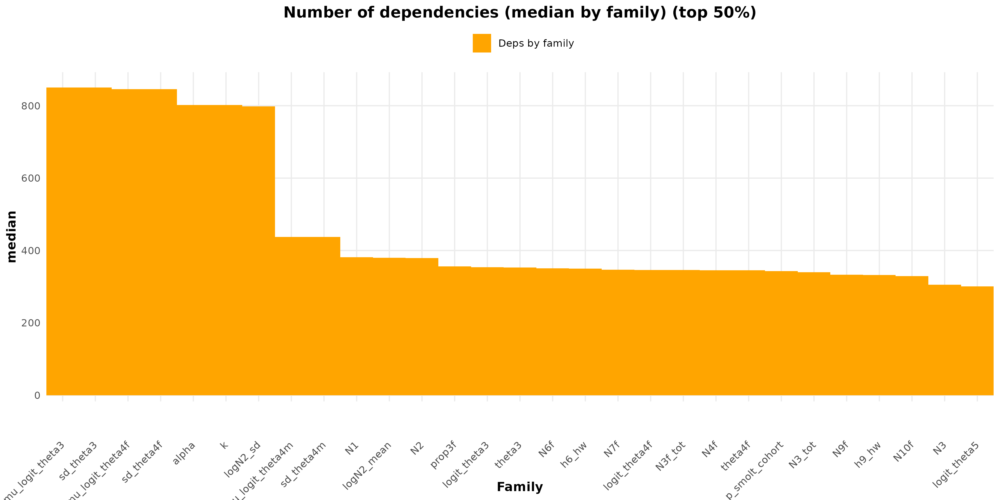
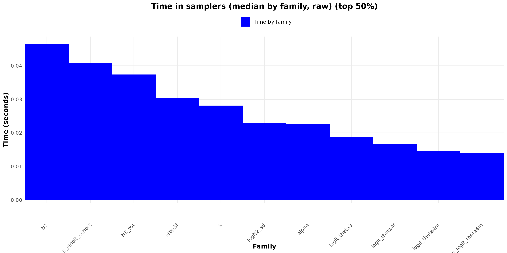

````{r setup, include=FALSE}
## ------------------------------------------------------------
## Global knitr options
## Purpose:
##  - Display all R code chunks
##  - Print console outputs, messages, and warnings
##  - Ensure reproducible and transparent reporting
## ------------------------------------------------------------

knitr::opts_chunk$set(
  echo    = TRUE,        # show R code
  results = "markup",   # print textual outputs in the document
  message = TRUE,       # show messages (message())
  warning = TRUE,       # show warnings
  error   = TRUE,       # keep rendering and display errors if they occur
  comment = "",         # do not prefix outputs with '##'
  prompt  = FALSE,      # avoid console-like '>' prompts
  fig.width  = 7,
  fig.height = 5
)

## Improve readability of printed outputs
options(
  width = 90,           # line width for console outputs
  scipen = 999          # avoid scientific notation when possible
)
````

# Introduction

Following the methodological framework introduced in the main introductory vignette, we now turn to applied case studies in which the proposed diagnostics and benchmarking tools are used on operational models. Each vignette is dedicated to a specific model family and focuses on the interaction between model structure, sampler choice, and computational performance.

The first operational model considered is the **Scorff life-cycle model**, developed to estimate the heritability of mean age at maturation in Atlantic salmon. This model represents a single population and explicitly separates individual demographic flows for males and females, while adopting a simplified representation of the marine phase (no explicit capture at sea) [@Trehin2022;@Favreau2022;@Pechieras2021]. Despite this apparent biological simplification, the model remains computationally demanding due to its size and internal dependencies.

The Scorff model comprises **1,659 nodes**, including a large number of latent variables and deterministic transformations. Its central parameters are **α (alpha)** and **k**, which control key components of the maturation and inheritance processes. Importantly, the model is **non-differentiable**, due to the presence of constructs that prevent the use of gradient-based samplers such as HMC or NUTS. This makes it a **representative but deliberately difficult case study** for a broader class of ecological models in which sampler optimization must rely on non-gradient methods.

As such, the Scorff model provides an ideal test case to illustrate how the proposed workflow can (i) diagnose structural limitations, (ii) identify computational bottlenecks, and (iii) guide sampler selection and tuning in a non-differentiable setting. In this vignette, we focus on understanding where computational inefficiencies arise in the model and how targeted sampler strategies can improve performance relative to default configurations.

```{r Life cycle}
knitr::include_graphics("~/samOptiPro_packages_dev/samOptiPro/vignettes/Scorff/Life cycle.png")
```

*Figure 1. Life-cycle structure of the Scorff model. Individual demographic flows are modeled separately for males and females, with a simplified marine phase and explicit maturation dynamics.*

The remainder of the vignette follows a step-by-step workflow: loading dependencies (Step 0), preparing data, initial values and monitors (Step 1), defining the Scorff model (Step 2), and finally building, compiling and running MCMC experiments with structured diagnostics (Step 3).

# Step 0 – Load packages

```{r load-packages}
library(coda)
library(ggplot2)
library(nimble)
library(nimbleHMC)
```

```{r load-samoptipro}
devtools::load_all("~/samOptiPro_packages_dev/samOptiPro")
devtools::document()
devtools::load_all()
```

# Step 1 – Simulated data, initial values and monitors

```{r inputs-data-monitors}
# Data simulation
datafile <- "~/samOptiPro_packages_dev/samOptiPro/vignettes/Scorff/data_scorff_LCM_v2.rds"
Constfile <- "~/samOptiPro_packages_dev/samOptiPro/vignettes/Scorff/Const_scorff_LCM_v2.rds"
Data_nimble <- readRDS(datafile)
Const_nimble <- readRDS(Constfile)

# Initial values
#initfile <- "Scorff/0_generate_inits_base.R"
source("~/samOptiPro_packages_dev/samOptiPro/vignettes/Scorff/0_generate_inits_base.R")
# Monitors
monitors <- c(
  
  # Abundances
  "N1","N2","N3",
  "N3_tot","N4","N5","N6","N7","N8","N9","N10",
  "N3f_tot","N4f","N5f","N6f","N7f","N8f","N9f","N10f",
  "N3m_tot","N4m","N5m","N6m","N7m","N8m","N9m","N10m",

  # Stock recruitment
  "logN2_mean","logN2_sd",
  "alpha","k",
  
  # Smolt ages
  "p_smolt_cohort",
  "p_smolt1_migr",  "p_smolt_dirch",

  # Sex-ratio
  "prop3f","prop6f","prop9f",

  # Post-smolt survival
  "theta3","logit_theta3",
  "sd_theta3",

  # Probability of maturation as 1SW
  "theta4f","theta4m","theta4", 
  "logit_theta4f","logit_theta4m",
  "sd_theta4f","sd_theta4m","mu_logit_theta3",  "mu_logit_theta4f", "mu_logit_theta4m",

  # survival from end sum1 to return
  "theta5","theta8",
  "logit_theta5","logit_theta8",
  
  "h6_hw","h9_hw",
  "C6_hw","C9_hw"
)

```

# Step 2 – Model Scorff

```{r model-Scorff}
model.nimble <- nimbleCode({
  
  # Observation equations ---------------------------------------------------
  
  ## Total smolt abundances estimates -----
  ## we estimate the total true abundance of smolts (N3_tot) using the log of the median, the mean and the standard deviation estimated from a previous CMR model
  
  # Fit of N3_tot to available data  with observation errors (Pseudolikelihood method)
  # from 1996 to 2019
  for (t in 3:(nyear-1)) {
    log_N3_mu[t] ~ dnorm(log(N3_tot[t]), sd = log_N3_sd[t])
  }
  
  
  ## Smolt Sex ratio -----
  ## use of the number of individuals for each sex  (SAMARCH data) to estimate the sex ratio (p_sex_smolt) (multinomial)
  
  # from 1996 to 2018
  for (t in 3:(nyear-2))  {
    sex_ratio_smolt[t,1] ~ dhyperg(N1 = round(prop3f[t]*N3_tot[t]), 
                                  N0 = round((1-prop3f[t])*N3_tot[t]),
                                  nx = N_sample_smolt_sex[t])
  }
  
  ## smolt age proportion ----------------------------------------------------
  # 1997 to 2019
  for(t in 4:(nyear-1)){
    p_smolt_dirch[t,1] <- p_smolt1_migr[t]*N_sample_smolt_age
    p_smolt_dirch[t,2] <- (1-p_smolt1_migr[t])*N_sample_smolt_age
    p_smolt_migr_data[t, 1:2] ~ ddirich(p_smolt_dirch[t,1:2])
  }
  
  
  
  ## Total adult abundances estimates ----
  ## we estimate the total true abundance of adults (N6/N9) using the log of the median, the mean and the standard deviation estimated from a previous CMR model
  
  # from 1994 to 2019
  for (t in 1:(nyear-1))  {
    log_N6_mu[t] ~ dnorm(log(N6[t]), sd = log_N6_sd[t])
  }
  # from 1994 to 2020
  for (t in 1:(nyear))  {
    log_N9_mu[t] ~ dnorm(log(N9[t]), sd = log_N9_sd[t])
  }
  
  
  ## adult Sex ratio -----
  ## use of the number of individuals for each sex  (SAMARCH data) to estimate the sex ratio for 1SW and 2SW (prop6f, prop9f) (multinomial)
  
  # from 1994 to 2019
  for (t in 1:(nyear-1)){
    sex_ratio_1SW[t,1] ~ dhyperg(N1 = round(prop6f[t]*N6[t]), 
                                   N0 = round((1-prop6f[t])*N6[t]),
                                   nx = N_sample_1SW[t])
  }
  
  # from 1994 to 2020
  for (t in 1:(nyear)){
    sex_ratio_2SW[t,1] ~ dhyperg(N1 = round(prop9f[t]*N9[t]), 
                                 N0 = round((1-prop9f[t])*N9[t]),
                                 nx = N_sample_2SW[t])
    
  }
  
  
  ## Homewater Catches -------------------------------------------------------
  # from 1994 to 2019
  for (t in 1:(nyear-1))  {
    log_C6_mu[t] ~ dnorm(log(C6_hw[t]), sd = log_C6_sd[t])
  }
  # from 1994 to 2020
  for (t in 1:(nyear))  {
    log_C9_mu[t] ~ dnorm(log(C9_hw[t]), sd = log_C9_sd[t])
  }
  
  
  
  # Priors ------------------------------------------------------------------
  
  ## Stock-recruitment parameters --------------------------------------------
  
  logN2_sd ~ dunif(0,5)
  alpha ~ dbeta(theta1_max*nsample_theta1, (1-theta1_max)*nsample_theta1)
  k ~ dlnorm(meanlog = logk_pr, sdlog = 1)
  
  ## Smolt Abundance & Sex Ratio  ---------------------
  
  # year 1996 
  N3_tot[3] ~ dlnorm(0,0.01)
  
  # year 1996-2018
  for (t in 3:(nyear-2)){
    prop3f[t] ~ dbeta(10,10)
  }
  
  
  ## Smolt freshwater age proportion ----------------------------------------------------
  # 1994 to 2017
  for(t in 1:(nyear-3)){
    p_smolt_cohort[t,1] ~ dbeta(2,2)
    p_smolt_cohort[t,2] <- 1-p_smolt_cohort[t,1]
  }
  
  ## Post-smolt survival  ----------------------
  # survival during first summer (probability for individuals to survive)
  # psurv_smolt_F[t,k] is for smolt survival, in year t and size class k. 
  # Here we consider only one size class so k=1.
  
  # year 1996-2018
  for (t in 3:(nyear-2)){
    theta3[t] <- ilogit(logit_theta3[t])
    # survival in logit scale
    logit_theta3[t] ~ dnorm(mu_logit_theta3,sd = sd_theta3)
  }
  sd_theta3 ~ dunif(0,5)
  mu_logit_theta3 ~ dnorm(0,0.1)
  
  ## Probability of maturation  -----------
  # maturation during first summer (probability for individuals to mature)
  # pmat1_F[t,k] is for maturation at end of first summer, in year t and size class k. 
  
  # year 1997-2019
  for (t in 4:(nyear-1)){
    theta4f[t] <- ilogit(logit_theta4f[t])
    theta4m[t] <- ilogit(logit_theta4m[t])
    theta4[t] <- prop3f[t-1]*theta4f[t]+ (1-prop3f[t-1])*theta4m[t]
    
    #maturation in logit scale: intercept + temporal trend
    logit_theta4m[t] ~ dnorm(mu_logit_theta4m,sd = sd_theta4m)
    logit_theta4f[t] ~ dnorm(mu_logit_theta4f,sd = sd_theta4f)
    
  }
  sd_theta4f ~ dunif(0,5)
  sd_theta4m ~ dunif(0,5)
  mu_logit_theta4f ~ dnorm(0,0.1)
  mu_logit_theta4m ~ dnorm(0,0.1)
  
  ## Post PFA mortality ------------------------------------------------------
  # sync with cohort maturing year t
  # year 1997-2019
  for (t in 4:(nyear-1)){
    ### Survival probabilities -----
    # s1 and s2 are constant rates.
    # s1 is the additional survival probability during the first year at sea for 1SW adults
    # s2 is the additional survival probability during the first year at sea and during the second year at sea for 2SW adults
    # M is the mortality rate per additional month at sea after the end of first summer (november). Delta_t is the number of additional month at sea. 
    # 1SW fish return on next July, 2SW fish stay an additional year and return on the next march
    logit_theta5[t] <- logit(exp(-E_M*(delta5)))
    logit_theta8[t] <-  logit(exp(-E_M*(delta8)))
    theta5[t] <- ilogit(logit_theta5[t])
    theta8[t] <- ilogit(logit_theta8[t])
    
  }
  
  
  ## Exploitation Rates ------------------------------------------------------
  
  # year 1994-2019
  for(t in 1:(nyear-1)){
    h6_hw[t] ~ dbeta(1,2)
  }
  # year 1994-2020
  for(t in 1:(nyear)){
    h9_hw[t] ~ dbeta(1,2)
  }
  
  ## Return Abundance & sex-ratio 1994-1997 ----------------------------
  
  # 1SW : year 1994-1996
  for(t in 1:3){
    prop6f[t] ~ dunif(0,1)
    N6[t] ~ dlnorm(meanlog = 6.5, sdlog = 1)
    N6f[t] <- N6[t] * prop6f[t]
    N6m[t] <- N6[t] * ( 1 - prop6f[t] )
  }
  
  # 2SW : year 1994-1997
  for(t in 1:4){
    prop9f[t] ~ dunif(0,1)
    N9[t] ~ dlnorm(meanlog = 4.5, sdlog = 1)
    N9f[t] <- N9[t] * prop9f[t]
    N9m[t] <- N9[t] * ( 1 - prop9f[t] )
  }
  
  # Life Cycle  -----------------------------------------------------------
  # (indices are available up to n.year)
  
  ## Egg deposition and Stock-Recruitment -----------------
  
  # 1994 to 2017
  for (t in 1:(nyear-3)){
    N1[t] <- 
      N7f[t] * eggs[1,t] + 
      N10f[t] * eggs[2,t]
    
    # Stock 
    logN2_mean[t] <-  log(N1[t] / (1/alpha + N1[t]/k))
    N2[t] ~ dlnorm(logN2_mean[t]-0.5*logN2_sd^2, sd = logN2_sd)
  }
  
  ## Parr-smolt transition ---------------
  # 1994 to 2017
  for(t in 1:(nyear-3)){
    for(fw in 1:2){
      N3[t+1+fw,fw] <- N2[t]*p_smolt_cohort[t,fw]
    }
  }
  
  # 1997 to 2019
  # N3_tot[1] has a direct prior
  for(t in 4:(nyear-1)){
    N3_tot[t] <- N3[t,1] + N3[t,2]
    p_smolt1_migr[t] <- N3[t,1]/N3_tot[t]
  }
  for(t in 3:(nyear-2)){
    N3f_tot[t] <- N3_tot[t] * prop3f[t]
    N3m_tot[t] <- N3_tot[t] * (1 - prop3f[t])
  }
  
  ## post-smolt survival -----------------
  ### N4 is PFA
  # N3_tot: 1996 to 2018
  for (t in 3:(nyear-2)){
    N4f[t+1] <- N3f_tot[t] * theta3[t]
    N4m[t+1] <- N3m_tot[t] * theta3[t]
    N4[t+1]  <- N4m[t+1]   + N4f[t+1]
  }
  
  ## maturation -----------------
  # 1997 to 2019
  for (t in 4:(nyear-1)){
    # Dynamic equation for maturing individuals
    # Total number of maturing fish
    N5f[t] <- N4f[t]  * theta4f[t]  
    N5m[t] <- N4m[t]  * theta4m[t] 
    N5[t] <- N5f[t]+N5m[t]
    # Total number of non maturing fish
    N8f[t] <-  N4f[t]  * (1-theta4f[t])
    N8m[t] <-  N4m[t]  * (1-theta4m[t]) 
    N8[t] <- N8f[t]+N8m[t]
  }
  
  
  ### total numbers N6f, N6m, N9f, N9m
  #total number of individuals that survived grew and matured in each sea age and sex categories should be multiplied by the additional survival, differently for 1SW and 2SW
  
  # 1997 to 2019
  for (t in 4:(nyear-1))
  {	
    # 1SW F and M (maturing individuals * survival s1 between sum1 and return)
    N6f[t] <-  N5f[t] * theta5[t]
    N6m[t] <-  N5m[t] * theta5[t]
    N6[t] <- N6f[t]+N6m[t]
    prop6f[t] <- N6f[t]/N6[t] 
    
    # 2SW F and M (non maturing individuals * survival s2 between sum1 and return)
    N9f[t+1] <-  N8f[t] * theta8[t]
    N9m[t+1] <-  N8m[t] * theta8[t]
    N9[t+1] <- N9f[t+1]+N9m[t+1]
    prop9f[t+1] <- N9f[t+1]/N9[t+1]
  }
  
  
  ## Homewater Catches  ------------------------------------------------------
  # 1994 to 2019
  for(t in 1:(nyear-1)){
    C6_hw[t] <- N6[t]*h6_hw[t]
    N7f[t] <- N6f[t]*(1-h6_hw[t])
    N7m[t] <- N6m[t]*(1-h6_hw[t])
    N7[t] <- N7f[t]+N7m[t]
  }
  # 1994 to 2020
  for(t in 1:(nyear)){
    C9_hw[t] <- N9[t]*h9_hw[t]
    N10f[t] <- N9f[t]*(1-h9_hw[t])
    N10m[t] <- N9m[t]*(1-h9_hw[t])
    N10[t] <- N10f[t]+N10m[t]
  }
  
  
  ## End of population dynamic process  ----------------
  # end model
})

```

# Step 3 – Building and compiling the model

The function `build_fn()` is the central entry point used by most `samOptiPro`
tools. It returns the model, its compiled version, the default monitors and the
model code as plain text.

```{r Definition of auxiliary nimbleFunctions and compiled model object,eval= FALSE, message=FALSE, warning=FALSE}
## ------------------------------------------------------------------
## NIMBLE options (set once, early)
## ------------------------------------------------------------------
nimble::nimbleOptions(buildInterfacesForCompiledNestedNimbleFunctions = TRUE)
nimble::nimbleOptions(MCMCsaveHistory = FALSE)

## ------------------------------------------------------------------
## Custom nimbleFunctions (define once)
## ------------------------------------------------------------------

# nlchoose - Binomial coefficient calculator (log choose)
nlchoose <- nimble::nimbleFunction(
  run = function(n = double(0), k = double(0)) {
    returnType(double(0))
    k <- round(k)
    n <- round(n)
    if (n == k | k == 0) return(0)
    else if (n < k) return(-Inf)
    else return(sum(log((n - k + 1):n)) - sum(log(1:k)))
  }
)

# dhyperg - hypergeometric density function
dhyperg <- nimble::nimbleFunction(
  run = function(x  = double(0),
                 nx = double(0),
                 N1 = double(0),
                 N0 = double(0),
                 log = integer(0, default = 1)) {
    returnType(double(0))
    logProb <- nlchoose(N1, x) + nlchoose(N0, nx - x) - nlchoose(N0 + N1, nx)
    if (log) return(logProb) else return(exp(logProb))
  }
)

# rhyperg - hypergeometric RNG (n=1)
rhyperg <- nimble::nimbleFunction(
  run = function(n  = integer(0, default = 1),
                 nx = double(0),
                 N1 = double(0),
                 N0 = double(0)) {
    returnType(double(0))
    if (n != 1) print("rhyperg only allows n = 1; using n = 1")

    dev  <- runif(1, 0, 1)
    minx <- max(nx - N0, 0)
    maxx <- min(nx, N1)

    xs <- numeric(length = maxx - minx + 1)
    ps <- xs

    xs[1] <- minx
    ps[1] <- dhyperg(minx, nx, N1, N0, log = 0)

    if (maxx > minx) {
      for (i in (minx + 1):maxx) {
        xs[i - minx + 1] <- i
        ps[i - minx + 1] <- dhyperg(i, nx, N1, N0, log = 0) + ps[i - minx]
      }
    }

    return(xs[which(!(dev > ps))[1]])
  }
)

## Register Nimble functions to the global environment
assign("nlchoose", nlchoose, envir = .GlobalEnv)
assign("dhyperg",  dhyperg,  envir = .GlobalEnv)
assign("rhyperg",  rhyperg,  envir = .GlobalEnv)

## ------------------------------------------------------------------
## Model build + compile (YOUR REQUIRED SHAPE)
## ------------------------------------------------------------------

build_M <- local({
  model.nimble_ <- model.nimble
  Const_nimble_ <- Const_nimble
  Data_nimble_  <- Data_nimble
  myinits_      <- myinits
  monitors_     <- monitors

  function(chain_id = 1L, export_global = FALSE) {

    m <- nimble::nimbleModel(
      code        = model.nimble_,
      name        = sprintf("model.nimble (chain %d)", as.integer(chain_id)),
      constants   = Const_nimble_,
      data        = Data_nimble_,
      inits       = myinits_,
      buildDerivs = TRUE
    )

    conf.mcmc <- nimble::configureMCMC(m, monitors = monitors_)
    cm <- nimble::compileNimble(m, showCompilerOutput = FALSE)

    if (isTRUE(export_global)) {
      assign("m",        m,        envir = .GlobalEnv)
      assign("conf.mcmc", conf.mcmc, envir = .GlobalEnv)
      assign("cm",       cm,       envir = .GlobalEnv)
    }

    list(
      model     = m,
      cmodel    = cm,
      conf      = conf.mcmc,
      monitors  = monitors_,
      code_text = paste(deparse(model.nimble_), collapse = "\n"),
      chain_id  = as.integer(chain_id)
    )
  }
})
## quick sanity check (sequential)
b1 <- build_M(chain_id = 1L, export_global = TRUE)
#str(b1, 1)
exists("m"); exists("cm")
```

# Step 4 – Diagnosing differentiability and HMC eligibility

## `diagnose_model_structure()`: structural and timing bottlenecks

```{r diagnose-structure, eval= FALSE,message=FALSE, warning=FALSE,fig.show='hide'}
cat("\n[MODEL STRUCTURE CHECK]\n")
diag_s <- diagnose_model_structure(
  model              = m,
  include_data       = FALSE,
  removed_nodes      = NULL,
  ignore_patterns    = c("^lifted_", "^logProb_"),
  make_plots         = TRUE,
  output_dir         = "outputs/diagnostics",
  save_csv           = FALSE,
  node_of_interest   = NULL,
  sampler_times      = NULL,
  sampler_times_unit = "seconds",
  auto_profile       = TRUE,
  profile_niter      = 5000,
  profile_burnin     = 500,
  profile_thin       = 1,
  profile_seed       = NULL,
  np                 = 0.5,
  by_family          = TRUE,
  family_stat        = c("median", "mean", "sum"),
  time_normalize     = c("none", "per_node"),
  only_family_plots  = TRUE
)
```

```{r diagnose-structure  plots}


```

Figure X summarizes, by parameter family, two complementary structural diagnostics: (i) the median size of the dependency set associated with node updates (left panel), and (ii) the median raw computation time per sampler update (right panel), both reported for the upper 50% of families.

The dependency metric reveals a marked heterogeneity across parameter families. A small subset of families is associated with very large downstream closures, involving several hundreds of dependent stochastic and deterministic nodes, whereas most families correspond to much more localized dependency structures, with only a limited number of affected nodes. This contrast reflects the strongly hierarchical nature of the model, where updates of certain high-level parameters propagate widely through latent states and deterministic transformations.

In this model, the parameters α and k clearly belong to the group of highly connected families. Updates to these parameters affect a large fraction of the latent state space and intermediate deterministic quantities, placing them among the largest dependency profiles observed. By contrast, many lower-level latent components and observation-level parameters fall into families with substantially smaller dependency sets, indicating more local influence within the model graph.

The right panel shows that median per-update computation times also vary substantially across families, but with an ordering that does not strictly mirror the dependency ranking. Some families with relatively moderate dependency sizes still incur non-negligible update costs, while others with very large dependency sets do not systematically dominate the time profile. This mismatch highlights that structural reach (as measured by dependency size) and realized computational cost capture distinct aspects of sampler behavior at the family level.

Taken together, these diagnostics emphasize that computational bottlenecks in the Scorff model arise from an interplay between graph connectivity and sampler-specific costs, rather than from a single structural metric. In particular, highly connected parameters such as α and k combine wide propagation effects with non-trivial per-update costs, explaining their dominant role in limiting overall MCMC efficiency. This structural perspective provides a mechanistic basis for the targeted sampler configurations explored in the subsequent analyses.

## `run_structure_and_hmc_test()`: combined structure + HMC/NUTS check


```{r structure-hmc-test, eval= FALSE,message=FALSE, warning=FALSE}
out <- run_structure_and_hmc_test(build_M, include_data = FALSE)
```
The structural diagnostic indicates that the model comprises 217 stochastic nodes and 1,365 deterministic nodes, confirming that its computational complexity is largely driven by deterministic transformations rather than by stochastic sampling alone. The non-differentiability scan identifies several non-smooth functions, most notably the use of round. While no individual latent node constitutes a local “showstopper” for gradient-based samplers, the enforcement of strict global differentiability leads to the exclusion of HMC/NUTS for the model as a whole.

In this case, the limiting factor is not the choice of probability distributions—such as the use of a hypergeometric likelihood—but rather the presence of the round function, which imposes an explicit discretization of intermediate quantities required by the hypergeometric formulation. This operation introduces discontinuities in the model’s log-density, resulting in undefined gradients on sets of non-zero measure and thereby violating the core assumptions of Hamiltonian Monte Carlo.

Importantly, this source of non-differentiability stems from a modeling choice rather than from the underlying biological process itself. In principle, a probabilistic reformulation—such as replacing the rounded quantity with an explicitly discrete latent variable (e.g. a binomial construction), or adopting a suitable continuous approximation—could restore global differentiability and render the model compatible with HMC/NUTS.

# Step 5 – Baseline MCMC, bottlenecks and performance assessment

## `run_baseline_config()`: a safe default MCMC runner

run_baseline_config_parallel() is the main entry point used in this vignette to run a baseline NIMBLE configuration for the Scorff model.
In this vignette, we rely exclusively on the parallel implementation to generate a long baseline run for the Scorff model, as a sequential execution would be prohibitively time-consuming. For this reason, the corresponding code chunk is marked as eval = FALSE, ensuring that the vignette compiles quickly while still documenting the full baseline configuration.

```{r baseline-run-Scorff, eval= FALSE, echo=TRUE, message=FALSE, warning=FALSE, results='hide'}
## MCMC schedule for the baseline run
n.iter   <- 500e3
n.burnin <- n.iter*0.3
n.thin   <- 2
n.chains <- 3

## Baseline configuration and run
res_a <- run_baseline_config(
  build_fn = build_M,
  niter    = n.iter,
  nburnin  = n.burnin,
  thin     = n.thin,
  nchains  = n.chains,
  monitors = monitors,
  seed      = 123,
  n_cores   = n.chains
)

## Merge samples / samples2 into a clean mcmc.list
samples_mla <- as_mcmc_list_sop(
  res_a$samples,
  res_a$samples2 = NULL,
  drop_loglik = FALSE,
  thin        = n.thin
)

## Total runtime (seconds) for this baseline configuration
runtime_s_a <- res_a$runtime_s

## High-level performance summary (ESS / ESS/s / Rhat)
ap <- assess_performance(
  samples   = samples_mla,
  runtime_s = runtime_s_a
)

## Node-level bottlenecks (ESS & Rhat), working at the target level
bot <- identify_bottlenecks(
  samples           = samples_mla,
  runtime_s         = runtime_s_a,
  ess_threshold     = 1000,
  sampler_params    = NULL,
  model             = m,
  mcmc_conf         = NULL,
  ignore_patterns   = c("^lifted_", "^logProb_"),
  strict_sampler_only = TRUE,
  auto_configure      = TRUE,
  rhat_threshold      = 1.01,
  ess_per_s_min       = 0
)

runtime_s_a      # total runtime
ap$summary       # global performance summary
bot$top3         # worst nodes (ESS/Rhat) at the target level

## Family-level bottlenecks (aggregated by parameter family)
bot2 <- identify_bottlenecks_family(
  samples           = samples_mla,
  runtime_s         = runtime_s_a,
  ess_threshold     = 1000,
  sampler_params    = NULL,
  model             = m,
  mcmc_conf         = NULL,
  ignore_patterns   = c("^lifted_", "^logProb_"),
  strict_sampler_only = TRUE,
  auto_configure      = TRUE,
  rhat_threshold      = 1.01,
  ess_per_s_min       = 0
)

bot2$top3        # worst families by AE/CE and Rhat

```


```{r baseline-run- Scorff parallel, eval=FALSE, echo=TRUE, message=FALSE, warning=FALSE, results='markup'}
## MCMC schedule for the baseline run
n.iter   <- 500e3
n.burnin <- n.iter*0.3
n.thin   <- 2
n.chains <- 3

## Baseline configuration and run
res_a <- run_baseline_config_parallel(
    build_fn  = build_M,
    niter     = n.iter,
    nburnin   = n.burnin,
    thin      = n.thin,
    nchains   = n.chains,
    monitors  = monitors,
    seed      = 123,
    n_cores   = n.chains,
    extra_export = c("model.nimble", "Const_nimble", "Data_nimble", "myinits", "monitors"))

## Merge samples / samples2 into a clean mcmc.list
samples_mla <- as_mcmc_list_sop(
  res_a$samples,drop_loglik = FALSE, thin = n.thin
)

## Total runtime (seconds) for this baseline configuration
runtime_s_a <- res_a$runtime_s
runtime_s_a      # total runtime

## Family-level bottlenecks (aggregated by parameter family)
bot2 <- identify_bottlenecks_family(
  samples           = samples_mla,
  runtime_s         = runtime_s_a,
  ess_threshold     = 1000,
  sampler_params    = NULL,
  model             = m,
  mcmc_conf         = NULL,
  ignore_patterns   = c("^lifted_", "^logProb_"),
  strict_sampler_only = TRUE,
  auto_configure      = TRUE,
  rhat_threshold      = 1.01,
  ess_per_s_min       = 0
)

bot2$top3        # worst families by AE/CE and Rhat

```

##Bottleneck analysis for the Scorff model (baseline configuration)

The family-level bottleneck analysis for the Scorff model reveals a clear and fully consistent hierarchy of limiting components, which is identical across the three diagnostic axes considered: algorithmic efficiency (AE), computational efficiency (CE), and time-based ranking.

Across all metrics, the parameter $\alpha$ is unambiguously identified as the primary bottleneck of the model. It exhibits the lowest median algorithmic efficiency (AE_med $\approx 0.0012$), the lowest computational efficiency (CE_med $\approx 0.76$), and the largest contribution to total runtime, with a slow-node time exceeding 1300 seconds. Because this family contains a single parameter, these poor performance metrics cannot be attributed to aggregation effects, and instead point to either an intrinsically challenging posterior structure or a suboptimal sampler assignment for this parameter.

The parameters N3_tot and k emerge as secondary bottlenecks, consistently ranked second and third across all diagnostic criteria. Although their inefficiencies are substantially less pronounced than those observed for $\alpha$, both parameters still display reduced AE and CE values relative to the remainder of the model, together with non-negligible contributions to overall computation time. Their systematic appearance immediately after $\alpha$ across all rankings confirms that they represent genuine structural bottlenecks, rather than stochastic artifacts of the diagnostic procedure.

Importantly, the fact that the ordering of bottlenecks is strictly identical for AE-, CE-, and time-based diagnostics indicates a stable and coherent diagnostic signal. This alignment suggests that the dominant performance limitations of the Scorff model are driven by a small number of well-identified parameters, rather than by diffuse inefficiencies spread across the parameter space.

Overall, these results indicate that model optimization efforts should primarily target the parameter $\alpha$, followed by k and N3_tot, as improvements focusing on other components are unlikely to yield substantial gains in overall sampling efficiency. This clear prioritization illustrates the practical value of the family-level bottleneck diagnostics implemented in samOptiPro for guiding targeted sampler reconfiguration and model refinement.

# Step 6 – Adaptive strategy

```{r strategy-family, eval=FALSE,echo=TRUE, message=FALSE, warning=FALSE}
diff <- test_strategy_family(
  build_fn            = build_M,
  monitors            = NULL,   # optional, just passed through
  try_hmc             = FALSE,   # only used for full-model path; surgical ignores
  nchains             = 3,
  pilot_niter         = 500000,
  pilot_burnin        = 150000,
  thin                = 1,
  out_dir             = "outputs/diagnostics",
  nbot                = 2,
  strict_scalar_seq   = NULL, #c("NUTS","slice","RW"),
  strict_block_seq    = c("slice"), #c("NUTS_block","AF_slice","RW_block"),
  force_families      = c("alpha","k"),   # e.g. c("logit_theta","N")
  force_nodes         = NULL,   # e.g. list(logit_theta=c("logit_theta[1]",...))
  force_union         = NULL,   # e.g. c("logit_theta","N")
  ask                 = TRUE,
  ask_before_hmc      = FALSE,
  block_max           = 20,
  slice_control       = list(),
  rw_control          = list(),
  rwblock_control     = list(adaptScaleOnly = TRUE),
  af_slice_control    = list(),
  slice_max_contractions = 5000
)
```

## Comparison of sampler configurations (Scorff model)

Table X summarizes the main sampling configurations tested on the Scorff model.  
The comparison is based on algorithmic efficiency (AE), computational efficiency (CE), total computational efficiency (CE\_tot), parameter-specific computation times, and overall model runtime, including compilation overhead.

| Configuration | AE\_α | AE\_k | CE\_α | CE\_k | CE\_tot\_α | CE\_tot\_k | CT\_α | CT\_k | Total time (s) | Compilation time (%) |
|:--|--:|--:|--:|--:|--:|--:|--:|--:|--:|--:|
| 1. Baseline model | 0.09 | 0.54 | 0.61 | 1.45 | 0.0008 | 0.0005 | 3.71 | 2.48 | 683.83 | 9.5 |
| 2. NUTS on $\alpha$ | 0.85 | 0.64 | 5.74 | 1.82 | 0.0073 | 0.0055 | 28.68 | 3.64 | 798.97 | 17.3 |
| 3. NUTS on $\alpha$ and $k$ (separate) | 0.80 | 0.80 | 5.75 | 2.12 | 0.0066 | 0.0066 | 41.22 | 27.49 | 834.53 | 16.44 |
| 4. NUTS on $\alpha$ and $k$ (coupled) | 0.87 | 0.87 | 6.75 | 2.42 | 0.0071 | 0.0071 | 76.78 | 0.00 | 839.99 | 16.39 |
| 5. Slice on $\alpha$ and $k$ (separate) | 0.85 | 0.85 | 6.63 | 2.29 | 0.0077 | 0.0076 | 7.76 | 6.90 | 717.70 | 9.35 |
| 6. Slice on $\alpha$ | 0.87 | 0.71 | 6.72 | 2.11 | 0.0081 | 0.0066 | 8.19 | 3.41 | 716.28 | 9.75 |
| 7. RW block on $\alpha$ and log $k$ | 0.06 | 0.79 | 4.40 | 2.26 | 0.0005 | 0.0072 | 3.20 | 0.00 | 700.00 | 10.14 |
| 8. RW block on $\alpha$ and $k$ | 0.04 | 0.08 | 0.31 | 0.22 | 0.0004 | 0.0007 | 3.03 | 0.00 | 706.36 | 10.36 |

---

## Summary of tested configurations

Several sampler configurations were explored for the Scorff model, combining gradient-based methods (HMC/NUTS), adaptive univariate sampling (slice), and random-walk block updates. These strategies were applied to the main parameters identified as computational bottlenecks, namely $\alpha$ and $k$, using both separate and coupled updates.

Overall, the results clearly show that improvements in local algorithmic efficiency do not automatically translate into gains in global computational efficiency or reductions in total runtime. In particular, configurations relying on NUTS applied to $\alpha$ alone or jointly with $k$ achieve high algorithmic efficiency at the parameter level, but at the cost of substantially increased computational burden. This additional cost is driven by repeated gradient evaluations, numerical integration of Hamiltonian trajectories, and increased compilation overhead, which together offset the local gains in mixing efficiency.

This behavior is consistent with the methodological literature, which emphasizes that the benefits of gradient-based samplers may be strongly attenuated in complex hierarchical models, especially when deep deterministic dependencies, weakly identified parameters, or non-differentiable components are present.

Conversely, random-walk block strategies perform poorly across all metrics, confirming that aggressive blocking does not guarantee improved efficiency when cross-parameter correlations are weak or misaligned with the imposed block structure.

By comparison, the configuration based on slice sampling applied separately to $\alpha$ and $k$ provides a more balanced trade-off. While it does not maximize algorithmic efficiency for each parameter individually, it achieves robust mixing, reasonable computational efficiency, and moderate total runtime, without relying on gradient information and without incurring excessive compilation or evaluation costs. This configuration consistently outperforms the baseline and avoids the large overheads associated with NUTS-based strategies.

For the remainder of this vignette, we therefore retain the configuration using slice sampling on $\alpha$ and $k$, with all other parameters left under the baseline configuration. This choice should be interpreted as a pragmatic and model-specific compromise, rather than as a universally optimal strategy.

Finally, for subsequent analyses, we retain CE_tot as the primary measure of computational efficiency. The alternative CE metric based on per-node update times was discarded, as it depends on sampler-specific timing information that becomes unreliable or unavailable once samplers are modified or removed. In contrast, CE_tot provides a stable and comparable efficiency measure across configurations, directly reflecting the effective sampling output relative to the total computational cost.

---

# Discussion: model structure, sampler choice, and efficiency metrics

The following section discusses the broader implications of these results, emphasizing the relationship between model structure and computational performance, and situating the Scorff model within the wider context of applied ecological and fisheries stock assessment models.

In the baseline configuration, the Scorff model exhibits contrasted performance between the two main bottleneck parameters. Algorithmic efficiency is particularly low for $\alpha$, while k shows only moderate mixing. This imbalance is directly reflected in computational efficiency metrics, with $\alpha$ emerging as the dominant limiting component of the model. These results clearly indicate that default sampler assignments are poorly matched to the structural properties of the model, a situation that is frequently encountered in hierarchical Bayesian formulations [@geyer1992practical; @de2017programming].

Several alternative sampler strategies were subsequently explored for these two parameters, including NUTS (under multiple configurations), slice sampling, and random-walk variants. Among all tested options, the strategy based on slice samplers applied separately to $\alpha$ and k consistently provides the best overall performance. This configuration substantially improves mixing for both parameters while keeping computational costs under control, leading to a clear gain in computational efficiency relative to the baseline.

These results indicate that, for this non-differentiable model, carefully chosen non-gradient samplers can outperform more sophisticated alternatives. In particular, although gradient-based samplers such as HMC or NUTS are known to yield major gains in efficiency when applied to smooth and differentiable posteriors [@monnahan2017faster], their applicability remains structurally constrained in realistic stock assessment models that include deterministic transformations, discrete processes, or hard constraints [@de2017programming]. In such contexts, the additional computational overhead associated with gradient evaluation and Hamiltonian integration may outweigh potential algorithmic gains.

The Scorff model thus exemplifies a broader principle: hybrid sampler configurations are not merely a design preference but a practical necessity. Effective inference requires adapting the sampling strategy to the local geometry and structural role of individual parameters, rather than enforcing a uniform approach across the entire parameter space. The success of the slice-based configuration for $\alpha$ and k reflects both the adaptive nature of slice sampling and the importance of decoupling the treatment of key bottleneck parameters in hierarchical models [@neal2003slice].

###Choice of the computational efficiency metric

An important methodological decision in this vignette concerns the definition of the computational efficiency metric used to compare sampler configurations. While computational efficiency can in principle be defined using per-node update times (e.g. time per sampler update), this formulation was deliberately not retained. Instead, we rely on CE_tot, defined here as the ratio between effective sampling output (ESS) and the total MCMC runtime, excluding model and MCMC compilation time.

The exclusion of compilation time is intentional and reflects the primary objective of this vignette, which is to compare sampling performance conditional on a fixed, already compiled model structure, rather than the full end-to-end cost of a modeling workflow. Compilation costs are highly context-dependent—varying with platform, compiler, caching, and code generation options—and are incurred once per configuration. As such, they can dominate short runs without providing meaningful information about the intrinsic efficiency of the sampling algorithm itself. For transparency, compilation times are reported separately (Table X), but they are not included in CE_tot.

Alternative choices exist in the literature. In particular, some studies include compilation or setup time when the focus is on overall wall-clock efficiency in repeated model fitting or operational contexts. However, in the present setting—where the goal is diagnostic rather than production-oriented—excluding compilation time allows for a clearer comparison of how sampler choice interacts with model structure to determine sampling efficiency.

Per-node update–based efficiency metrics were also discarded for structural reasons. In complex hierarchical models such as Scorff, a substantial fraction of the computational burden arises from deterministic nodes and downstream dependency propagation, rather than from the stochastic updates themselves. Metrics based solely on sampler update times therefore tend to underweight deterministic costs and become unstable or non-comparable once sampler configurations differ (e.g. when samplers are added, removed, or blocked differently) [@de2017programming].

By contrast, CE_tot provides a stable and configuration-invariant measure of computational efficiency, as it captures the combined effects of posterior geometry, deterministic dependencies, and sampler strategy on the effective production of independent samples per unit of execution time. This perspective is consistent with general principles in the MCMC literature, which emphasize evaluating algorithmic performance through an explicit trade-off between Monte Carlo precision and computational cost [@geyer1992practical]. Moreover, in applied ecological settings where advanced methods such as HMC or NUTS may yield substantial gains in algorithmic efficiency but at the expense of higher computational overhead, reasoning in terms of ESS per unit of runtime remains a natural and interpretable basis for comparison—provided that the definition of runtime is made explicit [@monnahan2017faster].

###Implications of distributional choices: hypergeometric versus binomial formulations

Beyond sampler configuration, these results also highlight the broader impact of distributional and structural modeling choices on computational performance. In the Scorff model, the use of a hypergeometric formulation introduces discrete constraints and deterministic transformations that contribute to non-differentiability and hinder the applicability of gradient-based methods.

From both a statistical and ecological perspective, an alternative binomial formulation could be considered in some contexts. Binomial models are often used as approximations to hypergeometric processes when population sizes are large relative to sample sizes, and they can offer greater flexibility for probabilistic modeling while simplifying computational structure. Such a reformulation could reduce deterministic constraints, improve identifiability, and potentially restore differentiability, thereby expanding the range of viable sampling strategies.

Importantly, this observation does not imply that the hypergeometric formulation is inappropriate from a biological standpoint. Rather, it illustrates how scientifically reasonable modeling choices can have substantial downstream consequences for computational efficiency, and how alternative formulations may sometimes offer a better compromise between biological realism, statistical coherence, and computational tractability.

More generally, these findings reinforce the view that computational performance in applied ecological and fisheries models cannot be dissociated from model structure. Seemingly minor modeling decisions—such as introducing deterministic nodes, truncations, or alternative parameterizations—can have disproportionate effects on MCMC efficiency, and default sampler configurations are unlikely to be optimal in such settings [@geyer1992practical]. Even advanced variants of slice sampling, including ensemble-based approaches, remain sensitive to posterior geometry in high-dimensional hierarchical models [@karamanis2021ensemble].

Overall, this vignette demonstrates how detailed computational benchmarking, applied to a realistic and operational stock assessment model, can inform principled decisions about sampler configuration and model formulation without relying on idealized assumptions. The workflow and tools implemented in samOptiPro are intended to support transparent, reproducible, and structure-aware evaluation of MCMC performance in complex hierarchical models, where computational constraints are an intrinsic component of applied stock assessment practice.

# Step 7 – Visualization and diagnostics

```{r diagnostics-plots, echo=FALSE,eval= FALSE, message=FALSE, warning=FALSE, results='markup',fig.show='as.is', fig.width=6.5, fig.height=4.5}

out_dir <- "outputs/diagnostics"
dir.create(out_dir, showWarnings = FALSE, recursive = TRUE)

# 1) Generate all diagnostics outputs (files + objects)
diag_tbl  <- compute_diag_from_mcmc_alt(samples = samples_mla, runtime_s = res_a$runtime_s)
conf.mcmc <- nimble::configureMCMC(m)

plots_bn <- plot_bottlenecks(
  diag_tbl,
  sampled_only = TRUE,
  conf.mcmc    = conf.mcmc,
  samples_ml   = samples_mla
)

plots_cv <- plot_convergence_checks(
  samples_mla,
  out_dir               = out_dir,
  top_k_rhat            = 8,
  top_k_aelow           = 8,
  runtime_s             = runtime_s_a,
  rhat_ref              = 1.01,
  make_rhat_hist        = TRUE,
  make_traces_rhat      = TRUE,
  make_traces_ae        = TRUE,
  make_rhat_family_bars = TRUE
)

plots_bi <- plot_bottlenecks_index(
  diag_tbl,
  out_dir      = out_dir,
  top_k        = 20L,
  make_hist_ce = TRUE,
  make_hist_ae = TRUE
)

# 2) Include ONLY the requested PNG files in the document
wanted <- c(
  "AE_by_target__all_nodes.png",
  "CE_by_target__all_nodes.png",
  "ESS_worst_targets_q5_line__sampled_only.png",
  "bar_family_computational_eff.png",
  "bar_family_algorithmic_eff.png",
  "rhat_family_bars_overall.png"
)

wanted_paths <- file.path(out_dir, wanted)

missing <- wanted_paths[!file.exists(wanted_paths)]
if (length(missing) > 0) {
  cat("\n[WARNING] Some requested figures were not found on disk:\n")
  print(missing)
  cat("\n[INFO] Available PNG files in out_dir:\n")
  print(list.files(out_dir, pattern="\\.png$", full.names=FALSE))
} else {
  knitr::include_graphics(wanted_paths)
}

invisible(NULL)

```

```{r diagnostics-plots2, echo=FALSE,eval= FALSE, message=FALSE, warning=FALSE, fig.align="center"}
diag_dir <- "~/samOptiPro_packages_dev/samOptiPro/vignettes/Scorff/outputs/diagnostics"

wanted <- c(
  "AE_by_target__all_nodes.png",
  "CE_by_target__all_nodes.png",
  "ESS_worst_targets_q5_line__sampled_only.png",
  "bar_family_computational_eff.png",
  "bar_family_algorithmic_eff.png",
  "rhat_family_bars_overall.png"
)

paths <- file.path(diag_dir, wanted)

missing <- wanted[!file.exists(paths)]
if (length(missing) > 0) {
  stop(
    "Missing diagnostic figures:\n",
    paste(" -", missing, collapse = "\n")
  )
}

for (p in paths) {
  knitr::include_graphics(p)
}
```


# 8. Concluding remarks

The benchmarking results presented in this vignette confirm that the computational behavior of the Scorff life-cycle model is primarily driven by its structural properties, rather than by any single modeling choice or sampler setting. Across the configurations explored, marked differences in convergence behavior, effective sample size, and runtime arise as direct consequences of hierarchical dependencies, latent state propagation, and the presence of non-differentiable components embedded in the model.

In particular, these results illustrate that commonly used strategies such as aggressive blocking do not automatically translate into improved efficiency when cross-parameter correlations are weak, and may even incur unnecessary computational costs. Conversely, gradient-based samplers such as HMC or NUTS can yield substantial gains in algorithmic efficiency on differentiable subcomponents, but their applicability remains structurally constrained in realistic stock assessment models, where discrete processes, truncations, or deterministic transformations cannot easily be removed or reformulated. The Scorff model thus exemplifies a situation in which hybrid sampler configurations are not a design preference but a practical necessity.

By treating the Scorff model as a representative yet deliberately challenging case study, this vignette highlights a broader message: in applied ecological and fisheries models, computational performance cannot be dissociated from model structure. Seemingly minor deterministic elements or innocuous modeling decisions can have disproportionate effects on MCMC efficiency, and default sampler configurations are unlikely to be optimal in such settings. Effective inference therefore requires model-aware diagnostics, targeted experimentation with sampler strategies, and an explicit assessment of trade-offs between algorithmic efficiency and computational cost.

Overall, this vignette demonstrates how detailed computational benchmarking, applied to a realistic and operational stock assessment model, can support principled decisions about sampler configuration without relying on idealized assumptions. The workflow and tools presented here aim to facilitate transparent, reproducible, and structure-aware evaluation of MCMC performance in complex hierarchical models, where computational constraints are an intrinsic component of applied stock assessment practice.

# 9. References
