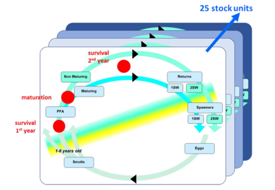
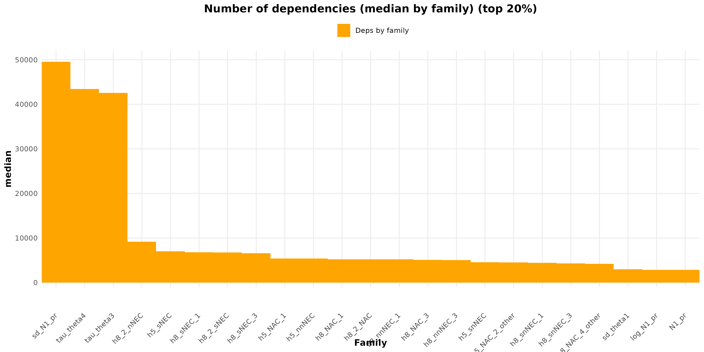
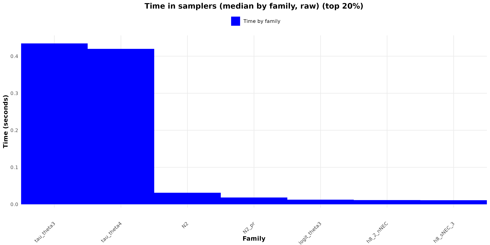
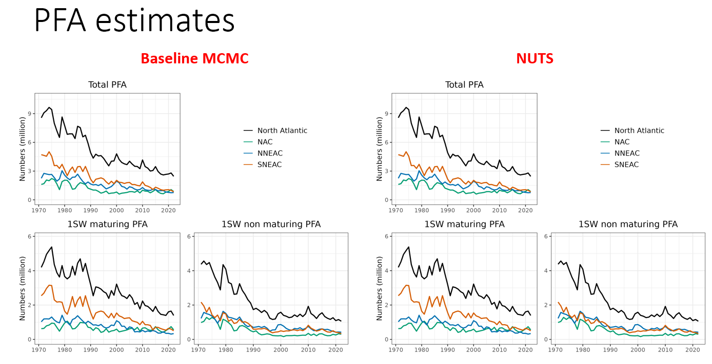
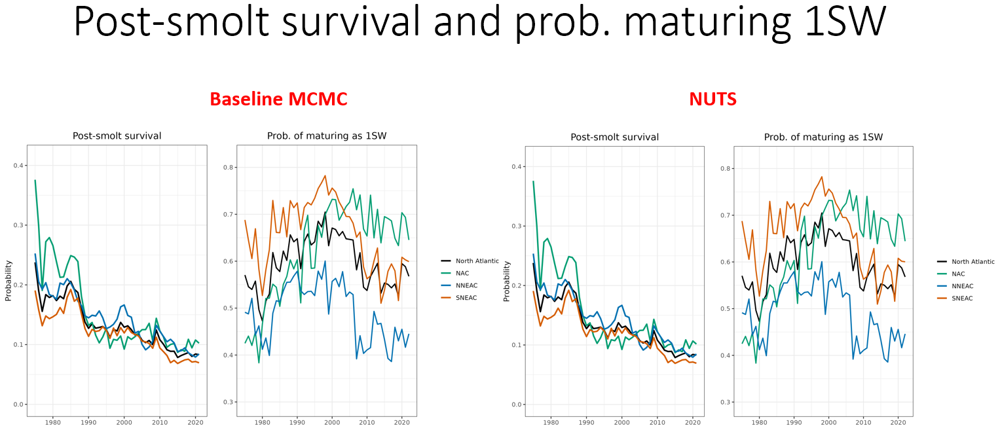
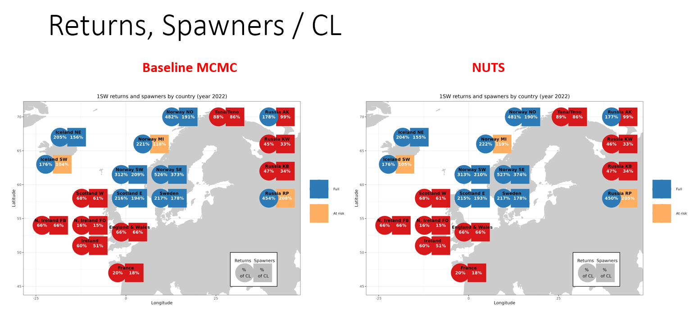
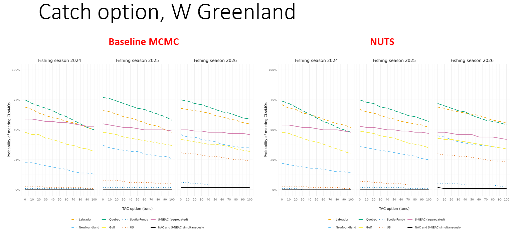

````{r setup, include=FALSE}
## ------------------------------------------------------------
## Global knitr options
## Purpose:
##  - Display all R code chunks
##  - Print console outputs, messages, and warnings
##  - Ensure reproducible and transparent reporting
## ------------------------------------------------------------

knitr::opts_chunk$set(
  echo    = TRUE,        # show R code
  results = "markup",   # print textual outputs in the document
  message = TRUE,       # show messages (message())
  warning = TRUE,       # show warnings
  error   = TRUE,       # keep rendering and display errors if they occur
  comment = "",         # do not prefix outputs with '##'
  prompt  = FALSE,      # avoid console-like '>' prompts
  fig.width  = 7,
  fig.height = 5
)

## Improve readability of printed outputs
options(
  width = 90,           # line width for console outputs
  scipen = 999          # avoid scientific notation when possible
)
````

# Introduction

The second case study is based on a hierarchical, integrated Bayesian life-cycle model developed and operationalised within the International Council for the Exploration of the Sea Working Group on North Atlantic Salmon (ICES WGNAS) to provide stock assessment and multi-year catch advice for Atlantic salmon (Salmo salar) at the scale of the North Atlantic basin. This framework explicitly embeds an age- and stage-structured population dynamics model within a Bayesian inferential architecture, enabling simultaneous estimation of key demographic processes — including post-smolt survival and the probability of maturation after one winter at sea (1SW vs 2SW) — while coherently integrating heterogeneous time-series data on returns and harvests across 25 stock units spanning North America, Northern Europe, and Southern Europe. Such an approach harmonises life-history dynamics among stock units, accounts for mixed-stock fisheries, and propagates observational and process uncertainty through to management quantities of interest [@rivot2019_arxiv; @ices2024_wkbsalmon; @ices2024_wgnas]; it builds on earlier hierarchical Bayesian life-cycle assessments developed for Atlantic salmon stock evaluation [@massiotgranier2014_icesjms] and has been formally benchmarked and adopted within the ICES advisory workflow [@ices2024_wkbsalmon; @ices2024_wgnas].

From a methods in ecology perspective, Bayesian hierarchical life-cycle models like this extend traditional stock assessment by jointly modelling latent demographic state variables and observation processes, which is critical when data quality and availability vary across spatial and temporal scales. By borrowing strength across stock units via shared hyperparameters and structured covariance, these models improve estimation of rare or poorly observed states (e.g., marine survival), while accommodating spatial synchrony and life-history variation characteristic of Atlantic salmon populations [@rivot2019_arxiv; @ices2024_wgnas].

In our NIMBLE implementation, the resulting probabilistic graphical model contains >80,000 nodes, presenting a substantial computational challenge that makes it an ideal stress test for sampling optimisation frameworks. Structural diagnostics and sampler-level benchmarks consistently highlighted two dominant computational bottlenecks: the first-year-at-sea survival parameter (θ₃), which governs the transition from smolt to post-smolt survival (a phase empirically known to contribute disproportionately to total population variability in Salmo salar life cycles), and the maturation probability parameter (θ₄), which determines the proportion of individuals returning after one versus multiple sea winters. Empirically and from life-history theory, these components capture the most consequential demographic transitions in Atlantic salmon and exhibit high variability across stock units and through time [see e.g. @rivot2019_arxiv; marine survival declines documented in ICES literature and analyses of life-history trait variation]. Because both θ₃ and θ₄ are modelled on the logit scale to ensure probabilistic constraints while permitting hierarchical shrinkage, they occupy large swathes of the parameter space and strongly influence posterior geometry — a property that can slow convergence and lower effective sample size (ESS) in many MCMC samplers.

Importantly, the full model formulation used here yields a fully differentiable posterior, enabling the use of gradient-based algorithms such as Hamiltonian Monte Carlo (HMC) and the No-U-Turn Sampler (NUTS) to improve sampling efficiency for these high-impact components. As illustrated in Figure X, this approach yields coherent posterior estimates of key demographic parameters across all stock units, enhancing both inference and operational advice under full propagation of uncertainty [@rivot2019_arxiv; @ices2024_wgnas].

```{r Life cycle}

```
*Figure 1. Scheme of the stage-based structured life cycle model* [@RivotEtAl_2019_LCM]

# Step 0 – Load packages

```{r load-packages}
library(coda)
library(ggplot2)
library(nimble)
library(nimbleHMC)
```

```{r load-samoptipro}
devtools::load_all("~/samOptiPro_packages_dev/samOptiPro")
devtools::document()
devtools::load_all()
```

Before initiating any sampler optimisation, a set of mandatory preparatory steps is required to ensure that the WGNAS life-cycle model is correctly specified, reproducible, and amenable to diagnostic analysis. These prerequisites include Step 1 – simulated data generation, definition of initial values, and monitor specification, Step 2 – loading the WGNAS model code and associated data structures, and Step 3 – building and compiling the model within the NIMBLE framework. In this workflow, the function build_M() acts as the central entry point for most tools implemented in samOptiPro: it encapsulates model construction, consistency checks, and compilation, and returns a fully operational NIMBLE model object. Completing these steps is essential before any optimisation is attempted, as all subsequent diagnostics, benchmarking procedures, and sampler comparisons rely on a stable, compiled model with valid initialisation and monitoring schemes.

# Step 1 – Simulated data, initial values and monitors

```{r inputs-data-monitors}

# ================================================

# Section 0 - setup R environment

isCluster <- TRUE
source("~/samOptiPro_packages_dev/samOptiPro/vignettes/WGNAS_model1/Rscript/0_setup.R")

# ================================================

# Section 1 - Inits generation

#source("~/samOptiPro_packages_dev/samOptiPro/vignettes/WGNAS_model1/Rscript/1_generate_inits.R")
inits_nimble <- readRDS("~/samOptiPro_packages_dev/samOptiPro/vignettes/WGNAS_model1/input_data/inits_nimble.rds")

# ------------------------------------------------------------------
# Load Monitors (cleaned – forecast/hindcast-safe)
# ------------------------------------------------------------------

monitor <- c(

  # ================================================================
  # Abundances (life-cycle states)
  # ================================================================
  "N1", "N1_1", "N1_2", "lagged_eggs",
  "N2", "N3", "N3_tot",
  "N4", "N5", "N8",
  "N6", "N9", "N9_2",
  "N8_1", "N8_2",
  "N7",
  "N10", "N10_2",

  # Log-abundances
  "logN6", "logN9",

  # ================================================================
  # Harvest rates
  # ================================================================
  "h5_NEC_1", "h5_NAC_1", "h5_NAC_2",
  "h8_NEC_1", "h8_NAC_1", "h8_2",
  "h8_NEC_3", "h8_NAC_3", "h8_NAC_4",
  "h6_hw", "h9_hw",
  "h6_hw_delSp", "h9_hw_delSp",

  # ================================================================
  # Catches
  # ================================================================
  "C6_hw_delSp", "C9_hw_delSp",
  "C6_hw", "C9_hw",
  "C8_2",
  "p_C8_2_NECNAC", "p_C8_2_NECsn",

  "C5_NEC_1", "p_C5_NEC_1_3sub",
  "C5_NAC_1", "C5_NAC_2",

  "C8_NEC_1", "p_C8_NEC_1_3sub",
  "C8_NAC_1",

  "C8_NEC_3", "p_C8_NEC_3_3sub",
  "C8_NAC_3", "C8_NAC_4",

  # ================================================================
  # Survival & maturation (key demographic processes)
  # ================================================================
  "logit_theta3", "logit_theta4",
  "tau_theta3", "tau_theta4",

  # ================================================================
  # Smolt age structure
  # ================================================================
  "p_smolt_stoch",

  # ================================================================
  # Eggs → smolts survival
  # ================================================================
  "theta1",

  # ================================================================
  # Initialisation / priors (first cohort)
  # ================================================================
  "logit_theta3_pr",
  "p_smolt_stoch_pr",
  "N1_pr",
  "log_N9_pr",
  "N2_pr"
)

```

# Step 2 – WGNAS Model 

```{r WGNAS-model}
model.nimble <- nimbleCode({

  # ATLANTIC SALMON LIFE CYLE MODEL
  # Etienne RIVOT, Maxime OLMOS, Rémi PATIN, Pierre-Yves HERNVANN

  ### Etienne Rivot & Maxime Olmos - Juin 2020
  ### PY Hernvann - 20 Août 2020 : modify the parameter and variable names
  ### R. Patin - 2022 : change model structure to allow conditionning for hindcasting/forecasting mode
  ### E. Rivot - 13 Oct 2023 - Modifications to consider new simplified hypotheses for catch allocation in Faroes & Greenland
  #   E. Rivot Last modif 16 Febr 2024
  # ============================================================================ #
  # ============================================================================ #

  #  User guide (control variable, critical stages and transitions) -------------------------------

  # Hindcasting ans Forecasting -------------------------------

  # The code can be used for both hindcasting and forecasting (simulation)
  # (depending on the boolean variable "hindcast" (takes values TRUE / FALSE)
  # The time index may be adjusted depending on the way the model is used (see below)
  # Some sections of the code (those with no condition) are used for both hindcast and forecast
  # Other sections are specific to the hindcasting or forecasting phase
  # - Section selected for hindcasting only - Condition "if {hindcast} else {}"
  # - Section selected for forecasting only - Condition "if {!hindcast} else {}"
  # Caution : "else {}" is sbsolutely required to avoid bug

  # Time index t ---------------------------------------------

  # Time index t has different bounds depending on the hindcasting/forecasting mode
  # Different variables date_begin, date_end, date_end_hindcast, year_after
  # are used in the code. date_begin (first year) and date_end (last year) are adjusted
  # depending on the mode (hindcast/forecat)
  # *Hindcast
  # - date_begin set to 1 and date_end_hindcast = last year in the time series of data
  #  (date_end_hindcast for 2SW and date_end_hindcast-1 for 1SW
  # - date_end is automatically set to date_end_hindcast in the hindcasting mode
  # *Forecast
  # - date_begin set to the last year of the time series of data
  # - date_end set to date_end hindcast + year_after = number of forecasting years


  # Spatial index r --------------------------------------------

  # r = 1,...,N : stock units
  # N = 25
  # N_NAC = 6 (index from 1:6)
  # N_NEC = 19 (index from 7:25)

  # See "0_colors_and_country_definition.R" in data to see the order of the 25 SU in the model

  # Short name of the 25 SU (in the order in the data)
  # NAC - 	1:6 (N_NAC=6):		"LB", "NF", "QC", "GF", "SF", "US",
  # sNEC -	7:14 (N_sNEC=8):	"FR", "EW", "IR", "NI_FO","NI_FB", "SC_WE", "SC_EA", "IC_SW",
  # sn_NEC - 15:19 (N_snNEC=5):	"IC_NE", "SW", "NO_SE", "NO_SW", "NO_MI"
  # nn_NEC - 20:25 (N_nnNEC=6):	"NO_NO", "FI", "RU_KB", "RU_KW", "RU_AK", "RU_RP"

  # Full name of the 25 SU
  # NAC:	"Labrador", "Newfoundland", "Quebec", "Gulf", "Scotia-Fundy", "US",
  # sNEC:	"France", "EnglandWales", "Ireland", "Ireland.N_FO","Ireland.N_FB", "Scotland_West", "Scotland_East","Iceland.SW",
  # snNEC:	"Iceland.NE","Sweden","Norway_SE","Norway_SW","Norway_MI",
  # nnNEC:	"Norway_NO","Finland","Russia_KB","Russia_KW","Russia_AK","Russia_RP"

  # Main variables  ------------------------------------------

  # N1[t,r]								Total eggs deposition
  # N1_1[t,r], N1_2[t,r] 	Eggs spawned by 1SW and 2SW, respect
  #                       For NAC,  N1_2[t,r] is the egg deposition calculated from N10_2[t,r] = 2SW component of the spawners
  # N2[t,r]								Total smolt produced by the spawning deposition N1[t,r]
  # N3[t,k,r]							Smolts of age k migrating year t
  # N3_tot[t,r]						Total smolts migrating year t (sum over ages k)
  # N4[t,r]								PFA
  # N5[t,r] / N8[t,r]			Maturing / non maturing PFA
  # N6[t,r] / N9[t,r]			Returns 1SW / 2SW
  # N9_2[t,r]             Returns 2SW component only - Calculated from prop_returns_2SW[t,r]
  # N7[t,r] / N10[t,r]		Spawners 1SW / 2SW
  # N10_2[t,r]            Spawners 2SW component only - Calculated from prop_spawners_2SW[t,r]

  # logit_theta3[t,r] & theta3[t,r]		Survival N3_tot --> N4
  # logit_theta4[t,r] & theta4[t,r]		Proportion maturing N4 --> (N5 / N8)
  # logit_theta3 and logit_theta4     modelled as multivariate random walk in the logit scale

  # Maturing PFA --> Spawners 1SW ------------

  # N5[t,r] --> N6[t,r]					Maturing PFA --> 1SW returns

  # C5_NEC...  C5_NAC...				Sequential catches on maturing fish from NEC and NAC (see below)
  # h5_NEC...  h5_NEC...	 			Associated harvest rates
  #										          Different for NEC and NAC (see below)

  # Catches, Harvest rates and escapement for sequential fisheries at sea
  # Different for NEC and NAC

  # NEC ------------
  # C5_NEC_1[t,r]	h5_NEC_1[t,r]			Faroes 1SW mature

  # NAC ------------
  # C5_NAC_1[t,r]		h5_NAC_1[t]			LB-NFL fishery SFA 3-7 on 1SW mature (harvest rate homogeneous among SU)
  # C5_NAC_2[t,r]		h5_NAC_2[t,r]		LB-NFL fishery SFA 8-14 on 1SW mature

  # Returns and Spawners
  # N6[t,r] --> N7[t,r]						Returns 1SW --> spawners 1SW
  # C6_hw[t,r]	& h6_hw[t,r]				Homewater catches 1SW and harvest rates
  # C6_hw_delSp[t,r] & h6_hw_delSp[t,r]		Catches of delayed spawners in homewaters - 1SW


  # Non maturing PFA --> Spawners 2SW ------------
  #
  # N8[t,r] --> N9[t,r]						Non maturing PFA --> 2SW returns
  # N8_1[t,r]								Escapement fishery before WG
  # N8_2[t,r]								Escapement Greenland fishery
  # C8_NEC...  C8_NAC...					Sequential catches on maturing fish (see below)
  #											Different for NEC and NAC (see below)
  # h8_NEC...  h8_NEC...	 				Associated harvest rates

  # N9[t,r] --> N10[t,r]					Returns 2SW --> spawners 2SW
  # C9_hw[t,r]	h9_hw[t,r]					Homewater catches 2SW and harvest rates
  # C9_hw_delSp[t,r] & h9_hw_delSp[t,r]		Catches of delayed spawners in homewaters - 2SW

  # Catches, Harvest rates and escapement for sequential fisheries at sea ------------
  # Different for NEC and NAC

  # NEC ------------
  # C8_NEC_1[t,r]	h8_NEC_1[t,r]			Faroes fishery 1SW non mature
  # C8_2[t,r]			h8_2[t,r]			Greenland fishery on 2SW (common with NAC)
  # C8_NEC_3[t+1,r]	h8_NEC_3[t,r]			Faroes fishery on 2SW

  # NAC ------------
  # C8_NAC_1[t,r]		h8_NAC_1[t]		 	LB-NFL fishery all zone on 1SW non mature (harvest rate homogeneous among SU)
  # C8_2[t,r]			  h8_2[t,r]			Greenland on 2SW (NAC and NAC - harvest rates variable among SU)
  # C8_NAC_3[t+1,r]	h8_NAC_3[t]				LB-NFL fishery zone 3-7 on 2SW (harvest rate homogeneous among SU)
  # C8_NAC_4[t,r]		h8_NAC_4[t,r]		LB-NFL other zone + SPM fishery on 2SW


  # ============================================================================ #
  # ============================================================================ #


  # ---------------------------------------------------------------------------#
  # ---------------------------------------------------------------------------#
  #                           Hindcating
  # ---------------------------------------------------------------------------#
  # ---------------------------------------------------------------------------#


  # FIXED PARAMETERS or TIGHT INFORMATIVE PRIORS ---------------------

  # M = Monthly natural mortality rate M
  # Considered constant after PFA
  # Is applied for all stages between PFA and returns using duration deltat..

  # M fixed to E_M
  for(t in date_begin:date_end)
  {
    for(r in 1:N)
    {
      M[t,r] <- E_M
    }
  }

  # Alternatively one can also use a tight informative prior
  # ~LogNormal with E_M and CV_M fixed in the data
  # tau_log_M <- 1/log(CV_M*CV_M + 1)
  # E_log_M <- log(E_M) - 0.5/tau_log_M
  # M ~ dlnorm(E_log_M,tau_log_M)

  # Inter-annual stochasticity
  # Eggs N1 --> total Smolts per cohorts N2
  # CV_theta1 fixed to an arbitrarily value (in the Constants)
  # Default value: CV_theta1[r] = 0.4 for all SU r
  for(r in 1:N)
  {
    sd_theta1[r] <- sqrt(log(CV_theta1[r]*CV_theta1[r] + 1))
  }


  # PRIOR ON POST-SMOLT SURVIVAL and PROBABILITY MATURING PFA ---------------------------------

  # Prior on post-smolts survival - theta3 : Smolt N3_tot[t] --> PFA N4[t+1] ----------------
  # and probability to mature the first year at sea - theta4 : N4[t] --> N5[t] + N8[t]

  # Time series modeled as MultiNormal with NxN variance-covariance matrix

  # Note :
  # Variance - covariance matrix is only estimated starting at year 6
  # Year 1:5 - estimates are sensitive to prior on number of fish (smolts)
  # not generated by the model
  # --> Temporal variations modelled through independent random terms
  #     Variance-covariance not estimated
  # Year 6:n : Start of multivariate random walk
#}

  # Post-smolts survival = theta3  -----------------------------------------
  # Used for the transition N3_tot[t] --> N4[t+1]
  # theta3 modelled as a multivariate random walk in the logit scale

  # Years in 1:5

  if(hindcast){
    for(r in 1:N)
    {
      for(t in 1:5)
      {
        logit_theta3[t,r] ~ dnorm(0,1)
      }
    }
  } else {

  } # end if(hindcast)

  # Years in 6:n

  # Prior on the variance-covariance matrix
  # Wishart prior on the precision (Omega and ddl fixed in the Constants
  # Omega = identity(N) and ddl=N
  tau_theta3[1:N, 1:N] ~ dwish(omega[1:N, 1:N],N)

  # Multivariate random walk in the logit scale
  # Theta3 stops on year date_end-2 as it generates N5(date_end_hindcast-1) (-> N6(date_end_hindcast-1)) and N8(date_end_hindcast-1)
  # (-> N9(date_end_hindcast)) the last year used in observation equations
  for(t in (date_begin+4):(date_end-3))
  {
    logit_theta3[t+1, 1:N] ~ dmnorm(logit_theta3[t,1:N], tau_theta3[1:N,1:N])
  }

  # Back to natural scale
  for(r in 1:N)
  {
    for(t in date_begin:(date_end-2))
    {
      theta3[t,r] <- ilogit(logit_theta3[t,r])
    }
  }


  # Probability maturing PFA  theta4 --------------------------------------
  # Used for the transitions N4[t] --> N5[t] + N8[t]
  # theta4 modelled as a multivariate random walk in the logit scale

  # Years in 1:5

  if(hindcast){
    for(r in 1:N)
    {
      for(t in 1:5)
      {
        logit_theta4[t,r] ~ dnorm(0,1)
      }
    }
  } else {

  } # end if(hindcast)

  # Years in 6:n

  # Prior on the variance-covariance matrix
  # Wishart prior on the precision (Omega and ddl fixed)
  # Omega = identity(N) and ddl=N
  tau_theta4[1:N, 1:N] ~ dwish(omega[1:N, 1:N],N)

  # Multivariate random walk in the logit scale
  # theta4 stops on year date_end-1 as it generates N5(date_end-1) and N8(date_end-1), the last
  # cohort used in observation equations
  for(t in (date_begin+4):(date_end-2))
  {
    logit_theta4[t+1, 1:N] ~ dmnorm(logit_theta4[t,1:N], tau_theta4[1:N,1:N])
  }

  # Back to natural scale
  for(r in 1:N)
  {
    for(t in date_begin:(date_end-1))
    {
      theta4[t,r] <- ilogit(logit_theta4[t,r])
    }
  }


  # DEMOGRAPHIC TRANSITIONS ------------------------------------------------------------------------------

  # N7, N10 = Number of spawners 1SW and 2SW respectively ---------------------------------------------------------
  # defined as = returns (N6 and N9, respect.) - Homewater catches

  if(hindcast){
    # Harvest rate not needed in forecast
    # catches equations will be changed for the forecasting phase (see Forecasting section)

    # Harvest rate - Homewater fishery
    # date_end_hindcast is the last year of data for 2SW
    # then (date_end_hindcast-1) is the last year for which returns are updated by data

    for(r in 1:N)
    {
      for(t in 1:(date_end_hindcast-1))
      {
        h6_hw[t,r] ~ dbeta(1,2)
      }

      for(t in 1:(date_end_hindcast))
      {
        h9_hw[t,r] ~ dbeta(1,2)
      }
    }

    # Harvest rate on delayed spawners
    # Null for all SU except r=23 (RU.KW)
    # Only r = 23 has a likelihood for those catches
    for(r in 1:N)
    {
      # Dummy value - no delayed spawners modelled year 1
      h6_hw_delSp[1,r] <- 99
    }
    for(t in 2:(date_end_hindcast-1))
    {
      # Delayed spawners only for stock-unit r = 23 = RU.KW
      h6_hw_delSp[t,23] ~ dbeta(1,2)
      for(r in 1:22)
      {
        h6_hw_delSp[t,r] <- 0
      }
      for(r in 24:N)
      {
        h6_hw_delSp[t,r] <- 0
      }
    }

    for(r in 1:N)
    {
      # Dummy value - no delayed spawners modelled year 1
      h9_hw_delSp[1,r] <- 99
    }
    for(t in 2:(date_end_hindcast))
    {
      # Delayed spawners only for stock-unit r = 23 = RU.KW
      h9_hw_delSp[t,23] ~ dbeta(1,2)
      for(r in 1:22)
      {
        h9_hw_delSp[t,r] <- 0
      }
      for(r in 24:N)
      {
        h9_hw_delSp[t,r] <- 0
      }
    }

  } else {

  } # end if(hindcast)

  # Catches and escapement --------------------------------------------------------
  # Escapement of 1SW fish after all fisheries and sources of mortality is N7

  for(r in 1:N)
  {

    # 1SW ----------------------------------------
    #
    # Spawners (escapement)
    # theta6_delsP[t] (resp. theta9_delsP[t] for 2SW) = proprotion of delayed spawners
    # = the proportion of fish that returns to homewater year [t-1] but spawn the year after
    # Must be considered AFTER the HW catches (see Run Reconstruction model NEC, lines 3470)
    # (1-theta6_delsP[t])*(N6[t] - HWcatches[t]) = number of fish N6[t] that will spawn year [t]
    # theta6_delsP[t-1]*(N6[t-1]-HWcatches[t-1]) = number of returns of the previous year (N6[t-1]) that will spawn year [t] (delayed)
    # Those delayed spawners are subject to additional catches (only for r = 23 = RU.KW, see data)
    # with harvest rate h6_hw_delSp (resp h9_hw_delSp for 2SW)

    # theta6_surv and theta9_surv account for additionnal mortality in freshwater
    # Fixed in the data (fixed to 1 for all SU except Scotland E and W)

    for(t in (date_begin+1):(date_end_hindcast-1))
    {
      N7[t,r] <-
        theta6_surv[t,r] * (
          N6[t,r]*(1- h6_hw[t,r])*(1 - theta6_delSp[t,r]) +
            N6[t-1,r]*(1- h6_hw[t-1,r])*theta6_delSp[t-1,r]*(1-h6_hw_delSp[t,r])  )
    }

    if(hindcast){
      # First year (no delayed spawners)
      N7[1,r] <- theta6_surv[1,r]*N6[1,r]*(1- h6_hw[1,r])

      # Homewater catches (likelihood until t = (date_end_hindcast-1) only)
      for(t in 1:(date_end_hindcast-1))
      {
        C6_hw[t,r] <- h6_hw[t,r] * N6[t,r]
      }

      # Catches on delayed spawners
      # Will be 0 for all r except r = 23 = RU.KW
      C6_hw_delSp[1,r] <- 1		# Dummy - No delayed spawners defined for the first year
      for(t in 2:(date_end_hindcast-1))
      {
        C6_hw_delSp[t,r] <- N6[t-1,r]*(1- h6_hw[t-1,r])*theta6_delSp[t-1,r]*h6_hw_delSp[t,r]
      }

    } else {

    } #end if(hindcast)

    # 2SW ------------------------------------------------------------------------
    #
    # Spawners (escapement)
    # Same as 1SW
    # Stocking_2SW = additional stocking of adults pre-spawning fish directly in rivers
    # Stocking_2SW is 0 for all SU, except for USA (r=6)
    # For USA (source = Tim Sheehan):
    # For years 1970-1999, NO adult fish were stocked and spawner estimates are logically LOWER than return estimates
    # For the years 2000-2020, pre-spawning adult fish were stocked and therefore spawner estimates are LARGER than return estimates
    # If returns = Spawners, means that no adult fish were stocked and no in-river harvest was recorded for returning fish

    for(t in (date_begin+1):(date_end_hindcast))
    {
      N10[t,r] <-
        theta9_surv[t,r]*
        ( N9[t,r]*(1- h9_hw[t,r])*(1 - theta9_delSp[t,r]) + N9[t-1,r]*(1- h9_hw[t-1,r])*theta9_delSp[t-1,r]*(1-h9_hw_delSp[t,r]) ) + Stocking_2SW[t,r]

      # Modif Etienne Rivot - 16 Febr 2024
      # 2SW component only (no proportion applied for NEAC)
      N10_2[t,r] <- N10[t,r] * prop_2SW_spawners[t,r]
    }

    if(hindcast){

      # First year (no delayed spawners)
      N10[1,r] <- theta9_surv[1,r]*N9[1,r]*(1-h9_hw[1,r])

      # Modif Etienne Rivot - 16 Febr 2024
      # 2SW component only (no proportion for NEAC)
      N10_2[1,r] <- N10[1,r] * prop_2SW_spawners[1,r]

      # Homewater catches (likelihood until t = date_end_hindcast)
      for(t in 1:(date_end_hindcast))
      {
        C9_hw[t,r] <- h9_hw[t,r]*N9[t,r]
      }

      # Catches on delayed spawners 2SW
      # Will be 0 for all r except r = 23 = RU.KW
      C9_hw_delSp[1,r] <- 1		# Dummy - No delayed spawners defined for the first year
      for(t in 2:(date_end_hindcast))
      {
        C9_hw_delSp[t,r] <- N9[t-1,r]*(1- h9_hw[t-1,r])*theta9_delSp[t-1,r]*h9_hw_delSp[t,r]
      }

    } else {

    } # end if(hindcast)
  }


  # Number of eggs from spawners (N1) --> Total Smolts per cohort (N2) -----------------------------------------------
  # N2 has the same time indice than N1 fo simplicity

  # Those equations stand for both hindcast and forecast
  # date_begin and date_end are adjusted depending on the hindcasting/forecasting mode

  # N1: nb eggs -----------------

  for(r in 1:N)
  {
    for(t in date_begin:(date_end-4))
    {
      # stops in year (date_end_hindcast-4) because N1(date_end_hindcast-4) -> N3(date_end_hindcast-2)
      # and only N3(date_end_hindcast-2) is ever used in model

      # Total eggs
      # This is what comes in the population dynamics model
      N1[t,r] <- N7[t,r] * prop_female[1,r,t] * eggs[1,r,t] + N10[t,r] * prop_female[2,r,t] * eggs[2,r,t]

      # For calculation of complicance to conservation limits
      # Calculation of the number of eggs deposited by 1SW (N1_1) and 2SW (N1_2) only
      # Variables N1_1 and N1_2 are not used in the model - just stored for posterior treatment (risk analysis)
      # An additional proportion is applied to calculate the egg deposition by the fraction that are 2SW
      # This proportion is different of 1 only for NEAC
      # Eggs spawned by 1SW only
      N1_1[t,r] <- N7[t,r] * prop_female[1,r,t] * eggs[1,r,t]
      # Eggs spawned by 2SW only for NAC - N10_2 is used (and not N10)
      # This is to account for the fact that compliance to CL in NAC considers 2SW only (and not all large fish)
      N1_2[t,r] <- N10[t,r] * prop_female[2,r,t] * eggs[2,r,t] * prop_2SW_spawners[t,r]

    }
  }


  for(r in 1:N)
  {
    for(t in date_begin:(date_end-4))
    {
      # N1 --> N2 (Smolts) -----------------
      #

      # Mean survival known and fixed to E_theta1 (Constants)
      # CV_theta1 fixed in the data set (Constants)

      # Without density dependence
      logN2[t,r] <- log(E_theta1[t,r]*N1[t,r]) - 0.5*(sd_theta1[r]*sd_theta1[r])
      # With density dependence (parameters a and B[r] must be known)
      # theta1_ddp[t,r] <- a/(1+B[r]*N1[t,r])
      # logN2[t,r] <- log(theta1_ddp[t,r]*N1[t,r]) - 0.5*(sd_theta1[r]*sd_theta1[r])

      N2[t,r] ~ dlnorm(logN2[t,r], sdlog = sd_theta1[r])

      # theta1 is the realized survival - useful for monitoring
      theta1[t,r] <- N2[t,r]/N1[t,r]
    }
  }


  # Total Smolt per cohort (N2) --> Smolts distribution by age class (6 age classes) -----------------------------------
  #
  # Ideally, proportions to split total smolts number into different smolt ages should be ~ Dirichlet Informative prior
  # To improve computational speed, the Dirichlet could be simulated through independent Gamma
  # Here, to further improve computational speed, this is simplified into a deterministic split directly from the proportion of smolt ages

  # Those equations stand for both hindcast and forecast
  # date begin and date _end are adjusted depending on the hindcasting/forecasting mode

  for(r in 1:N)
  {

    for(t in date_begin:(date_end-4))
    {

      # Proportion of smolts ages
      # k = smolt ages from 1 to nSm=6
      for(k in 1:nSm)
      {
        # Deterministic version
        p_smolt_stoch[t,k,r] <- p_smolt[t,k,r]

        # Stochastic version
        # +1 is needed to avoid mu_psm = 0 (would eventually crash the gamma()
        # mu_psm[t,k,r] <- p_smolt[t,k,r]*N_Sample_sm + 1
        # p_smolt_stoch[t,1:nSm,r] ~ ddirich(mu_psm[t,1:nSm,r])
        # To optimize sampling efficiency, the Dirichlet must be written using gamma
      }

    }

    # N3
    # stops in year (date_end_hindcast-4) because N2(date_end_hindcast-4) -> N3(date_end_hindcast-2) --> N3(date_end_hindcast+3) and only
    # N3(date_end_hindcast-2) is ever used in model.
    # N3 are the smolts of age k - k=1:6 - Smolt 1 (k=1) migrate at t+2 with ref to N2, smolt 2 (k=2= migrate at t+3 ...

    # Those equations stand for both hindcast and forecast
    # date begin and date _end are adjusted dependeing on the hindcasting/forecasting mode

    for(t in date_begin:(date_end-4))
    {
      for(k in 1:nSm)
      {
        N3[t+1+k,k,r] <- p_smolt_stoch[t,k,r]*N2[t,r]
      }
    }

    # N3 tot : Total smolt migrating each year t
    # stops in year (date_end_hindcast-2) because N3(date_end_hindcast-2) -> N3_tot(date_end_hindcast-2) -> N4(date_end_hindcast-1) last year
    # used for observation equations
    for(t in date_begin:(date_end-2))
    {
      N3_tot[t,r] <- sum(N3[t,1:nSm,r])
    }

    # Dummy - not used in the model - no effect on the model
    # Just to be sure the array N3 has values in all cells (no cells with NA)

    for(s in 1:( nSm-1 ))
    {
      for(k in 1:s)
      {
        N3[(date_end-2+s),k,r] <- 99
      }
    }

  } #end loop on r


  # Total Smolt migrating yeat t (N3_tot) --> PFA (N4) --------------------------------------------
  # From N3_tot and survival theta3

  # Those equations stand for both hindcast and forecast
  # date begin and date _end are adjusted dependeing on the hindcasting/forecasting mode

  for(r in 1:N)
  {
    for(t in date_begin:(date_end-2))
    {
      # logN4[t+1,r] <- log(theta3[t,r]*N3_tot[t,r]) - 0.5*(sd_dummy*sd_dummy)
      # N4[t+1,r] ~ dlnorm(logN4[t+1,r], sdlog = sd_dummy)
      N4[t+1,r] <- theta3[t,r]*N3_tot[t,r]
    }
  }

  # Computation of lagged eggs associated with PFA year [t]
  # Has no role in the model
  # This is only needed for the lagged-eggs - PFA pseudo stock-recruitment analysis
  # (hockey-Stick) that will be done as a post-treatment (to estimate CL)
  # N1 exists starting at t =date_begin
  # N4 exists until year t = date_end-1
  for(t in (date_begin+8):(date_end-1))
  {
    for(r in 1:N)
    {
      lagged_eggs[t,r] <-   N1[t-8,r]*p_smolt_stoch[t-8,6,r] +
        N1[t-7,r]*p_smolt_stoch[t-7,5,r] +
        N1[t-6,r]*p_smolt_stoch[t-6,4,r] +
        N1[t-5,r]*p_smolt_stoch[t-5,3,r] +
        N1[t-4,r]*p_smolt_stoch[t-4,2,r] +
        N1[t-3,r]*p_smolt_stoch[t-3,1,r]
    }
  }

  # PFA --> maturing (N5) / non maturing (N8 PFA) -------------------------------------------------
  # From N4 (PFA) and theta4 = proba. maturing the first year at sea

  # Those equations stand for both hindcast and forecast
  # date begin and date _end are adjusted dependeing on the hindcasting/forecasting mode

  for(r in 1:N)
  {
    for(t in date_begin:(date_end-1))
    {
      # logN5[t,r] <-  log(N4[t,r] * theta4[t,r]) - 0.5*(sd_dummy*sd_dummy)
      # N5[t,r] ~ dlnorm(logN5[t,r], sdlog = sd_dummy)
      N5[t,r] <- N4[t,r] * theta4[t,r]
      #
      # logN8[t,r] <- log(N4[t,r] * (1-theta4[t,r])) - 0.5*(sd_dummy*sd_dummy)
      # N8[t,r] ~ dlnorm(logN8[t,r], sdlog = sd_dummy)
      N8[t,r] <- N4[t,r] * (1-theta4[t,r])
    }
  }


  # Maturing PFA (N5) -> 1SW returns (N6)  -------------------------------------------------------

  # NEC - Faroes fisheries and returns to N6   -----------------------------------------

  # Those equations stand for both hindcast and forecast
  # date begin and date _end are adjusted dependeing on the hindcasting/forecasting mode

  for(r in 1:N_NEC)
  {
    for(t in date_begin:(date_end-1))
    {
      # Natural mortality between sequential fisheries
      # Directly deduced from M and duration deltat5_1 and deltat5_2 in the data (different among stock units but constant over time)
      # PFA -> Faroes m
      theta5_1[t,N_NAC+r] <- exp(-M[t,r]*deltat5_1[N_NAC+r])

      # Faroes  -> returns
      theta5_2[t,N_NAC+r] <- exp(-M[t,r]*(deltat5_2[N_NAC+r]))
    }
  }

  # Exploitation rate - Faroes 1SWm

  if(hindcast){
    # Note : Exploitation rate only defined a priori for hindcasting
    #        Not needed a priori in forecasting, because forecasting scenarios directly involve catches

    # Hypothesis of homogeneous harvest rate among SU within each of the three sub complex sNEC, snNEC, nnNEC
    # Harvest rate for complex sNEC
    for(t in 1:(date_end_hindcast-1))
    {
      h5_sNEC[t] ~ dbeta(1,2)
      # Harvest rate for complex snNEC
      h5_snNEC[t] ~ dbeta(1,2)
      # Harvest rate for complex nnNEC
      h5_nnNEC[t] ~ dbeta(1,2)
      # All SU within the same subcomplex have the same harvest rate
      for (r in 1:N_sNEC) { h5_NEC_1[t,r] <- h5_sNEC[t] }
      for (r in (N_sNEC+1):(N_sNEC+N_snNEC)) { h5_NEC_1[t,r] <- h5_snNEC[t] }
      for (r in (N_sNEC+N_snNEC+1):(N_sNEC+N_snNEC+N_nnNEC)) { h5_NEC_1[t,r] <- h5_nnNEC[t] }
    }

    # Catches Faroes 1SWm
    for(t in 1:(date_end_hindcast-1))
    {
      for(r in 1:N_NEC)
      {
        # Catches for each SU
        C5_NEC_1[t,r] <-  theta5_1[t,N_NAC+r] * h5_NEC_1[t,r] * N5[t,(r+N_NAC)]
      }
      # Total catches for NEC and for the three NEC subcomplex
      C5_NEC_1_tot[t] <-  sum(C5_NEC_1[t,1:N_NEC])
      C5_NEC_1_3sub[t,1] <- sum(C5_NEC_1[t,1:N_sNEC])
      C5_NEC_1_3sub[t,2] <- sum(C5_NEC_1[t,(N_sNEC+1):(N_sNEC+N_snNEC)])
      C5_NEC_1_3sub[t,3] <- sum(C5_NEC_1[t,(N_sNEC+N_snNEC+1):(N_sNEC+N_snNEC+N_nnNEC)])

    }

  }  else {

  }# end if(hindcast)

  #  N6 : Returns 1SW
  for(r in 1:N_NEC)
  {
    for(t in date_begin:(date_end_hindcast-1))
    {
      N6[t,N_NAC+r]  <- theta5_2[t,N_NAC+r] * theta5_1[t,N_NAC+r] * (1-h5_NEC_1[t,r]) * N5[t,N_NAC+r]
    }
  }


  # NAC - LB/NF and SPM fisheries on 1SWm and returns to N6 ---------------------------------------

  # Natural mortality between sequential fisheries
  # Directly deduced from M and duration deltat5_1 and deltat5_2 in the data (different among stock units but constant over time)

  # Here data are grouped in 2 fisheries
  # - LB-NFL fishery in zones SFA (3-7) supposed to impact all SU homegeneously
  # - NFL fishery in zones SFA (8-14) + SPM supposed to impact differently fish from Labrador and other SU

  # Those equations stand for both hindcast and forecast
  # date begin and date _end are adjusted dependeing on the hindcasting/forecasting mode

  for(r in 1:N_NAC)
  {
    for(t in date_begin:(date_end-1))
    {
      # PFA to Labrador/NFDL/SPM 1SWm
      theta5_1[t,r] <- exp(-deltat5_1[r]*M[t,r])
      # Labrador/NFDL/SPM -> Returns
      theta5_2[t,r] <- exp(-deltat5_2[r]*M[t,r])
    }
  }

  # Prior for harvest rates

  if(hindcast){
    # Exploitation rate are not needed in forecasting, because forecasting scenarios directly involve catches

    for(t in 1:(date_end_hindcast-1))
    {
      # LB-NFL fishery SFA zones 3-7 on 1SW mature (harvest rate homogeneous among SU)
      # h5_NAC_1[t,r]
      h5_NAC_1[t] ~ dbeta(1,2)

      # NFL fishery other zones (8-14) + SPM on 1SW mature
      # h5_NAC_2[t,r]
      # h homogeneous among all r except separate h for Labrador (r=1)
      # Labrador SU has no catches in SPM and a different fishing rate in the LB-NFL fishery as other zone
      h5_NAC_2_lab[t] ~ dbeta(1,2)
      h5_NAC_2_other[t] ~ dbeta(1,2)

      h5_NAC_2[t,1] <- h5_NAC_2_lab[t]
      for(r in 2:N_NAC)
      {
        h5_NAC_2[t,r] <- h5_NAC_2_other[t]
      }
    }

    # Sequential catches at sea

    for(t in 1:(date_end_hindcast-1))
    {
      for(r in 1:N_NAC)
      {
        # PFA --> LB-NFL fishery SFA zones 3-7 on 1SW mature
        C5_NAC_1[t,r] <- h5_NAC_1[t] * theta5_1[t,r] * N5[t,r]

        # NFL fishery SFA zones (8-14) + SPM on 1SW mature
        C5_NAC_2[t,r] <- h5_NAC_2[t,r] * (1-h5_NAC_1[t]) * theta5_1[t,r] * N5[t,r]
      }

      # Total catches
      # LB-NFL fishery in zones SFA (3-7) - all SU in NAC
      C5_NAC_1_tot[t] <- sum(C5_NAC_1[t,1:N_NAC])
      # NFL fishery in zones SFA (8-14) + SPM - impact differently fish from Labrador and other SU
      # Lab
      C5_NAC_2_lab[t] <- C5_NAC_2[t,1]
      # All SU in NAC except Lab
      C5_NAC_2_other[t] <- sum(C5_NAC_2[t,2:N_NAC])

    }

  } else {

  } # end if(hindcast)

  # N6: Returns 1SW NAC
  # Survival after sequential catches + natural mortality theta5_1

  for(r in 1:N_NAC)
  {
    for(t in date_begin:(date_end_hindcast-1))
    {
      N6[t,r] <- theta5_2[t,r] * (1-h5_NAC_2[t,r]) * (1-h5_NAC_1[t]) * theta5_1[t,r] * N5[t,r]
    }
  }


  # Non maturing PFA (N8) -> 2SW returns (N9)  -------------------------------------------------------

  #  N8 -> N8_1 (escapement before Greenland Fishery)

  # NEC

  # Survival rate theta8_1 for the transition PFA --> Faroes ------------------------------------------
  # followed by Faroes fisheries on non mature fish 1SWnm
  # Harvest rate h8_NEC_1, variable across r

  for(t in date_begin:(date_end-1))
  {
    for(r in 1:N_NEC)
    {
      # Survival rate before Faroes fishery
      # Duration deltat8_1 in the data (variable among SU but constant over years)
      theta8_1[t,N_NAC+r] <- exp(-M[t,r]*(deltat8_1[N_NAC+r]))
    }
  }


  # Prior on exploitation rates
  # Note : Exploitation rate only defined a priori for hindcasting
  #        Not needed a priori in forecasting, because forecasting scenarios directly involve catches
  if(hindcast){

    # Hypothesis of homogeneous harvest rate among SU within each of the three sub complex sNEC, snNEC, nnNEC
    # Harvest rate for complex sNEC
    for(t in 1:(date_end_hindcast-1))
    {
      h8_sNEC_1[t] ~ dbeta(1,2)
      # Harvest rate for complex snNEC
      h8_snNEC_1[t] ~ dbeta(1,2)
      # Harvest rate for complex nnNEC
      h8_nnNEC_1[t] ~ dbeta(1,2)
      # All SU within the same subcomplex have the same harvest rate
      for (r in 1:N_sNEC) { h8_NEC_1[t,r] <- h8_sNEC_1[t] }
      for (r in (N_sNEC+1):(N_sNEC+N_snNEC)) { h8_NEC_1[t,r] <- h8_snNEC_1[t] }
      for (r in (N_sNEC+N_snNEC+1):(N_sNEC+N_snNEC+N_nnNEC)) { h8_NEC_1[t,r] <- h8_nnNEC_1[t] }
    }

    # Catches Faroes 1SW non maturing

    for(t in 1:(date_end_hindcast-1))
    {
      for(r in 1:N_NEC)
      {
        # Catches for each SU
        C8_NEC_1[t,r] <- h8_NEC_1[t,r] * theta8_1[t,N_NAC+r] * N8[t,r+N_NAC]
      }

      # Total catches for NEC and for the three NEC subcomplex
      C8_NEC_1_tot[t] <- sum(C8_NEC_1[t,1:N_NEC])
      C8_NEC_1_3sub[t,1] <- sum(C8_NEC_1[t,1:N_sNEC])
      C8_NEC_1_3sub[t,2] <- sum(C8_NEC_1[t,(N_sNEC+1):(N_sNEC+N_snNEC)])
      C8_NEC_1_3sub[t,3] <- sum(C8_NEC_1[t,(N_sNEC+N_snNEC+1):(N_sNEC+N_snNEC+N_nnNEC)])
    }


  }  else {
  } # end if(hindcast)

  # Transition N8 --> N8_1
  for(t in date_begin:(date_end_hindcast-1))
  {
    for(r in 1:N_NEC)
    {
      N8_1[t,r+N_NAC] <- theta8_1[t,N_NAC+r] * (1-h8_NEC_1[t,r]) * N8[t,r+N_NAC]
    }
  }


  # NAC

  # Survival theta8_1_NAC for the transition PFA --> LB-NF ---------------------------------------------
  # followed by LB-NF fisheries all zone on 1SW non maturing
  # Harvest rate h8_NAC_1, homogeneous across r
  # There is no distinction of fish from labrador in this fishery

  for(t in date_begin:(date_end-1))
  {
    for(r in 1:N_NAC)
    {
      # Survival rate
      # Duration deltat8_1 in the data (variable among SU but constant over years)
      theta8_1[t,r] <- exp(-M[t,r] * deltat8_1[r])
    }
  }

  if(hindcast){

    for(t in 1:(date_end_hindcast-1))
    {
      # Prior on exploitation rate
      # h homogeneous across the 6 regions

      h8_NAC_1[t] ~ dbeta(1,2)

      # Catches 1SW non maturing
      for(r in 1:N_NAC)
      {
        C8_NAC_1[t,r] <- h8_NAC_1[t] * theta8_1[t,r] * N8[t,r]
      }

      # Total catches
      C8_NAC_1_tot[t] <- sum(C8_NAC_1[t,1:N_NAC])
    }

  } else {
  } # end if(hindcast)

  # Transitions N8 --> N8_1

  for(t in date_begin:(date_end_hindcast-1))
  {
    for(r in 1:N_NAC)
    {
      N8_1[t,r] <- (1-h8_NAC_1[t]) * theta8_1[t,r]	* N8[t,r]
    }
  }


  # NAC  &  NEC

  # N8_1 --> N8_2 Greenland Fisheries---------------------------------------------------------
  # Survival theta8_2[t,r] for NAC and NEC
  # Followed by Greenland Fisheries on NAC + NEC stocks
  # Harvest rate h8_2

  # Survival rate before Greenland Fishery - theta8_2[t,r]
  # Duration deltat8_1 in the data (variable among SU but constant over years)
  for(t in date_begin:(date_end-1))
  {
    for(r in 1:N)
    {
      theta8_2[t,r] <- 	exp(-M[t,r] * (deltat8_2[r]))
    }
  }

  # Prior on harvest rates at West Greenland Fishery
  # Note : Exploitation rate only defined a priori for the hindcasting phase
  #        Not needed a priori in forecasting, because forecasting scenarios directly involve catches
  if(hindcast){

    # Hypothesis of homogeneous harvest rate among SU within NAC, sNEC and nNEC
    for(t in 1:(date_end_hindcast-1))
    {
      # Harvest rate for NAC
      h8_2_NAC[t] ~ dbeta(1,2)
      # Harvest rate for complex sNEC
      h8_2_sNEC[t] ~ dbeta(1,2)
      # Harvest rate for complex nNEC
      h8_2_nNEC[t] ~ dbeta(1,2)
      # All SU within the same subcomplex have the same harvest rate
      for (r in 1:N_NAC) { h8_2[t,r] <- h8_2_NAC[t] }
      for (r in (N_NAC+1):(N_NAC + N_sNEC)) { h8_2[t,r] <- h8_2_sNEC[t] }
      for (r in (N_NAC+N_sNEC+1):N) { h8_2[t,r] <- h8_2_nNEC[t] }
    }

    # Catches Greenland defined for all SU in NAC and NEC
    for(t in 1:(date_end_hindcast-1))
    {
      for(r in 1:N)
      {
        C8_2[t,r] <- h8_2[t,r] * N8_1[t,r] * theta8_2[t,r]
      }

      # Total catches
      C8_2_tot[t] <- sum(C8_2[t,1:N])

      # Total catches for each complex (1 = NEC & 2 = NAC)
      # NAC
      C8_2_comp[t,2] <- sum(C8_2[t,1:N_NAC])
      # NEC
      C8_2_comp[t,1] <- sum(C8_2[t,(N_NAC+1):N])

      # Total catches for each sub-complex in NEC (1 = sNEC & 2 = nNEC)
      # sNEC = Southern NEAC (including SW Iceland)
      C8_2_NEC[t,1] <- sum(C8_2[t,(N_NAC+1):(N_NAC+N_sNEC)])
      # nNEC = Northern NEAC (including NE Iceland)
      C8_2_NEC[t,2] <- sum(C8_2[t,(N_NAC+N_sNEC+1):N])

    }

  } else {
  } # end if(hindcast)

  # Escapement W Greenland fishery N8_1 --> N8_2
  for(t in date_begin:(date_end_hindcast-1))
  {
    for(r in 1:N)
    {
      N8_2[t,r] <-  theta8_2[t,r] * (1-h8_2[t,r]) * N8_1[t,r]
    }
  }

  # AFTER Greenland Fisheries
  # From N8_2 to returns as 2SW fish N9 ---------------------------------------------------------
  #

  # NEC

  # Faroes 2SW fisheries and return ---------------------------------------------------------
  #
  for(r in 1:N_NEC)
  {
    for(t in date_begin:(date_end))
    {
      # Survival rate
      # Durations deltat8_2_1 and deltat8_2_2 in the data
      # Greenland -> Faroes 2SW
      theta8_2_1[t,N_NAC+r] <- exp(-M[t,r] * (deltat8_2_1[N_NAC+r]))
      # Faroes -> Returns
      theta8_2_2[t,N_NAC+r] <- exp(-M[t,r] * (deltat8_2_2[N_NAC+r]))
    }
  }

  # Prior on exploitation rates
  # Note : Exploitation rates only defined a priori for hindcasting
  #        Not needed a priori in forecasting, because forecasting scenarios directly involve catches
  if(hindcast){

    # Hypothesis of homogeneous harvest rate among SU within each of the three sub complex sNEC, snNEC, nnNEC
    # Starts at t=2 as no observation equations for catches in Faroes 2sw for the first year
    for(t in 2:(date_end_hindcast))
    {
      # Harvest rates for complex sNEC
      h8_sNEC_3[t] ~ dbeta(1,2)
      # Harvest rates for complex snNEC
      h8_snNEC_3[t] ~ dbeta(1,2)
      # Harvest rates for complex nnNEC
      h8_nnNEC_3[t] ~ dbeta(1,2)
      # All SU within the same subcomplex have the same harvest rate
      for (r in 1:N_sNEC) { h8_NEC_3[t,r] <- h8_sNEC_3[t] }
      for (r in (N_sNEC+1):(N_sNEC+N_snNEC)) { h8_NEC_3[t,r] <- h8_snNEC_3[t] }
      for (r in (N_sNEC+N_snNEC+1):(N_sNEC+N_snNEC+N_nnNEC)) { h8_NEC_3[t,r] <- h8_nnNEC_3[t] }
    }
    # No observation equations for catches in Faroes 2sw for the first year
    for (r in 1:N_NEC) { h8_NEC_3[1,r] <- 99 }
    h8_sNEC_3[1] <- 99
    h8_snNEC_3[1] <- 99
    h8_nnNEC_3[1] <- 99

    # Catches 2SW at Faroes
    # C8_NEC_3[1] and C8_NEC_3_tot[1] not defined by the dynamic equations
    for(t in 1:(date_end_hindcast-1))
    {
      for(r in 1:N_NEC)
      {
        C8_NEC_3[t+1,r] <- h8_NEC_3[t+1,r] * theta8_2_1[t+1,N_NAC+r] * N8_2[t,r+N_NAC]
      }

      # Total catches for NEC and for the three NEC subcomplex
      C8_NEC_3_tot[t+1] <- sum(C8_NEC_3[t+1,1:N_NEC])
      C8_NEC_3_3sub[t+1,1] <- sum(C8_NEC_3[t+1,1:N_sNEC])
      C8_NEC_3_3sub[t+1,2] <- sum(C8_NEC_3[t+1,(N_sNEC+1):(N_sNEC+N_snNEC)])
      C8_NEC_3_3sub[t+1,3] <- sum(C8_NEC_3[t+1,(N_sNEC+N_snNEC+1):(N_sNEC+N_snNEC+N_nnNEC)])
    }

  } else {
  } # end if(hindcast)

  #  Returns 2SW NEC
  for(r in 1: N_NEC)
  {
    for(t in date_begin:(date_end_hindcast-1))
    {
      N9[t+1,r+N_NAC] <-  theta8_2_2[t+1,N_NAC+r] * theta8_2_1[t+1,N_NAC+r] * (1-h8_NEC_3[t+1,r]) * N8_2[t,r+N_NAC]

      # Modif Etienne Rivot - 16 Febr 2024
      # 2SW component onlny (no proportion applied for NEAC)
      N9_2[t+1,r+N_NAC] <- N9[t+1,r+N_NAC] * prop_2SW_returns[t+1,r+N_NAC]
    }
  }


  # NAC

  # Sequential fisheries LB/NF and SPM ----------------------------------------------
  # Here are distinguished 2 fisheries
  # - LB-NFL fishery in SFA zones (3-7) supposed to impact all SU homegeneously
  # - LB-NFL fishery in SFA zones (8-14) + SPM supposed to impact differently fish from Labrador and other SU

  for(t in date_begin:date_end)
  {
    for(r in 1:N_NAC)
    {
      # Survival rates
      # Durations deltat8_2_1 and deltat8_2_2 in the data
      # Greenland -> Labrador/NF/SPM 2SW
      theta8_2_1[t,r] <- exp(-M[t,r] * deltat8_2_1[r])
      # Labrador/NF/SPM -> returns 2SW
      theta8_2_2[t,r] <- exp(-M[t,r] * deltat8_2_2[r])
    }
  }

  if(hindcast){

    # LB-NF fishery zones (3-7) on 2SW = C8_NAC_3
    # Exploitation rate h8_NAC_3 -	considered homogeneous across the 6 regions

    # No observation equations for catches in NAC 2sw for the first year
    h8_NAC_3[1] <- 99
    for(t in 2:(date_end_hindcast))
    {
      h8_NAC_3[t] ~ dbeta(1,2)
    }

    # Catches
    # C8_NAC_3[1] and C8_NAC_3_tot[1]
    for(t in 1:(date_end_hindcast-1))
    {
      for(r in 1:N_NAC)
      {
        C8_NAC_3[t+1,r] <- h8_NAC_3[t+1] * theta8_2_1[t+1,r] * N8_2[t,r]
      }
      C8_NAC_3_tot[t+1] <- sum(C8_NAC_3[t+1,1:N_NAC])
    }

    # LB-NF other zones (8-14) + SPM on 2SW
    # = C8_NAC_4_lab and other C8_NAC_4_other
    # Exploitation rates h8_NAC_4
    # Considered homogeneous across the 5 regions except Labrador (r=1) that has a singular harvest rate

    # h_NAC_4 for year t=1 not used
    # No observation equations for catches in NAC 2sw for the first year
    h8_NAC_4_lab[1] <- 99
    h8_NAC_4_other[1] <- 99
    for(t in 2:(date_end_hindcast))
    {
      h8_NAC_4_lab[t] ~ dbeta(1,2)
      h8_NAC_4_other[t] ~ dbeta(1,2)
      # Separate for Lab r =1
      # No catches of labrador fish in SPM and different fishing rate in LB-NF other zone
      h8_NAC_4[t,1] <- h8_NAC_4_lab[t]
      # All regions except Labrador
      for(r in 2:N_NAC)
      {
        h8_NAC_4[t,r] <- h8_NAC_4_other[t]
      }
    }

    # Catches
    for(t in 1:(date_end_hindcast-1))
    {
      for(r in 1:N_NAC)
      {
        C8_NAC_4[t+1,r] <- h8_NAC_4[t+1,r] * (1-h8_NAC_3[t+1]) * theta8_2_1[t+1,r] * N8_2[t,r]
      }
      # Labrador
      C8_NAC_4_lab[t+1] <- C8_NAC_4[t+1,1]
      # All except labrador
      C8_NAC_4_other[t+1] <- sum(C8_NAC_4[t+1,2:N_NAC])
    }

  } else {
  } # end if(hindcast)

  #  N9 : Returns 2SW NAC
  for(r in 1:N_NAC)
  {
    for(t in 1:(date_end_hindcast-1))
    {
      N9[t+1,r] <-  theta8_2_2[t+1,r] * (1-h8_NAC_4[t+1,r]) * (1-h8_NAC_3[t+1]) * theta8_2_1[t+1,r] * N8_2[t,r]

      # Modif Etienne - 16 Febr 2024
      # 2SW component only
      N9_2[t+1,r] <-  N9[t+1,r] * prop_2SW_returns[t+1,r]
    }
  }


  # OBSERVATION EQUATIONS ----------------

  if(hindcast){
    # No observation equations are needed in forecast mode

    # Important note on observation equations

    # In logNormal likelihood for catches (homewater and marine), catches=0 were changed in the data to avoid numerical infinity in the log-scale
    # Minimum values of 1 was imposed in the data (in previous data formatting steps)

    # In logNormal likelihood for catches and return, too low values of CV creates miss-fitt issues in the MCMC procedure
    # A lower bound of CV = 0.05 was imposed in the data (in previous data formatting steps)

    # In Dirichlet likelihood function for the proportion to allocate catches, a 0 proportion in the data creates numerical issues
    # A lower bound of 10e-5 was imposed in the data (in previous data formatting steps)


    # Likelihood for returns ---------------------------------------------------------
    # Likelihood for 1SW is up to (date_end_hindcast-1) and (date_end_hindcast) for 2SW
    # This is because 1SW returns [t-1] and  2SW returns [t] belong to the same cohort

    # 1SW
    for(t in 1:(date_end_hindcast-1))
    {
      for(r in 1:N)
      {
        logN6[t,r] <- log(N6[t,r])
        log_N6_mu[t,r] ~ dnorm(logN6[t,r], sd = log_N6_sd[t,r])
      }
    }

    # 2SW
    for(t in 1:(date_end_hindcast))
    {
      for(r in 1:N)
      {
        logN9[t,r] <- log(N9[t,r])
        log_N9_mu[t,r] ~ dnorm(logN9[t,r], sd = log_N9_sd[t,r])
      }
    }

    # Likelihood for Homewater catches ------------------------------------------------
    #
    # Regular homewater catches --------------------------------------------
    # Likelihood for 1SW is up to (date_end_hindcast-1) and (date_end_hindcast) for 2SW
    # This is because 1SW returns [t-1] and  2SW returns [t] belong to the same cohort

    # 1SW
    for(t in 1:(date_end_hindcast-1))
    {
      for(r in 1:N)
      {
        log_C6_mu[t,r] ~ dnorm(log(C6_hw[t,r]), sd = log_C6_sd[t,r])
      }
    }

    # 2SW
    for(t in 1:(date_end_hindcast))
    {
      for(r in 1:N)
      {
        log_C9_mu[t,r] ~ dnorm(log(C9_hw[t,r]), sd = log_C9_sd[t,r])
      }
    }

    # Catches on delayed spawners --------------------------------------------
    # Only needed for r = 23 because harvest rates fixed to 0 for all other stock units
    # See definition of C6_hw_delSp and C9_hw_delSp above

    # 1SW (up to t = date_end_hindcast-1)
    # Starts at year t=2 as there is no delayed spawners in the model for year 1
    # (and no therefore no catch delayed spawners year 1 neither)
    for(t in 2:(date_end_hindcast-1))
    {
      log_C6_delSp_mu[t,23] ~ dnorm(log(C6_hw_delSp[t,23]), sd = log_C6_delSp_sd[t,23])
    }
    # 2SW (up to t = date_end_hindcast)
    # Starts at year t=2 as there is no delayed spawners in the model for year 1
    # (and no therefore no catch delayed spawners year 1 neither)
    for(t in 2:(date_end_hindcast))
    {
      log_C9_delSp_mu[t,23] ~ dnorm(log(C9_hw_delSp[t,23]), sd = log_C9_delSp_sd[t,23])
    }


    # Likelihood for total Catches at sea -----------------------------------------------------------------

    # West Greenland NAC + NEC -----------------------------------------------
    # Likelihood is up to (date_end_hindcast-1) because those are 1SWnm fishes
    # (increment in time step t-->t+1) is after the Greenland fishery

    for(t in 1:(date_end_hindcast-1))
    {
      log_C8_2_gld_tot_mu[t]  ~ dnorm(log(C8_2_tot[t]), sd = log_C8_2_gld_tot_sd[t])
    }

    # NEC -----------------------------------------------

    for(t in 1:(date_end_hindcast-1))
    {
      # Faroes 1SW maturing
      log_C5_NEC_1_far_mu[t] ~ dnorm(log(C5_NEC_1_tot[t]), sd = log_C5_NEC_1_far_sd[t])

      # Faroes 1SW non maturing
      log_C8_NEC_1_far_mu[t] ~ dnorm(log(C8_NEC_1_tot[t]), sd = log_C8_NEC_1_far_sd[t])
    }

    for(t in 2:(date_end_hindcast))
    {
      # Faroes 2SW
      # Starts at 2 - C8_NEC_3[1] and C8_NEC_3_tot[1] not defined by the dynamic equations
      log_C8_NEC_3_far_mu[t] ~ dnorm(log(C8_NEC_3_tot[t]), sd = log_C8_NEC_3_far_sd[t])
    }

    # NAC -----------------------------------------------

    # 1SW Mature fish
    # Likelihood up to t=(date_end_hindcast-1)
    for(t in 1:(date_end_hindcast-1))
    {
      # LB-NF zone 3-7
      log_C5_NAC_1_lbnf_mu[t] ~ dnorm(log(C5_NAC_1_tot[t]), sd = log_C5_NAC_1_lbnf_sd[t])

      # LB-NF other zone + SPM 1sw mature, r = 2, 3, 4, 5, 6
      log_C5_NAC_2_lbnf_oth_mu[t] ~ dnorm(log(C5_NAC_2_other[t]), sd = log_C5_NAC_2_lbnf_oth_sd[t])

      # LB-NF other zone for SU Labrador, r = 1
      log_C5_NAC_2_lbnf_lab_mu[t] ~ dnorm(log(C5_NAC_2_lab[t]), sd = log_C5_NAC_2_lbnf_lab_sd[t])
    }

    # 1SW non mature fish
    # Likelihood up to t = (date_end_hindcast-1)
    for(t in 1:(date_end_hindcast-1))
    {
      # Catches on 1sw non mature in LB-NF fishery all zone
      log_C8_NAC_1_lbnf_mu[t] ~ dnorm(log(C8_NAC_1_tot[t]), sd = log_C8_NAC_1_lbnf_sd[t])
    }

    # LB-NF fishery zone 3-7 on 2SW
    # Likelihood starts at t=2
    # C8_NAC_3_tot[t=1] not defined by dynamic equations
    for(t in 2:(date_end_hindcast))
    {
      # Catches on 2sw in LB-NF fishery zone 3-7
      log_C8_NAC_3_lbnf_mu[t] ~ dnorm(log(C8_NAC_3_tot[t]), sd = log_C8_NAC_3_lbnf_sd[t])
    }

    # LB-NF other zone + SPM on 2SW
    # Likelihood starts at t=2
    # C8_NAC_4_other[t=1] and C8_NAC_4_lab[t=1] not defined by dynamic equations
    for(t in 2:(date_end_hindcast))
    {
      # Catches on 2sw in LB-NF fishery other zone + SPM for r = 2,3,4,5,6
      log_C8_NAC_4_lbnf_oth_mu[t] ~ dnorm(log(C8_NAC_4_other[t]), sd = log_C8_NAC_4_lbnf_oth_sd[t])
      # Catches on 2sw in LB-NF fishery other zone for Labrador, r = 1
      log_C8_NAC_4_lbnf_lab_mu[t] ~ dnorm(log(C8_NAC_4_lab[t]), sd = log_C8_NAC_4_lbnf_lab_sd[t])
    }


    # Likelihood to allocate catches to groups of SU -----------------------------------------------------------------

    # 1/ Calculations of proportions from state variables
    # All proportion are scaled by N_Sample to be used as parameters of a Dirichlet
    # which precision is scaled by N_Sample
    # N_Sample is a time series N_Sample[t] and can be changed

    # Proportion to allocate the catches among complexes and SU within complex

    # West Greenland

    for(t in 1:(date_end_hindcast-1))
    {
      # Proportion to allocate the catches between NEC and NAC complexes
      # k=1 --> NEC / k=2 --> NAC
      for(k in 1:2)
      {
        p_C8_2_NECNAC[t,k] <- (C8_2_comp[t,k]/C8_2_tot[t]) * N_Sample[t]
      }

      # proportions to allocate between sNEC and nNEC within NEC
      # Proportion sNEC (including SW Iceland)
      p_C8_2_NECsn[t,1] <- (C8_2_NEC[t,1] / (C8_2_NEC[t,1] + C8_2_NEC[t,2])) * N_Sample[t]
      # Proportion nNEC (including NE Iceland)
      p_C8_2_NECsn[t,2] <- (C8_2_NEC[t,2] / (C8_2_NEC[t,1] + C8_2_NEC[t,2])) * N_Sample[t]

    }


    # Faroes

    for(t in 1:(date_end_hindcast-1))
    {

      # 1SWm Faroes

      # Proportion of each SU in the catches (not used anymore in the likelihood)
      # But still interesting to be compared to some genetic data
      # for(r in 1:N_NEC) { p_C5_NEC_1[t,r] <- (C5_NEC_1[t,r]/C5_NEC_1_tot[t]) * N_Sample[t] }

      # Proportion of each NEC sub complex in the catches
      for (c in 1:3)
      {
        p_C5_NEC_1_3sub[t,c] <- (C5_NEC_1_3sub[t,c]/C5_NEC_1_tot[t]) * N_Sample[t]
      }

      # 1SW nm Faroes

      # Proportion of each SU in the catches (not used anymore in the likelihood)
      # But still interesting to be compared to some genetic data
      # # for(r in 1:N_NEC) { p_C8_NEC_1[t,r] <- (C8_NEC_1[t,r]/C8_NEC_1_tot[t]) * N_Sample[t] }

      # Proportion of each NEC sub complex in the catches
      for (c in 1:3) { p_C8_NEC_1_3sub[t,c] <- (C8_NEC_1_3sub[t,c]/C8_NEC_1_tot[t]) * N_Sample[t] }

      # 2SW Faroes

      # Proportion of each SU in the catches (not used anymore in the likelihood)
      # But still interesting to be compared to some genetic data
      # # for(r in 1:N_NEC) { p_C8_NEC_3[t+1,r] <- (C8_NEC_3[t+1,r]/C8_NEC_3_tot[t+1]) * N_Sample[t+1] }

      # Proportion of each NEC sub complex in the catches
      for (c in 1:3) { p_C8_NEC_3_3sub[t+1,c] <- (C8_NEC_3_3sub[t+1,c]/C8_NEC_3_tot[t+1]) * N_Sample[t+1] }

    }


    # 2/ Dirichlet likelihood equations

    # Faroes

    for(t in 1:(date_end_hindcast-1))
    {
      # 1SWm Faroes
      p_C5_NEC_1_far_3sub_mu[t,1:3] ~ ddirch(p_C5_NEC_1_3sub[t,1:3])

      # 1SWnm Faroes
      p_C8_NEC_1_far_3sub_mu[t,1:3] ~ ddirch(p_C8_NEC_1_3sub[t,1:3])
    }

    for(t in 2:(date_end_hindcast))
    {
      # 2SW Faroes
      p_C8_NEC_3_far_3sub_mu[t,1:3] ~ ddirch(p_C8_NEC_3_3sub[t,1:3])
    }

    # West Greenland

    for(t in 1:(date_end_hindcast-1))
    {
      # Proportion NEC/NAC
      p_C8_2_NECNAC_gld_mu[t,1:2] ~ ddirich(p_C8_2_NECNAC[t,1:2])

      # Proportion between sNEC and nNEC within NEC
      p_C8_2_NECsn_gld_mu[t,1:2] ~ ddirich(p_C8_2_NECsn[t,1:2])
    }


  } else {

  } #end if(hindcast)


  # ---------------------------------------------------------------------------#
  # ---------------------------------------------------------------------------#
  #               Initialization of the loop on t (hindcast)
  # ---------------------------------------------------------------------------#
  # ---------------------------------------------------------------------------#

  # All number at all stages that are not generated by dynamic equations must be initialized in the model
  # For instance, year 1 is 1971. Some variables in year 1 (N9[1,r], N3[1,k,r] ...) have no parents
  # and cannot be generated through the life cycle. Those variables require to be directly drawn in a prior pdf.
  # Direct priors are assigned for N9[1,r].
  # For other variables, we assigned priors to higher levels parents backaward in the life-cycle.
  # Those variables are refered to as _pr (for prior). The life workflow is then used to indirectly generate
  # priors the variables that must be initialized in the model.
  #
  # Note that even with a fair and sensible complex prior structure on first-year variables,
  # the model is likely to be influenced by those priors during the first years of the life-cycle (year 1-5)
  # and those years should not be used to draw biological conclusions.

  if(hindcast){
    # All those steps are not needed for forecasting

    # N1_pr -------------------------------------------------
    # Weakly informative prior for the number of eggs (specific to each region)
    # (the mean mu_N1_pr is calculated in the data)
    # CV_N1_pr fixed in the Constant (0.8)

    sd_N1_pr <- sqrt(log(CV_N1_pr * CV_N1_pr + 1))

    for(r in 1:N)
    {
      for(t in 1:(nSm+2))
      {
        log_N1_pr[t,r] <- mu_N1_pr[r] - 0.5*(sd_N1_pr*sd_N1_pr)
        N1_pr[t,r] ~ dlnorm(log_N1_pr[t,r], sdlog = sd_N1_pr)
      }
    }

    # N2_pr --------------------------------------------------

    for(r in 1:N)
    {
      for(t in 1:(nSm+2))
      {
        # No density dependence
        logN2_pr[t,r] <- log(E_theta1_pr[t,r]*N1_pr[t,r]) - 0.5*(sd_theta1[r]*sd_theta1[r])

        # Density dependence
        # theta1_ddp_pr[t,r] <- a/(1+B[r]*N1_pr[t,r])
        # logN2_pr[t,r] <- log(theta1_ddp_pr[t,r]*N1_pr[t,r]) - 0.5*(sd_theta1[r]*sd_theta1[r])

        N2_pr[t,r] ~ dlnorm(logN2_pr[t,r], sdlog = sd_theta1[r])
      }
    }

    # N3 --------------------------------------------------
    # Initialization for all smolts that are not generated by the dynamics
    # The same informative Dirichlet distribution for the proportion of smolts age
    # is used than the one in the model

    for(r in 1:N)
    {
      # Allocation of smolt ages for years 64 to 70
      # mu_psm is defined here as time variable but is currently set constant for each SU due to the lack of data

      for(k in 1:nSm)
      {
        for(t in 1:(nSm+2))
        {
          # mu_psm_pr[t,k,r] <- p_smolt_pr[t,k,r]*N_Sample_sm + 1
          p_smolt_stoch_pr[t,k,r] <- p_smolt_pr[t,k,r]
          N3_pr[t+k+1,k,r] <- p_smolt_stoch_pr[t,k,r] * N2_pr[t,r]
        }
      }

      # Year 71 corresponds to the 9th line in N3_pr (from 63 to 70)
      # The first year that has to be completed
      for(k in 1:nSm)
      {
        N3[1,k,r] <- N3_pr[9,k,r]
      }

      # Filling years 72:77 from N3_pr of years 64 to 70
      for(k in 1:nSm)
      {
        for(kk in k:nSm)
        {
          N3[k+1,kk,r] <- N3_pr[k+9,kk,r]
        }
      }
    }


    # N4[1,r] --------------------------------------------------

    for(r in 1:N)
    {
      # Will provide approximately a uniform on [0,1] for theta3
      logit_theta3_pr[r] ~ dnorm(0,0.5)
      theta3_pr[r] <- ilogit(logit_theta3_pr[r])

      # logN4[1,r] <- log(theta3_pr[r]*sum(N3_pr[(2+nSm),1:nSm,r])) - 0.5*(sd_dummy*sd_dummy)
      # N4[1,r] ~ dlnorm(logN4[1,r], sdlog = sd_dummy)
      N4[1,r] <- theta3_pr[r]*sum(N3_pr[(2+nSm),1:nSm,r])
    }


    # N9[1,r] --------------------------------------------------

    for(r in 1:N)
    {
      sd_N9_pr[r] <- (max_log_N9[r] - min_log_N9[r])/4
      mean_log_N9_pr[r] <- (min_log_N9[r] + max_log_N9[r])/2 - 0.5*(sd_N9_pr[r]*sd_N9_pr[r])
      log_N9_pr[r] ~ dnorm(mean_log_N9_pr[r], sd = sd_N9_pr[r])
      N9[1,r] <- exp(log_N9_pr[r])

      # Modif Etienne - 16 Febr 2024
      # 2SW component only (No proportion applied for NEAC)
      N9_2[1,r] <- N9[1,r] * prop_2SW_returns[1,r]
    }

  } else {
  } # end if(hindcast)

})
```


```{r Monitors_sampled only,eval=FALSE,message=FALSE, warning=FALSE }
hindcast<-TRUE

tmp <- monitors_sampled_safe(
  monitors = monitor,
  chain_id = 1
)


monitors_sampled <- tmp$monitors_sampled
cat("monitor_sampled <- c(",
    paste(sprintf('"%s"', unname(unclass(tmp$monitors_sampled))), collapse = ", "),
    ")\n", sep = "")


```

# Step 3 – Building and compiling the model

```{r Building and compiling, eval=FALSE,message=FALSE, warning=FALSE}

monitor_sampled <- c("N2", "h5_NAC_1", "h8_NAC_1", "h8_NAC_3", "h6_hw", "h9_hw", "h6_hw_delSp", "h9_hw_delSp", "logit_theta3", "logit_theta4", "tau_theta3", "tau_theta4", "logit_theta3_pr", "N1_pr", "log_N9_pr", "N2_pr")

## ---- build_M (PSOCK-safe builder for configure_hmc_safely_parallel) ----

hindcast <- TRUE
Const_nimble$hindcast <- isTRUE(hindcast)

stopifnot(is.list(inits_nimble), length(inits_nimble) == 10)

build_M <- local({
  hindcast_     <- hindcast
  Const_nimble_ <- Const_nimble
  Data_nimble_  <- Data_nimble
  model.nimble_ <- model.nimble
  inits_nimble_ <- inits_nimble
  monitor_      <- monitor_sampled

  function(chain_id = 1L, export_global = FALSE) {

    ## ---- constants (chain-independent, but hindcast may change)
    Const_nimble_$hindcast <- isTRUE(hindcast_)

    chain_id <- as.integer(chain_id)
    stopifnot(chain_id >= 1L, chain_id <= length(inits_nimble_))

    ## ---- define R model
    m <- nimble::nimbleModel(
      code        = model.nimble_,
      name        = sprintf("Atlantic Salmon Hindcast Model (chain %d)", chain_id),
      constants   = Const_nimble_,
      data        = Data_nimble_,
      inits       = inits_nimble_[[chain_id]],
      buildDerivs = TRUE
    )

    ## ---- initialize info (non fatal if incomplete)
    try(m$initializeInfo(), silent = TRUE)

    ## ---- configure MCMC (R-level)
    conf.mcmc <- nimble::configureMCMC(m)

    ## ---- compile model (REQUIRED by run_baseline_config_parallel)
    cm <- nimble::compileNimble(m, showCompilerOutput = FALSE)

    ## ---- build + compile MCMC (correct NIMBLE workflow)
    Rmcmc <- nimble::buildMCMC(conf.mcmc)
    Cmcmc <- nimble::compileNimble(
      Rmcmc,
      project = m,                 # project = R model (correct)
      showCompilerOutput = FALSE
    )

    ## ---- optional export for debugging
    if (isTRUE(export_global)) {
      assign("m",        m,        envir = .GlobalEnv)
      assign("cm",       cm,       envir = .GlobalEnv)
      assign("conf.mcmc", conf.mcmc, envir = .GlobalEnv)
      assign("Rmcmc",    Rmcmc,    envir = .GlobalEnv)
      assign("Cmcmc",    Cmcmc,    envir = .GlobalEnv)
    }

    ## ---- return object (API-compliant)
    list(
      model     = m,        # R model
      cmodel    = cm,       # compiled model (MANDATORY)
      conf      = conf.mcmc,
      mcmc      = Rmcmc,    # optional but clean
      cmcmc     = Cmcmc,    # optional but clean
      monitors  = monitor_,
      code_text = paste(deparse(model.nimble_), collapse = "\n"),
      chain_id  = chain_id
    )
  }
})

## quick sanity check (sequential)
b1 <- build_M(chain_id = 1L, export_global = TRUE)
#str(b1, 1)
exists("m"); exists("cm")
```

# Step 4 – Diagnosing differentiability and HMC eligibility

## `diagnose_model_structure()`: structural and timing bottlenecks

```{r diagnose-structure, message=TRUE, eval= FALSE, warning=FALSE,fig.show='hide'}
cat("\n[MODEL STRUCTURE CHECK]\n")
diag_s <- diagnose_model_structure(
  model              = m,
  include_data       = FALSE,
  removed_nodes      = NULL,
  ignore_patterns    = c("^lifted_", "^logProb_"),
  make_plots         = TRUE,
  output_dir         = "outputs/diagnostics",
  save_csv           = FALSE,
  node_of_interest   = NULL,
  sampler_times      = NULL,
  sampler_times_unit = "seconds",
  auto_profile       = TRUE,
  profile_niter      = 1050,
  profile_burnin     = 50,
  profile_thin       = 1,
  profile_seed       = NULL,
  np                 = 0.2,
  by_family          = TRUE,
  family_stat        = c("median", "mean", "sum"),
  time_normalize     = c("none", "per_node"),
  only_family_plots  = TRUE
)
```
```{r diagnose-structure  plots}


```

*Figure2. Number of model dependencies by node family(a) and corresponding sampler runtime contribution(b)*


Figure 2a–b summarises the structural diagnostics by sampler family, reporting the median size of dependency sets and the median time spent per update. Although the life-cycle model is biologically structured around first-year-at-sea survival and maturation probabilities (θ₃ and θ₄), the diagnostics do not identify the stock-specific logit-scale effects themselves as the dominant structural components of the probabilistic graph at this stage. Instead, the largest dependency closures are systematically associated with their corresponding hierarchical variance parameters (τ_θ₃ and τ_θ₄).

These hyper-parameters occupy higher positions in the dependency graph and jointly control large collections of latent effects across stock units and years. Consequently, updates of τ propagate simultaneously through a substantial fraction of the model, yielding dependency sets that are orders of magnitude larger than those associated with most lower-level components. Such behaviour is a well-documented feature of hierarchical Bayesian models, in which variance parameters frequently induce strong global coupling and shape the overall posterior geometry in ways that can severely hinder Markov chain mixing [@gelman2006_prior; @papaspiliopoulos2007noncentered; @betancourt2015hamiltonian].

The time-per-update panel is consistent with this structural picture, showing that τ-related sampler families also incur the highest median computational costs. However, the ordering of families by runtime does not strictly mirror their dependency sizes, highlighting that computational burden arises from a combination of global connectivity, local posterior curvature, and the cost of deterministic recalculations triggered by parameter updates.

This first diagnostic test therefore reveals a clear distinction between biological centrality (θ₃, θ₄) and computational centrality (τ_θ₃, τ_θ₄). While θ₃ and θ₄ represent the most influential demographic transitions in the Atlantic salmon life cycle, it is their hierarchical variance components that emerge as the primary structural bottlenecks of the WGNAS model at this stage. This result is fully consistent with the methodological literature on hierarchical Bayesian inference, which repeatedly identifies variance hyper-parameters as key drivers of global dependencies and unfavourable posterior geometries for standard MCMC algorithms [@gelman2006_prior; @papaspiliopoulos2007noncentered; @betancourt2015hamiltonian]. These findings therefore motivate prioritising the optimisation of hierarchical variance components and provide a clear rationale for exploring alternative sampling strategies specifically tailored to highly connected, high-impact parameters in subsequent steps.

## `run_structure_and_hmc_test()`: combined structure + HMC/NUTS check

```{r structure-hmc-test, message=TRUE,eval= FALSE, warning=FALSE}
out <- run_structure_and_hmc_test(build_M, include_data = FALSE)
```

The combined output of run_structure_and_hmc_test() leads to two unambiguous conclusions. First, the WGNAS subgraph examined here is large, highly structured, and internally coherent. Second, there is no structural impediment to the use of gradient-based sampling within this subgraph. The monitored node set spans the core marine survival and maturation components—logit_theta3, logit_theta4, their associated prior nodes, and derived predictive quantities—together with the corresponding hierarchical variance–covariance terms (tau_theta3, tau_theta4) and several high-dimensional latent processes, notably h6_hw, h9_hw, and their _delSp counterparts.

At this stage of the analysis, the active probabilistic graph comprises 5,736 stochastic nodes and 79,662 deterministic nodes, indicating that computational effort is overwhelmingly dominated by deterministic transformations rather than by stochastic updates. Such an imbalance is characteristic of large hierarchical state-space and integrated stock-assessment models, in which latent demographic trajectories and observation operators generate extensive deterministic dependency chains [@devalpine2017_nimble; @monnahan2017_ssm]. In this configuration, dependency closures are necessarily large, and sampler performance is tightly coupled to the global geometry of the computational graph rather than to the number of stochastic nodes alone. Several posterior-predictive and latent components involve vectors of up to 1,300–1,325 elements, illustrating the operational scale of the workflow even prior to full production runs.

Crucially, the non-differentiability diagnostics report no non-differentiable functions in either the model code or the active graph conditional on constants. No BUGS-style truncations are detected, no bounded latent nodes induce implicit truncation, and no structural failures are flagged at latent nodes. All probability distributions encountered in the monitored subgraph (dnorm, dmnorm, dwish, dbeta, dlnorm, ddirichlet) are compatible with automatic differentiation under the NIMBLE framework. This finding is essential, as the presence of truncation or discrete discontinuities is known to invalidate Hamiltonian dynamics and preclude the use of HMC and NUTS [@betancourt2017_conceptual; @neal2011_hmc].

This structural assessment is further corroborated by an empirical HMC/NUTS smoke test, which proceeds through compilation and execution without immediate numerical instability or structural failure. Taken together, these results validate a key prerequisite for subsequent optimisation: the θ₃/θ₄ subgraph—including their hierarchical variance and precision structures (τ)—resides entirely within a smooth, differentiable region of the posterior distribution. Any remaining limitations to HMC or NUTS efficiency are therefore expected to arise from practical considerations—such as posterior geometry, parameterisation, and the cost of gradient evaluations—rather than from intrinsic structural incompatibilities of the model itself [@betancourt2015hamiltonian; @papaspiliopoulos2007noncentered].


# Step 5 – Baseline MCMC, bottlenecks and performance assessment

## `run_baseline_config()`: a safe default MCMC runner

```{r baseline-run-M3, eval=FALSE, echo=TRUE, message=FALSE, warning=FALSE, results='hide'}
## ================================================================
##  Baseline MCMC run with distinct initializations per chain
## ================================================================

n.iter   <- 275000
n.burnin <- 25000
n.thin   <- 250
n.chains <- 10

## --- ensure Init_nimble is a list of distinct inits
stopifnot(is.list(Init_nimble), length(Init_nimble) >= n.chains)

## --- run baseline (each chain uses Init_nimble[[chain_id]] inside build_M)
res_b <- run_baseline_config(
  build_fn = build_M,          # builder uses chain_id -> Init_nimble[[chain_id]]
  niter    = n.iter,
  nburnin  = n.burnin,
  thin     = n.thin,
  monitors = monitor,
  nchains  = n.chains
)

## --- extract samples as mcmc.list
samples_ml <- as_mcmc_list_sop(
  res_b$samples,
  res_b$samples2,
  drop_loglik = FALSE,
  thin = n.thin
)

runtime_s <- res_b$runtime_s
runtime_s

## --- make sure the objects exist (exported by build_M when first called)
stopifnot(exists("m"), exists("conf.mcmc"))

bot2 <- identify_bottlenecks_family(
  samples_ml,
  runtime_s,
  ess_threshold      = 1000,
  sampler_params     = NULL,
  model              = m,
  mcmc_conf          = conf.mcmc,   # <-- FIX: conf.mcmc (not conf_mcmc)
  ignore_patterns    = c("^lifted_","^logProb_"),
  strict_sampler_only= TRUE,
  auto_configure     = TRUE,
  rhat_threshold     = 1.01,
  ess_per_s_min      = 0
)

bot2$top3

```


```{r baseline parallel-run-WGNAS , eval=FALSE, echo=TRUE, message=TRUE, warning=FALSE}
n.iter   <- 300000
n.burnin <- 25000
n.thin   <- 250
n.chains <- 10

hindcast <- TRUE
Const_nimble$hindcast <- isTRUE(hindcast) 

#res_b <- run_baseline_config_parallel_bis(
  #build_fn  = "build_M",
  #niter     = n.iter,
  #nburnin   = n.burnin,
  #thin      = n.thin,
  #monitors  = monitor_sampled,
  #nchains   = n.chains,
  #n_cores   = n.chains,
  #seed      = 123,
  #opts = list(
    #worker_packages = "samOptiPro",
    #build_fn_object = build_M,
    #return_conf     = TRUE
 # )
#)

conf <- res_b$conf_by_chain[[1]]

res_b    <- readRDS("~/samOptiPro_packages_dev/samOptiPro/vignettes/WGNAS_model1/res_baseline_parallel.rds")
## --- extract samples as mcmc.list
samples_ml <- as_mcmc_list_sop(
  res_b$samples,
  samples2 = NULL,
  drop_loglik = FALSE,
  thin = n.thin
)


runtime_s <- res_b$runtime_s
runtime_s <-29897.09

## --- make sure the objects exist (exported by build_M when first called)
stopifnot(exists("m"), exists("conf.mcmc"))

bot2 <- identify_bottlenecks_family(
  samples_ml,
  runtime_s,
  ess_threshold      = 1000,
  sampler_params     = NULL,
  model              = m,
  mcmc_conf          = conf.mcmc,   # <-- FIX: conf.mcmc (not conf_mcmc)
  ignore_patterns    = c("^lifted_","^logProb_"),
  strict_sampler_only= TRUE,
  auto_configure     = TRUE,
  rhat_threshold     = 1.01,
  ess_per_s_min      = 0
)

bot2$top3
bot2
## ------------------------------------------------------------
## Diagnostics plots
## ------------------------------------------------------------
out_dir <- "~/samOptiPro_packages_dev/samOptiPro/vignettes/WGNAS_model1/outputs/diagnostics"
dir.create(out_dir, showWarnings = FALSE, recursive = TRUE)

## 1) Diagnostics table
diag_tbl <- compute_diag_from_mcmc_alt(
  samples   = samples_ml,
  runtime_s = res_b$runtime_s
)


## 2) Generate plots to disk (ensure out_dir is used)
plots_bn <- plot_bottlenecks(
  diag_tbl,
  sampled_only = TRUE,
  conf.mcmc    = conf.mcmc,
  samples_ml   = samples_ml,
  out_dir      = out_dir
)

## 4) Include ONLY requested PNGs
wanted <- c(
  "bar_family_computational_eff.png",
  "bar_family_algorithmic_eff.png",
  "rhat_family_bars_overall.png"
)

wanted_paths <- file.path(out_dir, wanted)

missing <- wanted_paths[!file.exists(wanted_paths)]
if (length(missing) > 0) {
  cat("\n[WARNING] Some requested figures were not found on disk:\n")
  print(missing)
  cat("\n[INFO] Available PNG files in out_dir:\n")
  print(list.files(out_dir, pattern = "\\.png$", full.names = FALSE))
} else {
  knitr::include_graphics(wanted_paths)
}

invisible(NULL)
```

The optimisation results further refine the structural diagnostics and confirm the initial hypotheses regarding the location of the dominant computational bottlenecks in the WGNAS model. When ranking sampler families jointly across computational efficiency (CE), algorithmic efficiency (AE), and time per update, three components consistently emerge at the top: logit_theta3_pr, N2_pr, and logit_theta3. These results reinforce the conclusion that the most computationally demanding parts of the model are associated with the core parameters governing the marine phase, and in particular with the logit-scale formulation of first-year-at-sea survival.

Importantly, the interpretation of this ranking must be informed by the hierarchical structure of the model and by the functional role of each component. The prominence of logit_theta3_pr and N2_pr in aggregated diagnostics primarily reflects their position within posterior-predictive or prior-predictive blocks and their participation in grouped samplers, rather than intrinsic mixing difficulties or adverse posterior geometry. As such, these components are not considered primary optimisation targets at this stage, as improvements at this level are unlikely to translate into substantial gains at the scale of the full model.

By contrast, logit_theta3 corresponds to the stock- and year-specific effects that directly govern post-smolt survival and enter the likelihood through multiple downstream population processes. Its comparatively high dimensionality, combined with its direct propagation through the marine phase of the life cycle, results in a substantial per-update computational cost and a strong influence on overall sampling efficiency. This behaviour is consistent with theoretical and applied results from hierarchical Bayesian modelling, which show that lower-level effects associated with key biological transitions can become effective bottlenecks when they interact strongly with both hierarchical variance components and large deterministic state updates [@papaspiliopoulos2007noncentered; @gelman2006_prior; @monnahan2017_ssm].

Across the three optimisation axes, median CE values for the leading families are remarkably similar (approximately 0.094–0.095), indicating that each contributes a comparable share to the total computational burden. However, the CE metric also makes clear that optimisation of logit_theta3 is expected to yield the largest practical gains, as this parameter family directly shapes the geometry of the posterior distribution and conditions the efficiency of the entire marine subgraph. In this sense, the optimisation results corroborate the earlier structural diagnostics: while several components appear costly in aggregated rankings, the true computational bottleneck is associated with the logit-scale first-year-at-sea survival effects and their interaction with the hierarchical structure of the model.

Taken together, these findings provide a coherent continuation of the previous analyses and confirm that optimisation efforts should focus on logit_theta3 (and its associated hierarchical variance parameters), rather than on higher-level predictive or prior components. This targeted strategy is consistent with established best practices in hierarchical Bayesian inference and with empirical evidence from large-scale state-space and stock-assessment models, where focusing on biologically central, high-impact latent effects yields the most substantial improvements in MCMC performance [@monnahan2017_ssm; @betancourt2015hamiltonian].

# Step 6 – Global NUTS optimisation strategy

Building on the preceding analyses, two key conclusions guide the transition from diagnostic assessment to concrete optimisation strategies. First, the WGNAS model is fully differentiable, with no structural impediments to gradient-based inference. Second, the logit-scale first-year-at-sea survival effects (logit_theta3) have been consistently identified as the primary computational bottleneck, both structurally and empirically. While the earlier steps focused on diagnosing model structure, dependency patterns, and sampler behaviour, the present stage explicitly addresses the choice of an effective optimisation strategy.

A natural first option would have been a targeted optimisation, consisting in applying NUTS specifically to logit_theta3, while leaving the remainder of the model to be sampled using conventional MCMC schemes. However, results obtained during preparatory phases based on toy examples (reported in detail in the accompanying technical report) indicated that applying NUTS to a single node or a restricted subset of nodes embedded within a large hierarchical model does not necessarily yield robust or stable gains. In such settings, local gradient-based updates can remain constrained by the surrounding non-gradient-based components and by the global posterior geometry, limiting the overall impact on sampling efficiency [@betancourt2015hamiltonian; @papaspiliopoulos2007noncentered].

Given that the full posterior distribution of the WGNAS model is smooth and differentiable, we therefore adopted a global gradient-based strategy, relying on a full NUTS configuration rather than a node-specific implementation. This choice is consistent with methodological results showing that Hamiltonian Monte Carlo and NUTS are most effective when applied to entire, coherently parameterised subgraphs, particularly in large hierarchical models where strong cross-parameter dependencies dominate posterior structure [@betancourt2017_conceptual; @monnahan2017_ssm].

Under this configuration, the MCMC setup was adjusted to niter = 2200, nburnin = 200, thin = 2, and nchains = 10, resulting in ten parallel chains, each run for 2,200 iterations and yielding 1,000 retained samples after thinning. A full run under this setup requires approximately two hours of wall-clock time.

Despite the relatively short chains, the improved mixing properties of NUTS led to a marked increase in algorithmic efficiency, particularly for the main bottleneck components associated with logit_theta3. In addition, sampling efficiency became substantially more homogeneous across parameters, with consistently higher effective sample sizes throughout the model. These results demonstrate that switching from a partially targeted approach to a fully gradient-based sampling strategy yields global gains in efficiency that extend beyond the initially identified bottlenecks and benefit the model as a whole. Such behaviour is consistent with previous findings in ecological and fisheries state-space models, where the use of HMC/NUTS improves both convergence and robustness when posterior geometry is dominated by strongly coupled hierarchical components [@monnahan2017_ssm; @betancourt2015hamiltonian].

```{r Run HMC/NUTS seq, eval=FALSE,message=TRUE, warning=FALSE}

hmc_full <- configure_hmc_safely_bis(
  build_fn   = build_M,           # generic builder, not fixed to chain 1
  niter      = 2400,
  nburnin    = 200,
  thin       = 2,
  nchains    = 10,
  monitors   = monitor_sampled,
  nuts_mode  = "all",
  inits      = inits_nimble,       # list of 10 distinct initializations
  buildDerivs = TRUE,
  enable_WAIC = exists("enableWAIC"),
  show_compiler_output = FALSE
)

samples_ml <- hmc_full$samples      # ou ...$samples2
stopifnot(inherits(samples_ml, "mcmc.list"))
diag_tbl <- compute_diag_from_mcmc_vect(
     samples_ml,
     runtime_s = hmc_full$runtime_s,
     compute_rhat = "both",
    ess_for = "both",
     target_block_ram_gb = 2
)
hmc_full$diag_tbl  <- diag_tbl
hmc_full$samples   <- samples_ml


plot_strategies_from_test_result_fast(
  res     = hmc_full,
  out_dir = "outputs/hmc_full_plots",
  per     = "target",    # or "family"
  top_k   = 40,
  top_by  = "CE"
)
```


```{r Run HMC/NUTS parallel, eval=FALSE,message=TRUE, warning=FALSE}

#hmc_full <- configure_hmc_safely_parallel(
  #build_fn    = build_M,
  #niter       = 2400,
  #nburnin     = 200,
  #thin        = 2,
  #nchains     = 10,
  #monitors    = monitor_sampled,
   #inits       = inits_nimble,
  #enable_WAIC = exists("enableWAIC"),
  #show_compiler_output = FALSE,
  #log_dir = "outputs/log"
#)

## ------------------------------------------------------------
## Load results
## ------------------------------------------------------------
hmc_full <- readRDS(
  "~/samOptiPro_packages_dev/samOptiPro/vignettes/WGNAS_model1/res_hmc_full_parallel.rds"
)

## ------------------------------------------------------------
## Extract / coerce samples -> mcmc.list
## ------------------------------------------------------------
if (!requireNamespace("coda", quietly = TRUE)) stop("Package 'coda' required.")

samples_ml <- coda::mcmc.list(lapply(hmc_full$samples, coda::as.mcmc))
stopifnot(inherits(samples_ml, "mcmc.list"))

hmc_full$samples <- samples_ml


## ------------------------------------------------------------
## Resolve HMC configuration (conf.hmc)
## ------------------------------------------------------------
if (!requireNamespace("nimbleHMC", quietly = TRUE)) stop("Package 'nimbleHMC' required.")
if (!requireNamespace("nimble", quietly = TRUE)) stop("Package 'nimble' required.")

## 1) Rebuild R model (chain 1)
parts1 <- build_M(chain_id = 1, export_global = FALSE)

## Accept either a direct model or list(model = ...)
if (inherits(parts1, "nimbleModel") || inherits(parts1, "modelBaseClass")) {
  m1 <- parts1
} else {
  stopifnot(is.list(parts1), !is.null(parts1$model))
  m1 <- parts1$model
}

## 2) configureHMC -> conf.hmc (same setup as parallel workers)
conf.hmc <- nimbleHMC::configureHMC(
  m1,
  monitors   = monitor_sampled,
  enableWAIC = FALSE
)

stopifnot(inherits(conf.hmc, "MCMCconf"))

## Use m1 as model reference if no global 'm' exists
if (!exists("m", inherits = TRUE)) {
  m <- m1
}


## ------------------------------------------------------------
## Diagnostics table (ESS / Rhat / CE / AE)
## ------------------------------------------------------------
diag_tbl <- compute_diag_from_mcmc_vect(
  samples_ml,
  runtime_s = hmc_full$runtime_s,
  compute_rhat = "both",
  ess_for = "both",
  target_block_ram_gb = 2
)

hmc_full$diag_tbl <- diag_tbl


## ------------------------------------------------------------
## Convergence & metric plots
## ------------------------------------------------------------
generate_all_convergence_and_metric_plots(
  res     = hmc_full,
  out_dir = "~/samOptiPro_packages_dev/samOptiPro/vignettes/WGNAS_model1/outputs/hmc_full_plots"
)


## ------------------------------------------------------------
## Bottleneck detection (family-level, HMC-aware)
## ------------------------------------------------------------
bot3 <- identify_bottlenecks_family(
  samples_ml,
  runtime_s          = hmc_full$runtime_s,
  ess_threshold      = 1000,
  sampler_params     = NULL,
  model              = m,
  mcmc_conf          = conf.hmc,
  ignore_patterns    = c("^lifted_", "^logProb_"),
  strict_sampler_only= TRUE,
  auto_configure     = TRUE,
  rhat_threshold     = 1.01,
  ess_per_s_min      = 0
)


## ------------------------------------------------------------
## Outputs
## ------------------------------------------------------------
bot3$top3
bot3


```


The optimisation results obtained under the full HMC/NUTS configuration further clarify the computational structure of the WGNAS model and provide a quantitative assessment of the trade-off between computational cost and sampling efficiency. Under this global gradient-based strategy, the ranking of computational bottlenecks is refined: the dominant component remains the logit-scale first-year-at-sea survival effects (logit_theta3), followed by the total abundance process (N3_tot) and the associated hierarchical variance parameters (tau_theta3 and tau_theta4). Compared to the default configuration, the distribution of computational burden is markedly more homogeneous, indicating that the primary bottleneck has been substantially alleviated rather than simply displaced.

This improvement is most clearly illustrated by the behaviour of logit_theta3. Under the default MCMC configuration, effective sample sizes (ESS) for this component were on the order of 1,500. Following the transition to a fully gradient-based strategy, ESS values increase to approximately 6,500, corresponding to a substantial improvement in mixing quality. Such gains are consistent with theoretical expectations for Hamiltonian Monte Carlo in hierarchical models, where gradient-informed proposals enable more efficient exploration of strongly correlated posterior regions [@betancourt2015hamiltonian; @betancourt2017_conceptual].

As expected, these improvements in algorithmic efficiency are accompanied by an increase in computational cost per iteration. Relative to the default configuration, wall-clock computation time increases by approximately a factor of thirteen, reflecting the overhead associated with gradient evaluations in a large and highly structured probabilistic graph. However, this additional cost is more than compensated by the improved mixing behaviour: overall sampling efficiency improves by roughly two orders of magnitude when assessed in terms of effective posterior exploration per iteration.

When both effects are combined, the resulting trade-off yields an overall efficiency gain of approximately 7.5 relative to the default configuration. Consistent with previous applications in ecological and fisheries state-space models, the use of HMC/NUTS entails a higher computational cost per iteration but can yield substantial gains in effective sample size and mixing quality, thereby improving overall practical efficiency in suitable settings [@monnahan2017_ssm].

Taken together, these results confirm that the chosen optimisation strategy is well adapted to the structural and geometric properties of the WGNAS model. While secondary bottlenecks persist—most notably in high-dimensional latent abundance processes and hierarchical variance components—the dominant limitations associated with logit_theta3 have been substantially mitigated, resulting in a configuration that provides a robust and efficient compromise for large-scale life-cycle stock-assessment models.

# 7. Concluding assessment: from optimisation strategy to management implications(FORECAST)

The optimisation strategy developed in this vignette follows a coherent methodological progression, moving from detailed structural diagnostics to a global improvement in MCMC efficiency. Preliminary analyses established that the WGNAS model is fully differentiable and compatible with gradient-based inference, and that first-year-at-sea survival effects (logit_theta3) constitute the primary bottleneck limiting efficient posterior exploration under default MCMC configurations. In this context, the adoption of a fully gradient-based HMC/NUTS strategy represents a natural and methodologically well-founded choice.

A central question is therefore whether this improvement in sampling efficiency affects the management outputs produced by the model. To address this issue, we first conducted a rapid graphical and visual comparison of key management quantities between the baseline and NUTS configurations, including PFA estimates, post-smolt survival, maturation probabilities, returns relative to conservation limits, and catch option probabilities.

Overall, long-term trends remain consistent across configurations, but results obtained under NUTS exhibit smoother temporal trajectories, increased stability of inter-regional patterns, and a clearer characterisation of posterior uncertainty, particularly for components directly driven by first-year-at-sea survival. The observed changes primarily concern cases that were already uncertain under the baseline configuration, leading to clearer classification rather than systematic reversals of management conclusions.

Taken together, these findings suggest that differences between the baseline and HMC/NUTS configurations do not reflect changes in the biological assumptions of the model, but rather a substantial improvement in the quality of posterior exploration. As a result, the adoption of a fully gradient-based strategy enhances inferential reliability and strengthens the robustness of management outputs, while preserving the biological content of the WGNAS model.
The following four figures compare key management outputs under the baseline and HMC/NUTS configurations.

```{r management-results-comparison, echo=FALSE, fig.cap="Comparison of management outputs under baseline and NUTS configurations"}




```

# Box X – Towards formal statistical comparison of management outputs

While the present vignette relies primarily on graphical and diagnostic evidence, several formal statistical approaches could be employed in future work to more rigorously quantify differences between baseline and HMC/NUTS-based results. Distributional distances such as the energy distance or Wasserstein distance provide global measures of divergence between posterior distributions and can be combined with permutation tests to assess statistical significance [@szekely2013_energy; @panaretos2019_wasserstein].

In parallel, Monte Carlo standard errors (MCSE) and modern convergence diagnostics can be used to evaluate whether observed differences exceed what would be expected from residual sampling variability alone [@vehtari2021_rank]. Uncertainty in the differences themselves may be quantified using bootstrap-by-chain or batch-means approaches, allowing credibility intervals to be constructed for changes in management-relevant quantities. Finally, posterior predictive checks offer a complementary perspective by assessing whether improved mixing affects the model’s ability to reproduce observed data patterns [@gelman2013_bda].

Together, these methods provide a principled framework for attributing changes in management outputs to improved posterior exploration rather than to artefacts of the sampling scheme. Although not fully implemented here, they represent natural extensions of the optimisation strategy developed in this vignette.

# 8. References
